<p align="center">
  
</p>

<p align="center">
  <b>You're Pip, a tiny cloud helping a miniature world through its day.</b><br>
  Rain on thirsty gardens, shade overheated sheep and puff sailboats home before the sun goes down.<br>
  But every drop counts, and too much rain fixes one problem by causing another.
</p>

<p align="center">
  
  
  
  
  
  
</p>

<p align="center">
  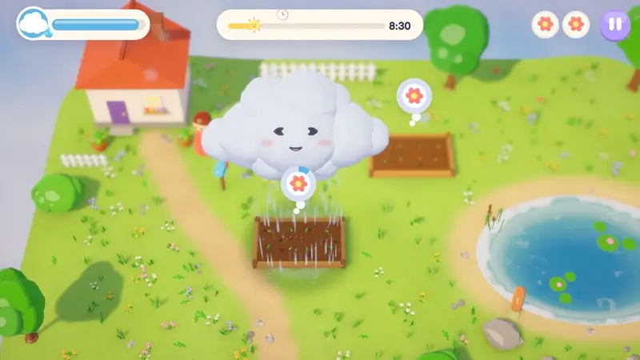
</p>

## Play in your browser

**[Play Pocket Weather in your browser](https://nearbycoder.github.io/PocketWeather/)** at
https://nearbycoder.github.io/PocketWeather/: no install, the current source rather than v0.1.0.
The page is ready but is being published separately, so the link may not work for a little while.

- **Needs WebGL 2:** a current Chrome, Edge, Firefox or Safari. About 17 MB downloads before the
  title screen; the music and ambience (about 10 MB) follow in the background, and later visits
  start from the browser's cache.
- **Phones and tablets:** Rain and Gust buttons appear in the bottom corner on a touch-first device
  (a finger as its pointer and no mouse or trackpad), or after any touch, and hide as soon as a
  key, mouse or gamepad is used (Settings → Touch buttons: Auto, On or Off). They're thumb-sized
  (80 and 59 px across on an iPhone held sideways), keep clear of the notch, rounded corners and
  home indicator, and work with several fingers: hold Rain with one thumb while the other steers.
  Dragging, holding still to rain and flicking work as well. Sideways is best; held upright, the
  game rearranges itself after a "turn sideways" card (Play anyway). There's no zoom, text
  selection or long-press menu over the game, sound starts at the first tap, and if the phone ran
  short of memory and killed the tab, the next visit says so and starts on lighter graphics.
- **Tested** in headless Chrome 154, Chromium 151 and Firefox 157 on Linux, served from a copy of
  the site under `/PocketWeather/`: mouse, keyboard and emulated phone touch. Phones and tablets
  were emulated with real touch events, multi-touch included, in Playwright's WebKit (iPhone 15 and
  iPad Pro 11) and Chromium (Pixel 7) (`node Tools/mobile_check.mjs`). Real phones and Safari
  itself haven't been tried.
- **What differs from the desktop game:** sound starts at your first click, tap or key (a browser
  rule). There's no Quit button; close the tab. Progress and settings are kept in the browser's
  storage for this site, separate from a desktop save, and clearing the site's data erases them.
  Auto graphics starts on High and drops to Low (and remembers it) if frames run slow; the Graphics
  slider works as on desktop. Fullscreen is in Settings, and a phone's first tap asks for it.

## Trailer

<p align="center">
  <a href="docs/media/pocket-weather-trailer.mp4">
    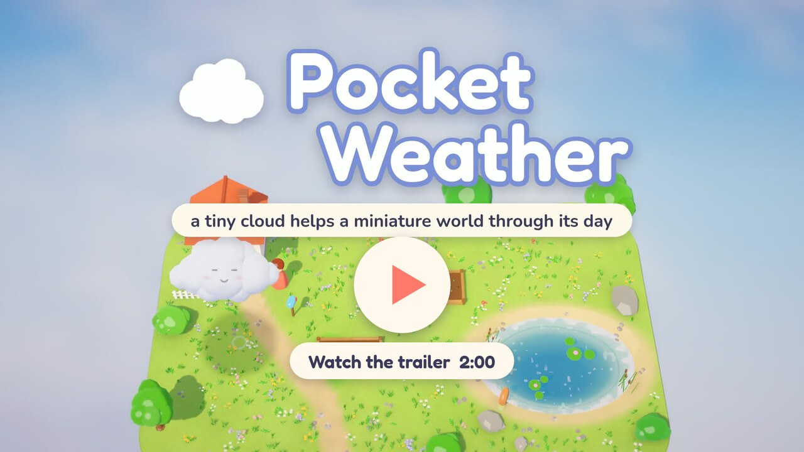
  </a>
</p>

<p align="center"><sub>Click to watch (MP4, 1080p, 2:00, with the game's own music and sound).
Recorded from the current source at the Ultra graphics setting. Every shot was staged by an
in-game script, not a screen recording; see <a href="#the-trailer-is-built-by-the-game">how</a>.</sub></p>

## About

Pocket Weather is a cosy puzzle game about being the weather. Twelve single-screen, tilt-shift
dioramas follow one summer in **Pocketvale**: from Rosa's first flower bed, through Tom's
becalmed fishing boat, a rainbow picnic and a night of runaway haystack fires, to their lakeside
wedding, where Pip sneezes, soaks the whole party, and has to make a rainbow to save the day.

Each day is a little ecosystem of wants. The carrots want rain (but not too much), the sheep want
shade (but not rain), the washing wants wind (and definitely not rain), and the duck pond you're
drinking from has a line the ducks would rather you didn't cross. You have one resource, water,
and three ways to spend it. Meet every need at the same moment and the day is saved.

There is no stock art or audio anywhere in it: every model is generated by a Blender script,
every sound and note of music is synthesised with numpy, and the levels are plain JSON.

## How to play

The pointer marks the spot **on the ground under Pip**: that's where rain lands and shade falls.
The camera looks down at an angle, so Pip floats above your cursor or finger and is never hidden.

| Action | Mouse | Keyboard | Gamepad | Touch |
| --- | --- | --- | --- | --- |
| Move | Pip follows the cursor | WASD / arrows | Left stick | Drag |
| Rain | Hold left button | Hold Space | Hold A / RT | Hold still until the ring fills, or hold the 💧 button |
| Gust | Right button: press, drag to aim, release | E or Q (blows the way you're moving) | X / RB (aim with the right stick) | Flick, or the 🌬 button |
| Drink | Hover over open water without raining | Fly over water, not raining | Fly over water, not raining | Drag over water, not raining |
| Pause | ⏸ button, or Esc | Esc / P | Start | ⏸ button |
| Mute music | | M | | |

Every menu works with mouse, touch, keyboard and gamepad (d-pad or stick to move, A or Enter to
choose, B or Esc to go back). With the keys or a pad, a blue ring glides to the control that Enter
or A will press, and hides again when the mouse moves or you touch the screen. The pause menu shows
a one-line reminder of the controls for whatever you're playing with.

Each need has a thought bubble with a progress ring and a badge for what helps. When 85% of the
day has gone, "Not long left" says how many friends still need you and their bubbles pulse. If the
sun sets first, the sunset card has a tip for each kind of friend left and a "Try again" that goes
straight back into the day.

## Features

<table>
<tr>
<td width="50%">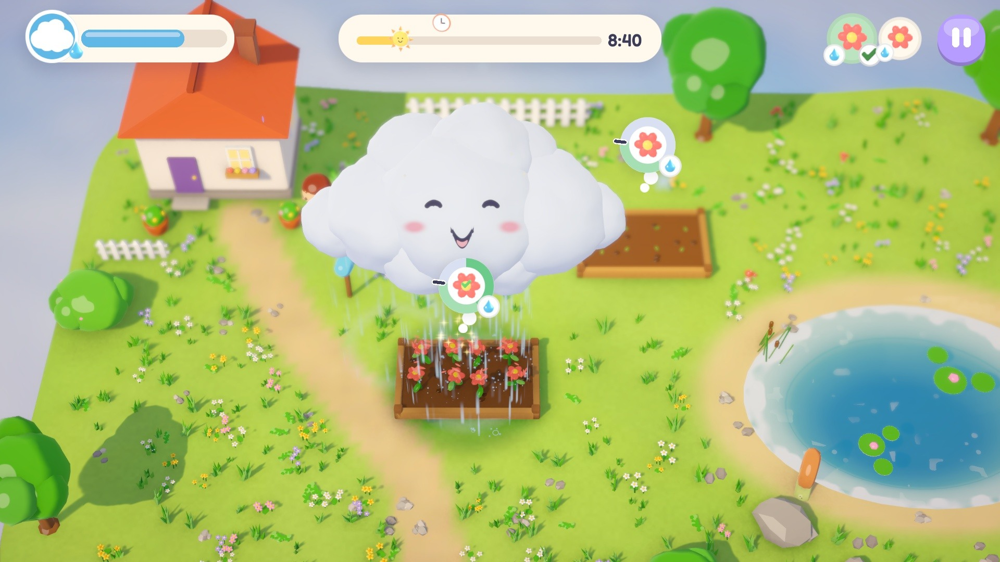</td>
<td>

### Rain that makes music
Hold to rain, and the soil darkens, the grass greens and sprouts pop into flowers. Each drop that
lands plays a note from the current chord of the soundtrack, on a timbre picked by what it hits:
kalimba on leaves, glass on water, glockenspiel on roofs, marimba on soil.

</td>
</tr>
<tr>
<td>

### One resource, three uses
**Water** (0 to 100) is everything. Rain spends it, a gust costs 6, and Pip's size, and so the
shade it casts, grows with how full it is. Refill by hovering over ponds and the sea, or by
catching vapour motes: morning dew, chimney steam, the steam off a doused fire.

</td>
<td width="50%">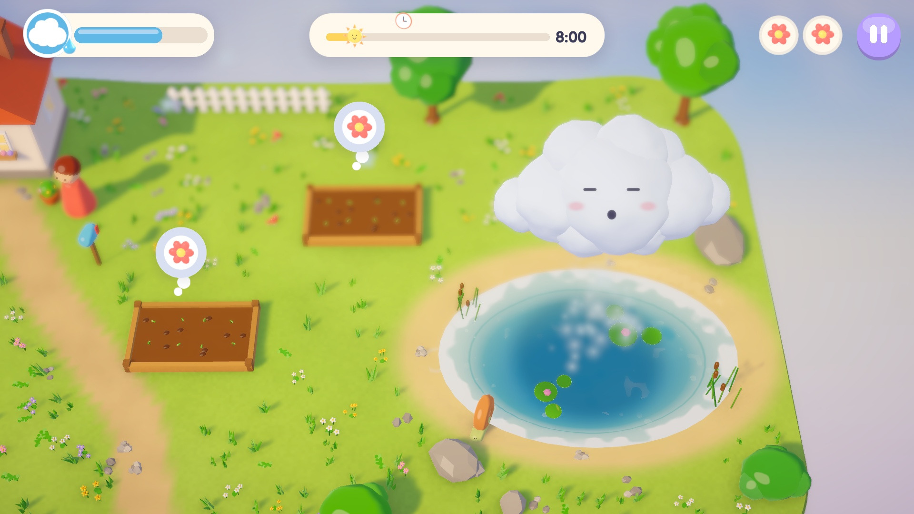</td>
</tr>
<tr>
<td>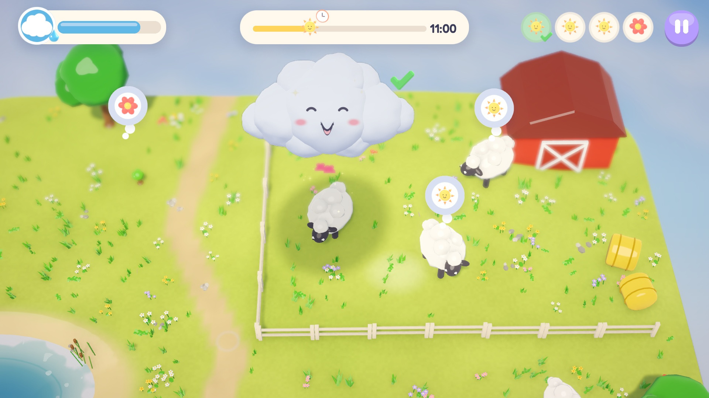</td>
<td>

### A world of competing wants
Everything that needs you shows a thought bubble with a progress ring, and a small badge for
what helps: a drop for rain, Pip for shade, a gust of wind, the sun, or a crossed-out drop for
"keep the rain off". The same badges sit on the needs tray, whose met and problem marks don't
rely on telling green from red.

- **Beds** (flowers, vegetables, wheat, a pig's wallow) want moisture inside a green band, and
  go soggy above it until the sun dries them. Their ring shows the band and a notch at its top,
  and stays up while you rain on them, so you can stop just in time.
- **Shade-seekers** (sheep, cows, a donkey, picnickers, sunbathers) cool down under Pip, and
  sulk if you rain on them.
- **Boats** are gusted into their dock or buoy. **Laundry** is dried by gusts and soaked by rain.
  **Windmills** spin up after a few good gusts.
- **Fires** must be rained out before they spread, while the **campfire**, **sandcastle** and
  **wedding cake** must stay dry. **Sunflowers** want sun, not shade. And the **duck pond** must
  not be drunk below its line.

The first time each kind of mistake happens, a hint says how to put it right ("Too wet! The sun
will dry it", "They wanted shade, not rain").

</td>
</tr>
<tr>
<td>

### Rainbows
Rain leaves a sparkling mist behind. Step aside and let the sun shine through it, and a rainbow
arcs over the spot. Anyone under it is delighted, forgives being rained on, and some wishes can
only be granted that way. That's the move the wedding finale is built around, and when the bride
throws her bouquet, a ring on the ground shows where to catch it.

</td>
<td>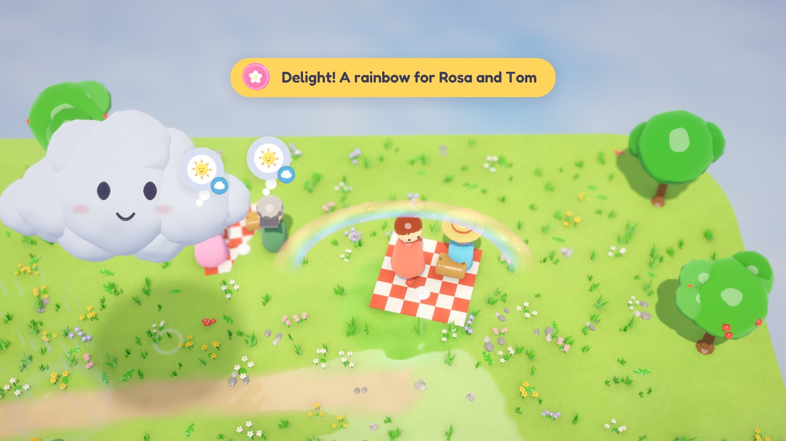</td>
</tr>
<tr>
<td>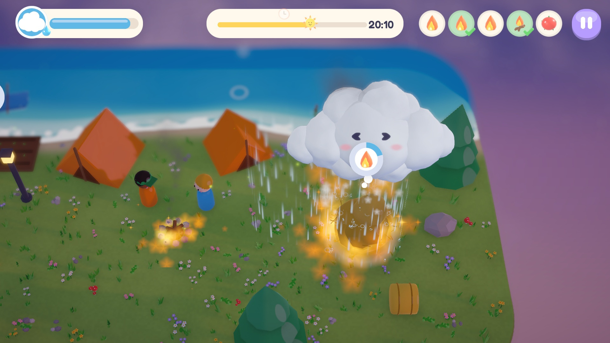</td>
<td>

### Days that change the rules
Day 9 happens at night, with haystack fires that spread if left alone and a campfire that must
stay lit; every fire lights the hay, grass, campers and Pip around it. The regatta needs several
boats at once. The heatwave dries beds as fast as you water them and has sunflowers that droop in
your shadow. The wedding has a twist of its own.

</td>
</tr>
<tr>
<td>

### Save the day, collect the stamps
Meet every need at the same moment and the day is saved: a hit-stop, confetti, and the rest of
the day plays out as a timelapse into a starry night. Each day has three stamps: **Day saved**,
**Before par** (finish before the par hour on the sun track) and **Delight**, a secret reaction
hinted at by a riddle in the pause menu. Postcards and results cards keep your best finishing time.

### Encores
Once a day is saved, its postcard offers an **Encore**: the same diorama on a scorcher. The sun
crosses the sky in three quarters of the time, the beds dry out as you watch, and Pip sets off
half-empty. Saving it earns that day's fourth stamp, and its postcard keeps your best scorcher
time to beat.

</td>
<td>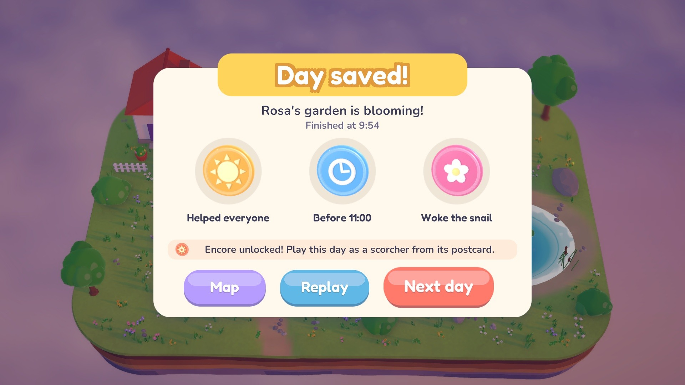</td>
</tr>
</table>

Also included: a title screen over the diorama of the day you're up to, a map of Pocketvale with
your stamps, a postcard before each day, wordless onboarding hints worded for the device you're
using, an ending, and saved progress. Restart and Map in the pause menu ask "Sure?" once a day is
a few seconds old.

### Graphics Fidelity

**Settings → Graphics** is a slider with five steps, moved by mouse, touch, the arrow keys or the
d-pad. The steps trade fine detail and effects for GPU time; it takes effect at once.

| Step | What it draws | GPU time a frame* |
| --- | --- | --- |
| **Auto** (the default) | High, dropping to Low if the GPU can't keep up; a machine that needed Low starts there next time | |
| **Low** | 75% resolution (upscaled with AMD FSR 1 where the build has its shader), no MSAA, no ambient occlusion, a cheaper depth of field that blurs only the far band, one short 1024 shadow cascade with cheap soft shadows, no lights besides the sun, 0.6x particles | 0.85 to 0.89 ms |
| **Medium** | full resolution, 2x MSAA, no ambient occlusion, bokeh depth of field, a 2048 shadow map with medium soft shadows, fire light | 1.15 to 1.22 ms |
| **High** | the full look: 4x MSAA, ambient occlusion, bokeh depth of field, two 4096 shadow cascades, high-quality bloom, fire light | 1.47 to 1.58 ms |
| **Ultra** | rendered at 1.5x and downsampled, four shadow cascades, finer and deeper ambient occlusion, high-quality bokeh sampling, a finer colour grade, a wetness map twice as fine (crisper wet and green edges where it rained), 1.6x particles and a second scatter of tufts and wildflowers | 2.79 to 2.97 ms |

<sub>*Measured on the development machine's integrated AMD Radeon 8060S at 1600x900 (Vulkan), on
three days; whole frames there are set by the CPU, at 10 to 17 ms. The web build starts from a
lighter base (80% resolution, 2x MSAA, one 2048 cascade), so its Ultra renders at 1.2x and has no
ambient occlusion. Comparison screenshots of every step are in
[docs/IMPROVEMENTS.md](docs/IMPROVEMENTS.md#round-12-results).</sub>

### Settings and accessibility

- **Volume:** music, sounds and ambience, each on its own slider; M mutes the music and brings it
  back at your own volume. A look-ahead limiter keeps the mix from clipping.
- **Look:** Graphics (above), tilt-shift blur strength, screen shake on or off, fullscreen.
- **Tap to rain:** rain becomes a toggle for anyone who finds holding a button tiring.
- **Relaxed days:** the sun takes half as long again to cross the sky on ordinary days (Encores
  keep their pace). The sunset card offers it too, from a day's second sunset. A relaxed day is
  saved as usual, but the "Before par" stamp and best times wait for the usual pace.
- **Hints** on or off, **Touch buttons** Auto (shown on phones and tablets, or once you touch the
  screen, and hidden when you use keys, a mouse or a pad), On or Off, and
  **Reset progress** (it asks first).
- The game pauses itself when the window loses focus, a phone sends it to the background, or the
  controller you're flying with disconnects (and says why). In the browser it goes quiet whenever
  its tab is hidden.
- **Phones:** held sideways, the HUD and menus are drawn larger (a 44 px pause button, settings in
  two columns, the pause menu in a grid). Held upright, the interface is rearranged, and a closer
  camera follows Pip from side to side, with the bubbles of needs out of frame waiting at the
  screen's edge. In a phone's browser the first tap goes fullscreen (Settings → Fullscreen turns
  that off).

## Content

Twelve days, each adding one new idea and combining it with the earlier ones. Spoiler-light:
the delights are left for you to find.

| Day | Diorama | What's new |
| --- | --- | --- |
| 1 | First Drops | move, rain, drink |
| 2 | Just Right | moisture bands and sogginess |
| 3 | Sunny Pasture | shade |
| 4 | Becalmed | gusts and boats |
| 5 | Washing Day | laundry, needs that want opposite things |
| 6 | Rainbow Picnic | rainbows |
| 7 | Windmill Hill | the windmill |
| 8 | Duck Pond Park | water that runs out |
| 9 | Campfire Night | fire, at night |
| 10 | Regatta | several boats, keeping things dry |
| 11 | Heatwave | fast drying, sunflowers that want sun |
| 12 | The Wedding | the finale |

A day runs two to three and a third minutes from dawn to dusk (saving it usually takes less), so
the whole summer is roughly half an hour, and longer if you chase all 36 stamps, plus the
twelve Encore stamps.

## Screenshots

<table>
<tr>
<td>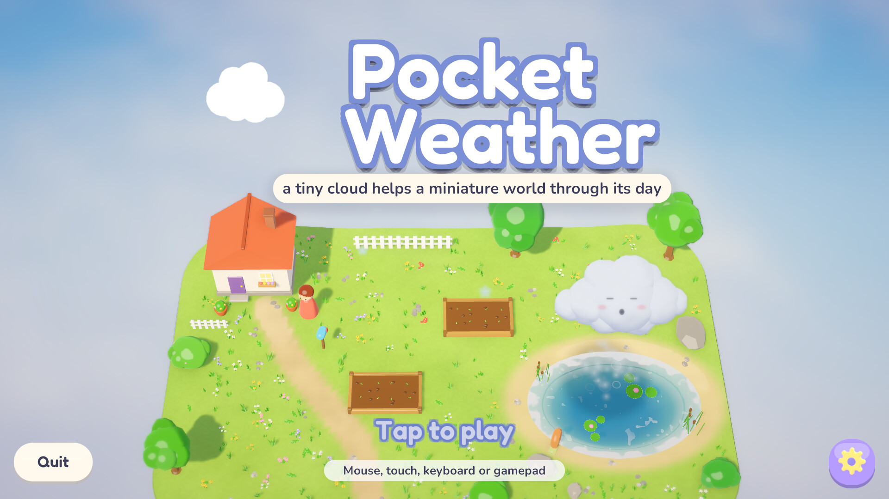</td>
<td>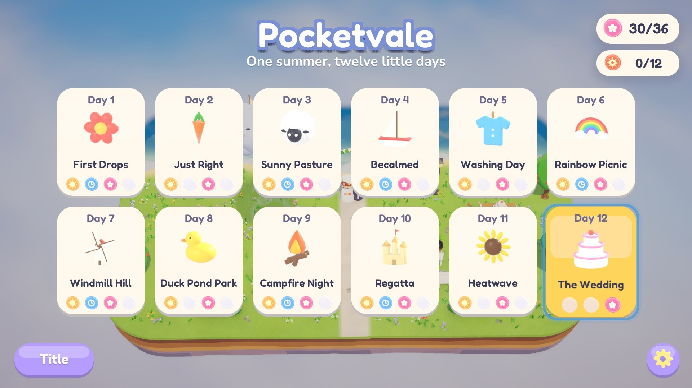</td>
</tr>
<tr>
<td>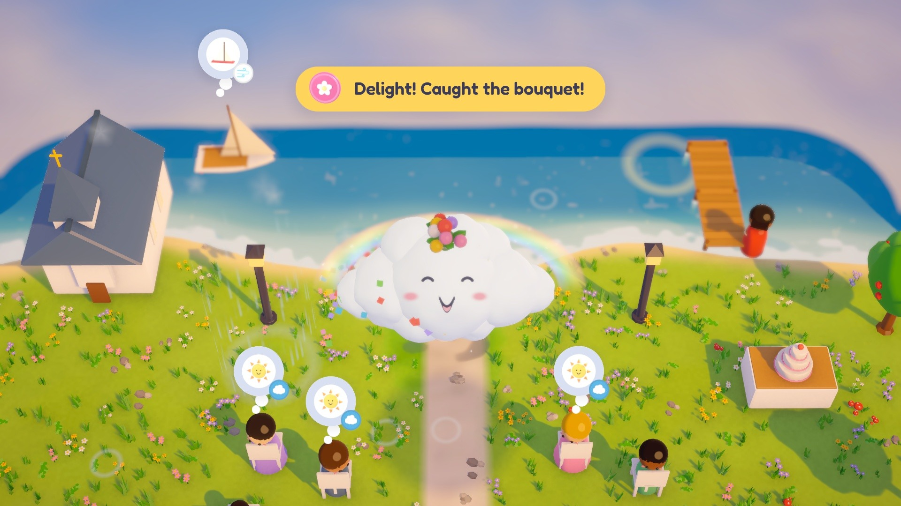</td>
<td>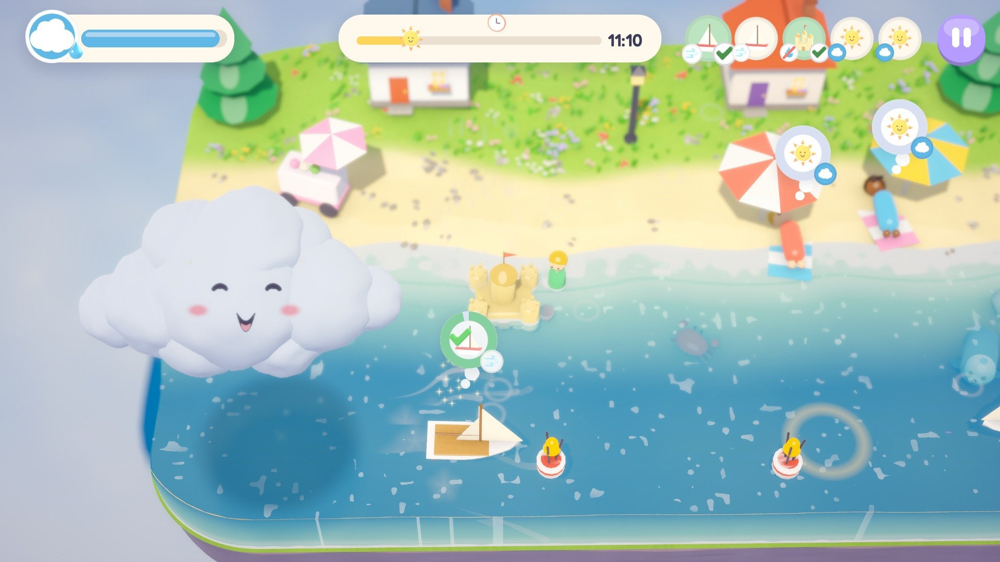</td>
</tr>
</table>

<sub>The trailer, the teaser and every screenshot on this page were captured from the current
source at the Ultra setting on October 8, 2026.</sub>

## System requirements

- **Linux:** x86_64, a GPU with OpenGL Core (the default) or Vulkan (`-force-vulkan`) drivers, and
  about 130 MB of disk. Developed and tested on CachyOS with KDE Plasma (Wayland) and an AMD
  Radeon 8060S integrated GPU, where every step of the Graphics slider takes under 3 ms of GPU time
  a frame (whole frames averaged 10 to 17 ms with the machine shared and busy). No minimum has been
  measured: weaker GPUs haven't been tried, Auto drops to Low when
  frames run slow, and under a pure software renderer the game ran at about 5 fps.
- **Web:** a browser with WebGL 2. About 17.7 MB downloads before the title screen, and the music
  and ambience (about 10 MB) follow in the background. Tested in headless Chrome and Firefox, and
  on emulated iPhone, iPad and Android phones (headless WebKit and Chromium); not yet on a real
  phone or in Safari itself.
- **macOS:** `Tools/unity.sh mac` builds a universal app, but it has never been run on a Mac.
- **Windows:** no build yet (this machine lacks Unity's Windows Build Support module).

## Play it

Download the latest release from [**Releases**](https://github.com/nearbycoder/PocketWeather/releases).

> **The v0.1.0 downloads (October 4, 2026) are older than this page.** They predate all twelve
> improvement rounds in [docs/IMPROVEMENTS.md](docs/IMPROVEMENTS.md): no Graphics Fidelity slider
> (v0.1.0 has an Auto, High or Low button), Encores, Relaxed days, focus ring, fire light, the
> bouquet's landing ring, mistake hints, phone layouts or Linux launcher. To play the game this
> page describes, [build it from source](#build-from-source).

- **Linux (x86_64):** unzip `PocketWeather-0.1.0-linux-x86_64.zip` and run `PocketWeather.x86_64`.
  On Wayland, add `-force-wayland` if the window doesn't appear (some compositors hang on the
  XWayland path). Builds from the current source include `PocketWeather.sh`, which does that for
  you, and starts the game again if it crashes while starting: start the game with it.
- **Web:** unzip `PocketWeather-0.1.0-web.zip` and serve the folder over HTTP (browsers won't run
  it from `file://`), for example `python3 -m http.server 8080` inside it, then open
  `http://localhost:8080`.

The current source builds a web version that's ready for a static host: the game fills the
window, loads behind its own loading card, offers a reload instead of a frozen screen if the game
crashes or the browser takes its graphics back, and needs no server configuration (see
[docs/HOSTING.md](docs/HOSTING.md)). `Tools/build-pages.sh` stages it for GitHub Pages; see
[Play in your browser](#play-in-your-browser).

## Status and known issues

Version 0.1.0 is complete: all twelve days, the finale and ending, menus, settings, saves, and
every input method. Twelve improvement rounds have been merged since; their plans, measurements
and screenshots are in [docs/IMPROVEMENTS.md](docs/IMPROVEMENTS.md). None of them is in a release
yet.

What has been verified on the Linux build unless noted. The full self-test passed every row on
round 12's code; the bots' margins come from earlier rounds' runs:

- All twelve levels pass the static validator. The expert AutoPilot saves every day before par
  with no exceptions or missing-asset warnings, and found 12 of 12 delights in the final run;
  Day 6's rainbow and the wedding bouquet depend on timing and have each been missed in some
  earlier runs. The newcomer bot also saves all twelve days before par (closest: Day 9, 1.2
  game-hours inside), and both bots save all twelve Encores before sundown.
- Keyboard (78 checks), gamepad (37) and touch (23) self-tests pass through the real Input System,
  and the UI audit passes at eight window shapes, from 1600x900 to a 360x800 phone held upright:
  every control reachable and on screen, no overlaps, no clipped text, the focus ring on screen
  around every menu control, and phone-sized text and buttons.
- **Web, in headless Chrome and Firefox 157:** plays with real browser touch events and a clean
  console, on desktop and phone emulation; goes quiet behind another tab; remembers Auto's drop to
  Low; and shows its reload card when the WebGL context is lost.
- The audio mix sits around -14 LUFS with no clipped samples, and every loop is seamless.

Rough edges, honestly:

- **No human playtesting yet.** The newcomer bot is a heuristic stand-in; par times, the
  difficulty curve, the Encores' balance and whether the bubbles, badges and hints help still need
  real players. So does whether a relaxed day should be able to earn "Before par" (it can't, for
  now).
- **No real touchscreen, controller or phone testing.** Touch and gamepad have only been exercised
  through virtual devices and emulated browser touch. There's no native Android or iOS build, and
  phone-browser performance is untested (emulation runs on a software renderer). Portrait works,
  but landscape is better, and the web page still suggests turning sideways.
- **A phone's memory limit is untested.** In headless WebKit with an iPhone profile the tab's
  process peaks at about 1.1 GB, but about 360 MB of that is this Linux WebKit's own empty page
  and software WebGL; the game holds a 171 MB WebAssembly heap and about 60-70 MB of WebGL
  resources, and Chrome's Pixel profile peaks at about 520 MB for the page plus 310 MB for its GPU
  process. Whether an older iPhone keeps the tab alive needs a real one.
- **The audio has never been heard by a person.** It was balanced by measurement (loudness,
  peaks, spectra), so tone and repetitiveness may need adjusting by ear. The same goes for the
  trailer's mix.
- **Weak GPUs are untested.** Ultra's extras are mostly fine detail that the tilt-shift blur
  softens; nobody but the screenshots has judged whether it's worth twice High's GPU time.
- **Linux on Wayland:** the binary on its own can hang at startup on some Wayland desktops (Unity's
  default X11 backend), and once in about 45 automated launches it crashed inside Unity's Wayland
  backend. `PocketWeather.sh` (in builds from the current source, not v0.1.0) starts it on Wayland
  and relaunches it once after a crash in its first 20 s. X11 sessions and other compositors
  haven't been tried.
- **Started with `-screen-fullscreen`, the Linux player keeps its prefs in
  `~/.config/unity3d/unknown/unknown/`**, a file other Unity games share, instead of
  `~/.config/unity3d/Pocketvale Studio/Pocket Weather/`. It's a Unity quirk; launched normally it
  uses the right folder.
- **The web build has only run in headless Chrome, Firefox and Playwright's WebKit.** Safari itself
  (iPhone, iPad, Mac) hasn't been tried; that WebKit can't play sound on this machine, so the
  sound on an iPhone has only been checked to start at the first tap, not heard. The reload card
  was tested by losing the WebGL context on purpose, not by a real crash. It's staged for GitHub Pages ([docs/HOSTING.md](docs/HOSTING.md)).
- **Colour blindness was checked by simulation only.** Under simulated protanopia and
  deuteranopia, a bed's just-right and soggy rings turn the same beige; the soggy bubble also
  swaps its icon for a puddle and its fill runs past the notch, so it should still read, but
  nobody colour-blind has tried it.
- **macOS is untested and there's no Windows build** (see System requirements); the macOS app
  isn't signed or notarised, so Gatekeeper warns on first launch.
- **No license has been chosen yet.** Until a `LICENSE` file is added, the default copyright
  rules apply to the code and assets (the fonts remain under the OFL).

---

## For developers

### Build from source

You'll need **Unity 6000.6.2f1** with the Linux Build Support module (plus WebGL Build Support
for the web build and Mac Build Support (Mono) for macOS). The project uses URP, the Input System
and runtime-built uGUI; the only scene is a bootstrap and everything else is constructed from code
and level data.

```sh
Tools/unity.sh compile        # import + compile, print any errors
Tools/unity.sh build          # Builds/Linux/PocketWeather.x86_64
Tools/unity.sh webgl          # Builds/WebGL (switches the editor's platform; slow the first time)
Tools/unity.sh mac            # Builds/macOS/PocketWeather.app (universal, unsigned, untested)
Tools/unity.sh                # open the editor
Tools/play.sh                 # run the Linux build at 1600x900 (bots, tests and captures get
                              # throwaway prefs in Recordings/config and a window, never your real prefs)
Tools/nested.sh <command>     # run a command with its windows in a private KWin on a virtual screen
                              # (play.sh's tool runs and selftest.sh do this by themselves; PW_NESTED=0 opts out)
Tools/serve_web.sh            # serve the web build on :8080, with LAN addresses for a phone
Tools/package_web.sh          # zip Builds/WebGL for a static host (docs/HOSTING.md)
Tools/build-pages.sh          # build and stage the GitHub Pages site in Builds/pages (docs/HOSTING.md)
```

`Tools/unity.sh` expects the editor at `~/Unity/Hub/Editor/6000.6.2f1/Editor/Unity`; set `UNITY=`
to point elsewhere. On Arch-based distros the editor needs `libxml2.so.2` (`pacman -S
libxml2-legacy`, or drop a copy into `Tools/libs/`).

### Regenerating the assets

Everything in `Assets/Resources` except the two fonts is generated, and the generators are the
source of truth.

```sh
# Levels: Tools/make_levels.py writes the JSON; Blender rebuilds each island's terrain from it
python3 Tools/make_levels.py
blender -b -P ArtSource/build_all.py -- --group terrain

# All models (groups: core, props, characters, terrain; --only a,b; --preview DIR renders checks)
blender -b -P ArtSource/build_all.py

# Icons, and a contact sheet of model previews for review
blender -b -P ArtSource/icons.py
blender -b -P ArtSource/build_all.py -- --preview /tmp/prev --no-export
python3 ArtSource/contact_sheet.py /tmp/prev /tmp/prev/sheet.png

# The web page's images (logo, favicon, link preview), cut from the logo, Pip's icon and the poster
python3 Tools/make_web_template.py

# Music, ambience, sound effects and the chord timeline (needs numpy + scipy)
python3 -m venv Tools/.venv && Tools/.venv/bin/pip install numpy scipy
Tools/.venv/bin/python Tools/audio/synth.py
```

### Tests and validators

`Tools/selftest.sh` runs every unattended check against the Linux build and prints a one-line
verdict for each (`--quick` skips the full campaign). It plays with fresh prefs of its own in
`Recordings/selftest/config`, so the settings it changes never reach anyone playing on the same
machine, and when `kwin_wayland` is installed its windows open in a private KWin on a virtual
screen (`Tools/nested.sh`), so they never appear on the desktop; it checks that each one did:

- **Level validator** (`python3 Tools/validate_levels.py`): every referenced model and icon
  exists, needs sit inside Pip's reachable area and on land (boats on water), and a water budget
  and lower-bound completion time are estimated against par and sundown, for each day and its
  Encore. It also fails if a day's music track is missing or any track plays on more than three
  days.
- **Audio loop seams** (`Tools/.venv/bin/python Tools/audio/check_loops.py`): no click or level
  jump where any looping clip wraps.
- **Keyboard, gamepad and touch self-tests** (`-pwKeyTest`, `-pwPadTest`, `-pwTouchTest`): virtual
  devices drive the real Input System from the title screen through menus and play (78, 37 and
  23 checks), including the Graphics slider stepped with the arrows and the d-pad (its label, the
  saved setting and the renderer's settings at each step), the focus ring settling on the selected
  map card, pause button and slider and hiding when the mouse moves, a new player's first tap going
  straight to Day 1, the pause menu's controls line, Restart asking "Sure?" well into a day, hints
  hiding behind pause, the Touch buttons Off setting, best times, the hint on each day that brings
  in a new idea, Encores (opening one from its postcard, saving it, and its own best time), and a
  controller that drops out mid-flight pausing the day. The keyboard test also checks Relaxed days,
  the "Not long left" note, toasts, the hints after a first mistake, the sunset card's tips, and
  Restart and Try again going straight back into the day. It also throws the wedding bouquet four
  times: the smallest Pip waiting on the ring must catch three throws at different angles, and
  must miss one when parked 2.5 units off it.
- **UI audit** (`-pwUiAudit`): every button, slider and toggle on every screen must receive a tap
  at its centre and sit fully on screen, at 16:9, 20:9, 4:3, two phones held sideways (844x390
  and 740x360) and three portrait sizes (720x1280, and 390x844 and 360x800 phones). No two
  controls may overlap, no menu text may run off screen or out of its card, pill or button, and
  the focus ring around each menu control must stay on screen. It checks the HUD's layout and
  sizes on desktops and phones, that every hint and the longest toasts fit, the camera's framing
  in landscape and portrait, and that every need on all twelve days has its "what helps" badge.
- **Linux launcher** (`Tools/linux/test_launcher.sh`): stand-in games check that `PocketWeather.sh`
  starts the game again after a crash while starting (once, with the same arguments), not after
  a clean exit, an error exit or a crash later on, and that stopping it stops the game. The
  self-test then boots the real build through the launcher.
- **AutoPilot** (`Tools/play.sh -pwAutopilot $PWD/Recordings/auto`): a bot plays every level through the same
  input API as the player and reports PASS/FAIL, finishing hour against par, oopses and water
  used. `-pwDelights` also chases each secret (with a second try for most of them),
  `-pwNewcomer` plays like a hesitant first-timer, `-pwEncore` plays every day as its Encore, and
  `-pwPerf` logs frame-time statistics.
- **Graphics fidelity** (`Tools/play.sh -pwCapture $PWD/Recordings/fid -pwScript fidelity`): the same
  frozen moment on three days at Low, Medium, High and Ultra. `Tools/play.sh -force-vulkan -pwPerf
  -pwBench` flies the same raining figure-of-eight on three days at each step, forwards then back,
  and logs `[Bench]` frame times and the GPU's own time (Vulkan reports it; OpenGL in the private
  KWin doesn't). `-pwScript nightlight` shoots Day 9's night with and without the fires' light.
- **Web smoke test** (`node Tools/web_smoke.mjs`, `--phone` for an emulated phone): boots the
  WebGL build in headless Chrome and plays it with real browser touch events, then reloads to
  check that a downgraded Auto graphics setting is remembered. `--throttle 20` emulates a 20 Mbps
  connection and screenshots the loading card; `--portrait` holds the phone upright and checks the
  "turn sideways" card; `--mouse` is a desktop with no touchscreen; `--firefox` runs it all in
  Firefox over WebDriver BiDi (a mouse desktop, or touch with `--phone`); `--dir` points it at
  another build, for comparisons, and `--url` at a page that's already served. It checks the
  device-aware wording, the rain notes' chord clock, going quiet in a hidden tab, fullscreen on a
  phone's first tap, the phone HUD's and menus' scale, the ambience arriving after boot, and the
  page's reload card. It isn't part of `selftest.sh`,
  which tests the Linux build.
- **Phone and tablet check** (`node Tools/mobile_check.mjs --device iphone`, also `ipad`, `pixel`,
  `*-portrait` and `desktop`): plays Builds/pages from `/PocketWeather/` in Playwright's headless
  WebKit or Chromium with a phone's profile and real touch events: title, Start, drag, hold to rain,
  flick, then the on-screen buttons (size, safe area, Rain held by one finger while another
  steers, Gust), Pause and Resume, and a key press hiding them; `desktop` checks they never show.
  It samples the tab's memory (the browser's processes, the WebAssembly heap, WebGL) and frame
  rate. `--title-only` measures memory alone; `--recovery` checks the page's answer to a tab killed
  for memory. Needs the blog's Playwright (see the script's header).

### Rebuilding the trailer and README media

```sh
R=$PWD/Recordings/trailer-capture
PW_CONFIG=$R/config PW_W=1920 PW_H=1080 Tools/play.sh -pwTrailer -pwFreshSave -pwVideo $R/frames -pwVideoQuality 95 -logFile $R/trailer.log
Tools/.venv/bin/python Tools/make_trailer.py docs/media/pocket-weather-trailer.mp4 $R/frames $R/trailer.log
```

The capture runs in a private KWin; on the development machine, shared and busy (load 22 to 106),
it took about half an hour and `make_trailer.py` another 12 minutes. `-pwTrailerGraphics high`
records at another step (Ultra is the default). It needs ffmpeg and ImageMagick 7.
`make_trailer.py` also rewrites the teaser loop, the poster and the logo, and leaves two frames
per beat in `$R/trailer_work/check` for checking. The README's screenshots are frames of the same
capture.

### Project structure

```
Assets/
  Scripts/
    Core/        GameRoot (boot), GameFlow (state machine), SaveData, GameSettings, Tween, Res
    Level/       LevelData (JSON schema + campaign), Level (builds a diorama from JSON, world
                 queries, rain/gust routing), DayCycle, LevelScript (timed events, the finale)
    Cloud/       Cloud (water, movement, rain, drink, gust), CloudInput (mouse/touch/keys/pad/
                 virtual), CloudVisual (puffs, SDF face, expressions), RainSystem (instanced drops)
    Needs/       Need base, BedNeed/SunnyNeed, ShadeNeed, BoatNeed, MoreNeeds (laundry, windmill,
                 rainbow wish, fire, campfire, keep-dry, pond line, delights)
    World/       WaterBody, WetMap, Rainbows, Motes, Critter, Scatter, AmbientLife
    Fx/          Fx (particles, splashes, ripples), CameraRig, PostFx (tilt-shift DoF, bloom,
                 grading), Quality (Auto, Low, Medium, High, Ultra)
    Audio/       AudioHub (music, ambience, buses), Sfx (pooled one-shots, musical rain notes),
                 MasterLimiter (look-ahead limiter on the listener)
    UI/          UiKit (runtime uGUI kit), Hud, Screens (title, map, postcard, pause, settings,
                 results, ending), Onboarding, FocusRing (keyboard and pad focus)
    Automation/  AutoPilot, Capture, KeyTest / PadTest / TouchTest, UiAudit, PerfProbe, FidelityBench,
                 Recorder (fixed-clock video), Trailer (the trailer's shot list)
  Editor/        BuildScript (batch builds), ProjectSetup (URP asset, renderer, volume)
  WebGLTemplates/PocketWeather/  the web page: full-window canvas, loading card, link previews
  Shaders/       Toon, Ground, Water, CloudPuff, CloudFace, Rainbow, Sky, Fx, WetMapUpdate
  Resources/     Levels/*.json, Models/*.fbx, Audio/, Icons/, Fonts/
  Music/         the music tracks, one asset bundle each (StreamingAssets/Music in a build), so the
                 web build can fetch them after it starts
  Ambience/      the four ambience loops, streamed the same way (StreamingAssets/Ambience)
  Plugins/WebGL/ a small jslib (asks the browser whether it's a touch device)
ArtSource/       Blender generators: pw_lib (the kit), props_core, props_world, characters,
                 terrain (one island per level JSON), icons, contact_sheet, build_all
Tools/           unity.sh, play.sh, nested.sh, selftest.sh, serve_web.sh, package_web.sh, web_smoke.mjs,
                 build-pages.sh and check-pages.mjs (the GitHub Pages site and its check),
                 linux/PocketWeather.sh (the launcher copied next to every Linux build) and its
                 test_launcher.sh,
                 make_levels.py, validate_levels.py, make_video.py, make_trailer.py,
                 make_web_template.py, audio/ (synth, sfx, music)
docs/            PLAN.md (design and technical plan), BRIEF.md (the original brief),
                 IMPROVEMENTS.md (twelve improvement rounds: plans and results),
                 HOSTING.md (web hosting), media/
```

### Tech highlights

- **Levels are data, used three ways.** Each `levelNN.json` (generated by `Tools/make_levels.py`)
  is the single source of truth for the island's shape, water, props, needs, day length and par.
  Blender reads it to sculpt the terrain mesh, Unity reads it to build the diorama, and the
  validator reads it to check reachability and water budgets.
- **Rain is physical and cheap.** Each drop is raycast once when it spawns (along the cloud's
  velocity, so a moving cloud rains at a slant), animated in C#, and drawn with
  `Graphics.RenderMeshInstanced`. On impact it delivers an exact amount of water to whatever it
  hit, paints the wetness map, spawns a splash or ripple, adds to the rainbow mist and plays a
  note.
- **Wet and green ground.** A render texture over the island (256 texels wide, 512 at Ultra)
  stores wetness (which the sun dries) and greenness (which stays for the day). The ground and toon
  shaders sample it by world position, so watered soil darkens and dry grass greens exactly where
  it rained.
- **Musical weather.** `Tools/audio/synth.py` exports each track's tempo and chord timeline to
  `music.json`. Rain notes, mote arpeggios and chimes pick pitches from whichever chord is playing,
  so playing well sounds good. A look-ahead limiter on the listener keeps the mix from clipping.
- **Shade by shader.** The cloud's shadow is a global shader vector (position, radius,
  strength); every surface inside that cylinder darkens, even the sheep's backs, and gameplay
  uses the same test.
- **Firelight in a toon world.** The toon, ground and cloud shaders read URP's additional lights
  (Forward+ clusters on desktop, the forward renderer's list on the web) through a softer, wrapped
  version of the sun's ramp, so a burning haystack paints a warm pool on the grass at night.
- **A face made of maths.** Pip's face is a signed-distance-field shader with 13 continuously
  blended parameters (eye openness, happy arcs, squeeze, brows, mouth curve and roundness, blush,
  sweat, sparkle...) behind 17 expression presets, from drinking to the finale's "ah... ah... CHOO".
- **Rainbows from mist.** A coarse CPU grid accumulates mist where rain falls and lets it decay.
  When enough has built up and the sun reaches it in daylight, a rainbow spawns over the spot,
  and needs underneath get an `OnRainbow` callback.
- **Tilt-shift that survives a push-in.** Bokeh depth of field focuses between the island and
  Pip's flying height; when the camera pushes in, the aperture stops down with the square of the
  zoom so the miniature blur stays the same instead of smearing the subject.
- **Music that doesn't hold up the web build.** Each track and ambience loop is its own asset
  bundle in `StreamingAssets`. Desktop players open one from disk when it's first played; the web
  build starts without them, downloads them one at a time in the background, and decodes one only
  when it's about to play (browsers keep decoded audio as raw samples, 15–20 MB a track). The
  models use Unity's mesh compression.
- **Bots that play it.** The AutoPilot plays every level through the same input intents as a
  player, which is how par times, delights and regressions are checked without a human.

### The trailer is built by the game

`-pwVideo` locks the game clock to 30 fps and writes every frame plus the mixed audio, so
recordings are smooth however slow the machine is, which is why the trailer can be shot at Ultra.
`-pwTrailer` runs `Trailer.cs`, a shot list that loads each day, sets the hour and the camera,
drives Pip through the virtual input API (and the settings menu through a virtual keyboard), and
marks where each shot begins and ends. The in-game music is muted for the capture but keeps playing
the trailer's track underneath, so the musical raindrops stay in key with the music bed added
later. `Tools/make_trailer.py` then cuts the beats, draws the captions in the game's own fonts,
icons and colours, chains them with crossfades, and mixes the game's music under the captured
sound effects with sidechain-style ducking, normalised for loudness.

## Credits

Pocket Weather was designed and built by [nearbycoder](https://github.com/nearbycoder), developed
with [Claude Code](https://claude.com/claude-code).

- **Fonts:** [Fredoka](https://github.com/hafontia/Fredoka-One) (© The Fredoka Project Authors)
  and [Nunito](https://github.com/googlefonts/nunito) (© The Nunito Project Authors), both under
  the [SIL Open Font License 1.1](https://openfontlicense.org). The license texts ship next to
  the fonts in `Assets/Resources/Fonts/`.
- **Engine and packages:** [Unity](https://unity.com) 6000.6.2f1 with the Universal Render
  Pipeline, Input System and uGUI packages from the Unity registry (Unity Companion License).
  They're resolved by the Package Manager and aren't part of this repository.
- **Models, icons, terrain:** generated by the Python scripts in `ArtSource/`, run in
  [Blender](https://www.blender.org) 4.5.
- **Music and sound:** synthesised from scratch by `Tools/audio/` with
  [NumPy](https://numpy.org) and [SciPy](https://scipy.org).
- **Trailer and media:** captured from the game itself and assembled with
  [FFmpeg](https://ffmpeg.org) and [ImageMagick](https://imagemagick.org).

There are no other third-party assets: no stock models, textures, sounds or music.
