# Pocket Weather: improvements, round 1

Written 2026-10-06 on the `improvements` branch, starting from `41a6f09` (v0.1.0). The plan for
the round comes first, as written before any work began. What was actually done, and how it was
verified, is under [Round 1 results](#round-1-results) at the end.

## Baseline (measured today)

Everything was run on this machine against a fresh `Tools/unity.sh build` of HEAD.

| Check | Result |
| --- | --- |
| Linux build (`Tools/unity.sh build`) | Succeeded, 133 MB, no compiler errors |
| `Tools/selftest.sh` (full) | **All passed**: validator, audio loop seams, keyboard 19/19, gamepad 24/24, touch 18/18, UI audit 9/9 at 1600x900, 1600x720, 1200x900 and 720x1280, AutoPilot 12/12 with 12/12 delights, no exceptions. The known flaky "rain waters the bed" check passed this time. |
| Expert AutoPilot | Every day was saved before par, 19 to 82 s into a 120 to 200 s day. It finished 1.3 to 4 game-hours ahead of par, with 3 oopses across the whole campaign. |
| Screenshot tour (`-pwCapture`) | All 12 days, pause, settings, fail and ending screens rendered with no exceptions. I reviewed them. |
| Web smoke (`node Tools/web_smoke.mjs`, desktop and `--phone`) | Both pass with 0 console errors. Boot (to `GameRoot booted`) took 1.4 to 2.2 s from localhost. Under SwiftShader, Auto graphics drops to Low, as expected. |
| Web download | 32.6 MB with gzip: data 22.8 MB, wasm 9.7 MB, framework 75 KB. Brotli would be 27.4 MB (data 20.4, wasm 7.0). |
| Web boot over an emulated network (Chrome DevTools throttling, 60 ms latency) | 7.6 s at 50 Mbps, **14.2 s at 20 Mbps, 33.7 s at 8 Mbps** |

Things I could not verify: how the game sounds, how it feels to a human, real touchscreens and
controllers, real phone GPUs, and any macOS or Windows build.

## What I found

Each item below comes from the code, the running game or the screenshots.

1. **The web version isn't really playable in a browser yet.** The blog lists Windows, macOS,
   Linux and Web. The release has a Linux zip and a web zip that has to be unzipped and served
   with `python3 -m http.server`. The web build uses Unity's default template: on desktop the game
   sits in a fixed 960x600 box on a white page with a Unity logo footer, and the tab title is
   "Unity Web Player | Pocket Weather" (`/tmp/pw-web/w04_play.png`). The "Made with Unity" splash
   is on (`m_ShowUnitySplashScreen: 1`), and its logo texture alone is 2.7 MB of build data. Phone
   browsers render at full devicePixelRatio (2 to 3x) with MSAA x4 and bokeh depth of field, and
   Auto quality has to discover the slowdown again on every visit. The touch design is the
   strongest thing about the game, and the platform that suits it best is the one that's hardest
   to reach.
2. **The "just right" band is invisible.** A bed's bubble ring fills to the bottom of its band
   (`BedNeed.Progress = Moisture / BandMin`) and then just stays full until the bed suddenly turns
   soggy. Nothing on screen shows the top of the band. Day 2's tomatoes have a band of 14 to 24
   (about one second of full rain), so on Days 2, 8, 11 and 12 overwatering is guesswork. The
   plan promised this ("L2 shows the bed's band on the bubble ring", PLAN §9), but it wasn't built.
3. **Bubbles show who wants something, not what to do.** Laundry shows a shirt, the windmill
   shows a windmill, boats show a boat, and shade-seekers show a sun. Nothing says "gust" or
   "shade" (see the Day 5, 7, 10 and 12 screenshots). On the wedding day the tray holds four
   near-identical sun icons.
4. **Several new ideas arrive with no hint.** `Onboarding.cs` has hints for move, drink, band,
   shade, gust (boats only), rainbow, fire, pond and sunny. Day 5 (laundry wants gusts and hates
   rain), Day 7 (the windmill wants repeated gusts), Day 9's campfire (keep it lit) and Day 10's
   sandcastle (keep it dry) have none, because their levels have an empty `teach`. There's also
   no way to look up the controls in game after the first hint fades: the pause menu has none.
5. **The music repeats a lot.** The "afternoon" loop is **38 s** long and plays on six days (5,
   6, 7, 8, 10, 11), about 16 minutes of a 30-minute summer. The wedding waltz is a 27 s loop
   under a 200 s day. The "evening" track (46 s) is generated and shipped (0.9 MB) but never used:
   no level references it.
6. **Small bugs and loose ends:**
   - **Settings → Touch buttons can't turn them off for touch players.** The toggle writes 1
     (always) or 0 (auto, which still shows them on touch). The "never" value (2) is unreachable
     (`Screens.cs:376`).
   - **The onboarding hint stays on screen over the pause menu** (tour screenshot `t03_pause`).
   - **M (mute) sets music back to 0.8** rather than the player's own volume (`GameFlow.Update`).
   - **Best finishing time is recorded but never shown** (`SaveData.bestHour`), so there's no
     target when replaying for the par stamp.
   - **The title and map always show Day 1's diorama.** `LoadDisplayLevel` computes the next
     unfinished day and then ignores it.
   - **The "rain waters the bed" check is flaky.** In KeyTest and PadTest, Pip can still be
     gliding (up to about 1.1 radii) when rain starts, so only part of the shower lands on the bed
     in the 1.2 s window.
7. **No macOS or Windows builds.** Mac Build Support is installed, so a macOS build is possible
   now, but it would be unsigned and untested (there's no Mac here). Without signing,
   Gatekeeper blocks it on download, and Apple Silicon needs at least an ad-hoc signature.
   Windows needs the Windows Build Support module, which isn't installed.
8. **Replayability ends at 36 stamps.** After that there's nothing new. Par is generous for an
   expert (the bot finishes 1.3 to 4 game-hours early), but the newcomer bot lands only 2.5 to 3
   hours inside par on the hardest days, so tightening par without human data would be guessing.

## Ranked list

Impact means how much it raises the game for a real player. Effort: S is under half a day, M is
about a day, L is several days. Risk is the chance of breaking something or of not being able to
verify it.

| # | Improvement | Impact | Effort | Risk |
| --- | --- | --- | --- | --- |
| 1 | **Hosted-ready web build**: branded full-window template, smaller and faster download, mobile resolution cap, a deploy-ready package (finding 1) | High: a link anyone can click, and the best platform for touch | M | Low to medium (Brotli fallback and splash licensing need checking) |
| 2 | **Moisture band on bed bubbles** (finding 2) | High for Days 2, 8, 11, 12: it turns guessing into a skill | S–M | Low |
| 3 | **"Wants" badges on need bubbles and tray** (finding 3) | Medium–high: every day is easier to read | S–M | Low |
| 4 | **Onboarding for the unhinted days, plus a controls card in pause** (finding 4) | Medium–high for first-time players | S | Low |
| 5 | **Fixes bundle**: touch-button setting, hint over pause, mute restores volume, best time shown, title shows your current day, flaky test made deterministic (finding 6) | Medium (each is small, and together they feel careful) | S | Low |
| 6 | **More music variety**: use the evening track, add B sections to the shortest loops, no loop on more than 3 days (finding 5) | Medium, but nobody can hear it | M | Medium: can't be judged by ear here, and the web download grows |
| 7 | macOS build, universal and unsigned, built from Linux (finding 7) | Medium for reach | S–M | High: untestable, and Gatekeeper friction without a Developer ID |
| 8 | Windows build (finding 7) | High for reach | S once the module is installed | Blocked: the owner has to install Windows Build Support |
| 9 | Persist Auto quality's downgrade between sessions (so phones start on Low) | Low–medium | S | Low (could fold into 1) |
| 10 | Post-campaign content (for example remixed "stormy" versions of days, or par challenges) | Medium for retention | L | Medium, and design work without playtest data |
| 11 | Retune par and difficulty from real playtests | High eventually | S per pass | Needs human playtesters |
| 12 | Native Android build | Medium | L | Needs the Android module and a device |

## Proposed scope for this round

Items 1 to 5. Item 6 if the web budget in item 1 leaves room. All five can be verified on this
machine, and none needs an owner decision to start.

### 1. Hosted-ready web build

What:

- A custom WebGL template in `Assets/WebGLTemplates/PocketWeather/`:
  - a full-window canvas that follows window resizes and phone rotation
  - a loading screen in the game's own style (sky gradient, Pip icon, cloud-paper progress pill,
    Fredoka title)
  - a proper `<title>`, description, Open Graph and Twitter-card tags, and a favicon made from
    the Pip icon
  - a friendly message for browsers without WebGL 2
  - no Unity footer
  - devicePixelRatio capped at 2 on desktop and 1.5 on phones
- `PlayerSettings` for the web:
  - turn the "Made with Unity" splash off if the licence allows (Unity 6 made it optional on
    Personal; I'll check this in the editor)
  - per-platform Vorbis quality overrides for music and ambience on WebGL
  - mesh compression where it doesn't hurt how things look
  - Brotli with decompression fallback, if the fallback's decompression time on load doesn't cost
    more than the download saves. Otherwise keep gzip.
- Persist Auto quality's downgrade (item 9) so returning phone players start on Low.
- `Tools/package_web.sh`: builds or zips `Builds/WebGL` into
  `Builds/PocketWeather-<version>-web.zip`. It must work from any static host with no special
  headers (GitHub Pages, itch.io, the blog's own host), with a short `DEPLOY.md` note. **Nothing
  will be deployed.**
- `Tools/web_smoke.mjs` gains a `--throttle <Mbps>` option and reports download size and time to
  boot.

Acceptance:

- Total download is **≤ 22 MB** (from 32.6 MB), and boot at an emulated 20 Mbps is **≤ 10 s**
  (from 14.2 s).
- The desktop browser shows the game filling the window with no Unity branding. The phone
  emulation fills the screen, as it does today.
- `web_smoke` passes on desktop and `--phone` with 0 console errors.
- The Linux self-test still passes in full.
- The README's Play-it section and badges are updated to match the truth.

How I'll verify: run web_smoke desktop and phone, unthrottled and at 20 and 8 Mbps, and record
the numbers before and after in this file. Review the loading-screen and in-game screenshots
myself. Diff the build report to see where the size went.

### 2. Moisture band on bed bubbles

What: bed bubbles get a ring that maps moisture onto 0 to about 1.25 × the top of the band.
- The band is drawn as a green arc behind the fill.
- The fill is blue below the band, mint inside it and coral when soggy.
- A small tick marks the top of the band.
- When moisture is within 10% of the top of the band, the bubble gives a gentle pulse while
  rain is landing on it.

Other needs keep their current ring.

Acceptance:

- On Day 2, screenshots of a bed at thirsty, in-band and soggy moisture clearly show where
  "just right" is. A new `-pwScript band` capture sets the three moisture levels directly.
- The expert AutoPilot campaign still passes 12/12, and the newcomer bot is no worse on oopses
  from sogginess than today's baseline, which I'll record before the change.
- The UI audit passes at all four window shapes.

How I'll verify: capture script screenshots reviewed by eye, then the selftest and newcomer runs.

### 3. "Wants" badges on bubbles and tray

What: a small badge on each bubble and tray icon shows the verb that helps:
- 💧 rain: beds, fires, rainbow wishes (rain beside them)
- ☁ shade: shade-seekers
- 🌬 gust: boats, laundry, windmill
- 🚫💧 "keep dry": campfire, sandcastle, cake
- ☀ "no shade": sunflowers

It uses the existing icon set where it can. Any new badge icons come from `ArtSource/icons.py`
(the generator), not hand-made art. The badge hides once the need is met.

Acceptance:

- Every need type in the 12 levels maps to a badge, and an automated check walks all levels'
  needs and fails on any unmapped type.
- The tour screenshots for Days 5, 7, 10 and 12 show the badges legibly at 1600x900 and 720x1280.
- The UI audit passes.

### 4. Onboarding gaps and a controls card

What:
- Add `teach` tags and device-aware hints for:
  - laundry: "Blow the washing dry", with the flick or right-drag hand aimed at the line
  - windmill: "Keep blowing the sails"
  - campfire: "Keep the campfire lit"
  - keep-dry: "Keep the sandcastle dry"
- The gust hint targets whatever gust-need comes first, not only boats.
- The pause menu gains a compact controls row for the device in use.
- Levels are regenerated through `Tools/make_levels.py`, not by editing the JSON by hand.

Acceptance:

- On a fresh save, Days 5, 7, 9 and 10 each show their hint within 3 s of play starting.
  KeyTest/TouchTest gain a check that a hint appears on Day 5.
- The pause controls row matches the last device used (checked in the keyboard, gamepad and
  touch self-tests).
- The validator passes.

### 5. Fixes bundle

What:
- Touch buttons becomes Auto / On / Off, using the existing cycle-button pattern from Graphics.
- The hint and hand are hidden while paused and come back on resume.
- M remembers and restores the player's music volume.
- The postcard and results show "Best 9:40" once a day has been finished.
- The title and map show the next unfinished day's diorama.
- KeyTest and PadTest wait until Pip has settled over the bed before measuring the rain.

Acceptance:
- Each fix has a self-test check where one is practical: a touch-buttons Off check in
  TouchTest, a hint-hidden-on-pause check in KeyTest, and a best-time label check in KeyTest's
  results step.
- Keyboard and gamepad tests pass **10 runs in a row** with no flake (run them in a loop and
  record the result here).

### 6. (Stretch) More music variety

What:
- Assign the unused evening track to Regatta and Heatwave.
- In `Tools/audio/music.py`, extend "afternoon" and "wedding" with a second section (new melody
  over the same chord loop) so each loop runs at least 75 s.
- Regenerate with `Tools/audio/synth.py`.

Acceptance:
- No track plays on more than 3 days.
- The loop-seam check passes, and loudness stays within ±1 LU of today's.
- The web download is still within item 1's budget.
- The README says plainly that this was done by measurement, not by ear.

## Blocked, or needs the owner

- **Where the web build will be hosted.** The packaging will work on GitHub Pages, itch.io or the
  blog's own static host. Picking one and publishing it is the owner's call, since this effort
  doesn't deploy. The blog should link to it once it's up.
- **macOS.** Should I build an unsigned universal `.app` (testable by nobody here, and Gatekeeper
  will warn), or wait until there's an Apple Developer ID for signing and notarisation
  (`rcodesign` can do both from Linux)?
- **Windows** needs Windows Build Support installed in Unity Hub (6000.6.2f1).
- **The blog lists Windows and macOS**, which don't exist yet. Either the builds arrive or the
  page should change.
- Human ears and hands are still needed for audio, feel and difficulty. This round doesn't
  change that, and the README will keep saying so.

## Round 1 results

Implemented on `improvements`, one commit per item. Screenshots are in
[`docs/media/improvements/`](media/improvements/).

### 1. Hosted-ready web build: done; the size and speed targets were not met

- **Page:** the game fills the window on desktop and phone, with a loading card in its own
  colours, link-preview tags and a favicon. It shows a plain message if WebGL 2 is missing, and
  the render resolution is capped at 1.5x on phones and 2x on desktops. There's no Unity footer
  or "Unity Web Player" title, and the "Made with Unity" splash is off for every build (Unity 6
  allows this on every licence).
  
- **Auto graphics** remembers dropping to Low, so phones and slow browsers start there on the
  next visit. web_smoke's reload check verifies it in headless Chrome.
- **Packaging:** `Tools/package_web.sh` produces a zip that any static host serves as-is, and
  [HOSTING.md](HOSTING.md) covers GitHub Pages, itch.io and the blog's own host. Nothing has been
  deployed.
- **Size and load time:**

  | Web build | Download | Boot at 20 Mbps | Boot at 8 Mbps |
  | --- | --- | --- | --- |
  | v0.1.0 (gzip, default page, splash) | 32.6 MB | 14.4 s | 33.6 s |
  | Item 1 alone (Brotli, size-optimised wasm, no splash) | 25.8 MB | 12.2 s | 28.4 s |
  | End of round (plus item 6's longer music) | 27.9 MB | 13.2 s | 30.2 s |

  Boot is the time from navigation to the game's first log line. Each figure is the median of 3
  runs in headless Chrome with DevTools network throttling (60 ms latency) and a fresh profile,
  alternating with v0.1.0 (which was re-measured alongside each build). The machine's load
  average was 6 to 12 at the time. Under heavier load (30 to 80) the same runs were noisier and
  slower for both builds.

  **Why not 22 MB / 10 s:**
  - The remaining 26 MB is mostly things the build settings can't shrink. Audio is 9.7 MB:
    Unity's WebGL path re-encodes every clip to 160 kbps AAC whatever the quality setting (I
    tried overrides: no change). URP's film-grain and blue-noise textures (about 3 MB of
    incompressible noise) live in its global settings and can't be stripped safely.
  - "Optimize mesh data" saved 1.9 MB but stripped the vertex colours, which turned the world
    beige, so it stays off.
  - Gzip was measured too: no faster than Brotli at 20 Mbps and about 5 s slower at 8 Mbps,
    because its download is 5 MB larger.
  - Shrinking further would mean cutting audio quality or lengths for the web, which nobody can
    judge by ear here.
- **Verified:** `web_smoke` passes on desktop and phone emulation, 0 console errors.

### 2. Moisture band on bed bubbles: done

- Bed rings show moisture on a fixed scale: a green band, a notch at its top, blue while thirsty,
  mint in the band and coral when soggy.
- The bubble now stays up while rain lands on a bed. Before, it vanished the moment the bed was
  happy, so nothing warned before it went soggy.
- The notch throbs in the top quarter of the band.

Verified with `-pwScript band` screenshots at each state (Day 2), plus the selftest. The bots
don't read bubbles, so no bot metric can show the benefit. It needs a human.

### 3. "Wants" badges: done

Every bubble and tray icon carries a badge for the verb that helps. For shade, the white Pip icon
sits on a sky disc, because the first version was invisible on white. The UI audit fails on any
need without a decided badge, and passes for all 12 days.

At 720x1280 portrait the badges are as small as the rest of the HUD. That was already true
before this round and is noted under known issues.

### 4. Onboarding gaps and controls card: done

Days 5, 7, 9 and 10 now show their new idea within 3 s (checked in KeyTest), and Day 9 follows
up with "Keep the campfire lit". The pause menu shows a one-line controls reminder for the device
in use, checked in the keyboard, gamepad and touch tests.

### 5. Fixes bundle: done

- Touch buttons cycle Auto / On / Off.
- Hints hide while paused.
- M restores the player's own volume, and the slider refreshes to match.
- Best times appear on the postcard and results.
- `FormatHour` can no longer print 9:60.
- The title and map show the day you're up to.

The "rain waters the bed" check now lines Pip up first. Keyboard and gamepad tests each passed
**10 runs out of 10**; before, the check failed about one run in six.

### 6. Music variety (stretch): done, scaled down

- The "evening" track was generated but never used. It now plays on Day 7 and Day 11, so
  "afternoon" covers four days instead of six.
- "afternoon" gains a B section (38 s → 77 s loop) and "wedding" a B and C section (27 s → 80 s).
  Each new section is a generated melody (chord tones on strong beats, mostly stepwise, in key)
  over the same chords.
- The other four tracks decode identically to before.
- Loop seams pass. RMS level is within 0.5 dB of before.
- Not done: no track playing on more than 3 days. There are only three daytime tracks for ten
  daytime days. Lengthening morning and evening too would add about 1.7 MB to the web download.
- **Nobody has heard the new sections**; they were checked only by measurement.

### macOS build (orchestrator-approved extra): built, untested

`Tools/unity.sh mac` produces `Builds/macOS/PocketWeather.app`:
- a universal binary (x86_64 + arm64, checked with `file`)
- Mono scripting
- bundle id `com.nearbycoder.pocketweather`
- 146 MB, or 60 MB zipped

Unity gives it an ad-hoc `_CodeSignature`, but it isn't signed with a Developer ID or notarised.
Gatekeeper will warn on first launch (right-click → Open, or clear the quarantine attribute). **It
has never been run on a Mac.** A zip is in `Builds/` (gitignored) and nothing is published.

`Tools/unity.sh windows` and `BuildScript.BuildWindows` exist but have never run: Windows Build
Support isn't installed.

### Also changed

- **AutoPilot:** a missed delight gets a second try, except the wedding's bouquet catch, which
  happens whenever the bouquet flies. Day 6's rainbow delight was timing-dependent: the v0.1.0
  build found it in 1 of 4 runs, and this build in 7 of 8 with the retry.
- **The wedding's bouquet always flies now.** It's thrown once the couple's rainbow wish is met,
  but only while the day is running. Reading the code, if that rainbow was the last need met, the
  day was saved in the same frame and the bouquet (the trailer moment, and Day 12's delight)
  never flew. Day 12 now holds completion from its start until the bouquet lands.
  - In 6 bot runs, the bouquet was thrown every time and the day was saved afterwards.
  - The bot caught it only once, so the selftest's delight count for Day 12 still varies. That's
    the bot's catching, not the game.
  - The last-need case itself wasn't reproduced.
- **web_smoke:** uses free ports. A fixed port once served another project's build during a run.

### Found along the way, not fixed

- **A native crash in Unity's Wayland backend:** one SIGSEGV inside
  `wl_display_dispatch_queue_pending` at startup, in about 45 automated launches. It isn't in the
  game's code. The XWayland path hangs instead, so `-force-wayland` stays.
- **On a shared machine,** the shared `/tmp` filled up (55 GB tmpfs) during the round, so this
  round's scratch files live in the gitignored `Recordings/scratch`. `selftest.sh` still writes
  its logs to `/tmp/pw-selftest`.

## Round 2 scope

Planned 2026-10-06 on `improvements-2`, from `main` after round 1 was merged. These items come
from the ranked list (10: post-campaign content) and from what round 1 turned up (the small
portrait HUD, and music still repeating across days). They're ordered by value to a player who
opens the game, most likely from a link on a phone.

### R2-1. Phones held upright

**Why:** the UI is laid out on a 1920-wide canvas. Held upright, a phone shows it at 0.375×:
720 px wide, so the HUD is tiny, and the map's six-card rows only fit because they shrink with it.

**What:** in portrait, the canvases switch to a narrower design width (1200), so everything is
about 1.6× bigger. The screens that don't fit in 1200 reflow:
- **HUD:** the sun track drops to a second row under the gauge and tray.
- **Map:** four cards per row instead of six.
- **Pause:** the controls line wraps.
- **Toast:** moves below the HUD's second row.

The web page also asks phones held upright to turn sideways (the dioramas are wide), with a
"Play anyway" button. Landscape layouts stay exactly as they are.

**Acceptance:**
- The UI audit passes at 720x1280 and a new 390x844 (phone) size.
- A new audit check fails if the HUD's top elements overlap, at any of the audited sizes.
- In portrait, the UI scale is at least 0.56 at 720 px wide (it was 0.375).
- Landscape screenshots at 1600x900 show no layout change; the UI audit still passes at all
  landscape sizes.
- The web smoke test with a portrait phone shows the rotate card, and "Play anyway" dismisses it.

**Verify:** UI audit at six window shapes, before/after screenshots, and the web smoke test with
`--phone --portrait`.

### R2-2. No music track on more than three days

**Why:** after round 1, "morning" still plays on Days 1–4 and "afternoon" on 5, 6, 8 and 10.

**What:** a fourth daytime track, made with the existing synth like the others. Its own key,
tempo and instruments, with a generated melody over its chords (round 1's `phrase_melody`).
It plays on Becalmed and the Regatta, the two sea days.

**Acceptance:**
- `validate_levels.py` fails if any track plays on more than 3 days, and the levels pass.
- The new track's loop seam passes `check_loops.py`. Its peak is at most -1 dBFS and its RMS is
  within 1 dB of the other daytime tracks.
- Its chord timeline is exported to `music.json`.
- The player logs the new track starting on Days 4 and 10.
- The web download grows by at most 1 MB.

**Verify:** the validator, the synth's stats, the loop checker, a capture tour's logs, and
`package_web.sh` sizes. It's still unheard by a person, and the README will keep saying so.

### R2-3. Encore days (something to do after 36 stamps)

**Why:** after all 36 stamps there's nothing left to play for.

**What:** once a day has been saved, its postcard offers an Encore: the same diorama on a
scorcher. The sun runs faster (the day is 25% shorter), beds and the flower arch dry out as if it
were the heatwave, and Pip starts with less water. Saving an Encore earns that day's fourth stamp
(a gold sun), so the summer has 48 stamps. The map cards and postcards show it.

The rules are generic modifiers applied when a level loads, not twelve hand-made variants, so the
existing level data and validator stay the source of truth. Saves from round 1 load unchanged.

**Acceptance:**
- The expert AutoPilot saves all 12 Encores before sundown (`-pwEncore`), and the newcomer bot
  saves at least 10 of 12.
- The level validator gets an Encore pass using the same budget estimate.
- The keyboard test opens an unlocked Encore from the postcard and checks that it runs with the
  modifiers.
- The UI audit covers the Encore postcard and a 4-stamp map.
- A round-1 save still loads with its stamps.

**Verify:** the AutoPilot and newcomer campaigns with `-pwEncore`, the self-tests, the validator,
and screenshots.

**Risk:** balance is judged only by bots. If the Encores can't all be made reliably solvable,
this ships with the solvable subset or is deferred, rather than half-landed.

### R2-4. The first minute

**Why:** a brand-new player currently goes Title → Map (one card unlocked) → Postcard → play.

**What:** on a fresh save, tapping the title goes straight to Day 1's postcard. Later visits still
go to the map.

**Acceptance:** a fresh-save self-test check that Enter on the title opens Day 1's postcard, plus
the existing check that a returning player reaches the map.

**Verify:** the keyboard and touch tests.

### Not in this round

- Windows Build Support, signing and notarisation, hosting, licences, and releases or tags are
  the owner's.
- Real-device phone and controller testing, and listening to the audio, need people.
- Unity's experimental progressive web loading
  (`PlayerSettings.WebGL.progressiveAssetLoading`) could start the game before every file has
  arrived. But the game loads all its content through `Resources` at runtime, so it would need
  restructuring. That's left as a lead.

## Round 2 results

Implemented on `improvements-2`, one commit per item. Screenshots are in
[`docs/media/improvements/round2/`](media/improvements/round2/). At the end, the full self-test
passed on HEAD:
- validator and loop seams
- keyboard 33, gamepad 25 and touch 20 checks
- the UI audit at five sizes, 14 checks each
- the AutoPilot campaign 12/12, with no exceptions

### R2-1. Phones held upright: done

- In portrait, the canvases use a 1200-wide design, so a 720-wide screen draws the UI at 0.6×
  (it was 0.375×) and a 390-wide phone at 0.325×.
- The HUD's sun track drops to a second row, the map shows four cards a row, the pause controls
  line narrows, and the cloud wipe covers a tall screen.
- Landscape is unchanged: 1600x900 before/after screenshots of eight screens differ only by
  animation (at most 2.4% of pixels, with a 2% tolerance).
- The UI audit now also runs at 390x844, and a new check fails on overlapping HUD pieces or a
  below-scale UI. It passes at all five sizes, on Day 1 and on Day 12's seven needs.
- In the browser, phones held upright get a "Turn your phone sideways" card with "Play anyway".
  `web_smoke --portrait` checks that it shows and that the button dismisses it.

What's left: the island itself is small in portrait, because its width sets the camera. Hence
the nudge to turn sideways.

### R2-2. No track on more than three days: done

- "seaside" (A major, 88 bpm, 43.6 s) plays on Becalmed and the Regatta. It's made with the
  existing synth: off-beat plucked strums, a generated marimba tune and a glockenspiel answer.
- Peak -1.0 dBFS and RMS -15.8 dB; the other daytime tracks sit at -15.5 to -16.1. The loop seam
  passes.
- Morning now plays on Days 1–3, afternoon on 5, 6 and 8, evening on 7 and 11, and seaside on 4
  and 10. The validator enforces at most three days per track.
- The player logs "music seaside" on Days 4 and 10.
- The web download grew by 0.9 MB.
- **Not heard by a person.**

### R2-3. Encore days: done

- A saved day's postcard offers its Encore, a scorcher: a 25% shorter day, Pip starting half as
  full, and beds drying at 0.35/s. Saving it earns a new fourth stamp (rendered by `icons.py`).
  The map shows Encore stamps on each card and in an x/12 pill.
- **Expert AutoPilot (`-pwEncore`):** 12/12 saved before sundown, using 19–71 s of 90–150 s days.
- **Newcomer bot:** 12/12. Its tightest were Becalmed (66 of 105 s) and the Heatwave (78 of 135 s).
- The validator's Encore pass is OK for all 12. KeyTest opens an Encore from its postcard and
  checks its rules, and the UI audit covers the Encore postcard and map.
- **Balance caveat:** both bots finish with time to spare, so for a skilled player the Encores
  may be a gentle step up rather than a real challenge. Tuning the three numbers needs human
  playtesting; they live in `LevelLibrary.MakeEncore` and are mirrored in the validator.
- Save compatibility is by design and wasn't run against a real old save: the Encore stamp is a
  new bit in the existing stamps field, and no fields were added.

### R2-4. The first minute: done

On a fresh save, tapping the title opens Day 1's postcard; returning players get the map.
KeyTest checks both. A fresh browser profile in `web_smoke` lands on the postcard (screenshot
`w02_after_title`).

### Also changed

- **Tools stay out of the shared `/tmp`:** `selftest.sh` now writes to `Recordings/selftest/`, and
  `web_smoke.mjs` writes to `Recordings/web-smoke/`. Its throwaway Chrome profile lives in
  `Recordings/` and is removed when the run ends (it used to be left behind).

### Web build at the end of round 2

- The download is 28.8 MB: up 1.0 MB on round 1, for the seaside track and the new stamp, and
  still down from v0.1.0's 32.6 MB.
- Desktop, landscape-phone and portrait-phone smoke runs all boot with 0 console errors, and
  remember Low on reload.
- Boot times, median of 3 alternating with v0.1.0, with the machine's load average at 20 to 30:

  | Web build | Boot at 20 Mbps | Boot at 8 Mbps |
  | --- | --- | --- |
  | v0.1.0 | 17.0 s | 34.8 s |
  | end of round 2 | 17.2 s | 33.0 s |

  At this load, the 20 Mbps advantage measured in round 1 (at load 6 to 12) disappears into the
  noise.

### Found along the way, not fixed

- On a phone, the first hint reads "Point to fly" until the first touch. Before any input, the
  WebGL player under Chrome's phone emulation doesn't report itself as a mobile platform. Not
  checked on a real phone.
- The bot still catches the wedding bouquet only some of the time (11/12 delights in the final
  campaign). That's its catching, not the game, as round 1 found.

## Round 3 scope

Planned 2026-10-06 on `improvements-3`, from `main` at `ffabb6a` (round 2 merged, `main` equal to
`origin/main`). Round 2 left the phone player with a small island in portrait and a desktop hint
before their first touch, and the web player with a 28.8 MB wait. While checking how the tools
keep away from real saves, I also found that the self-tests don't: the Linux player keeps
progress and settings in `~/.config/unity3d/Pocketvale Studio/Pocket Weather/prefs`, and
`selftest.sh`'s AutoPilot run passes `-pwFreshSave`, which deletes the save there. Anyone who
plays the game and runs the self-test on the same machine loses their stamps.

### R3-1. Tools never touch the real save

**What:** `Tools/play.sh` points the player's config folder (`XDG_CONFIG_HOME`, which the Unity
Linux player honours; checked) at the gitignored `Recordings/config/` whenever it's started with
an automation flag (`-pwAutopilot`, `-pwKeyTest`, `-pwCapture` and the rest). `selftest.sh` uses
a fresh one per run. `PW_REAL_PREFS=1` opts out. A plain `Tools/play.sh` still plays with the
real save.

**Acceptance:** the real prefs file's checksum is unchanged after a full `selftest.sh`, and the
sandbox holds the test's save afterwards.

**Verify:** `sha256sum` before and after the end-of-round self-test.

### R3-2. Portrait: a bigger island that follows Pip

**Why:** held upright, the island's width sets the camera, so a 390x844 phone shows the island in
a strip about 28% of the screen tall, with empty sky above and below it.

**What:** in portrait the camera frames part of the island's width (about 57% on a 20:9 phone,
70% at 720x1280, all of it again from a 4:5 window upward) and pans side to side to follow Pip,
with a dead zone in the middle, clamped to the island's edges. On the title, map and postcard it
stays centred. Touch still puts Pip under the finger, so holding a finger near the screen's edge
scrolls the view that way. Thought bubbles of needs that are off screen are pinned to the screen
edge, with their tail pointing toward the need, so nothing waits out of sight. Landscape framing
doesn't change.

**Acceptance:**
- At 390x844 the island's on-screen height is at least 1.5x what it is today (the UI audit
  measures and logs it, and fails below the target).
- The UI audit sends Pip to each end of the island at both portrait sizes and fails if Pip leaves
  the screen, or if a pinned bubble sits off screen.
- At 1600x900 the camera distance is identical to before (logged), and the UI audit still passes
  at all five sizes.
- The expert AutoPilot campaign still passes in a portrait window (the bot is world-space, so this
  checks nothing else broke).

**Verify:** UI audit at five sizes, before/after portrait screenshots of Days 1, 4, 7 and 12, and
a portrait AutoPilot run. Whether edge-scrolling under a finger feels good needs a real phone.

### R3-3. Phones get touch wording from the first hint

**Why:** before the first touch, the game guesses the device from `Application.isMobilePlatform`,
which the WebGL player doesn't set in Chrome's phone emulation, and which can't know about an iPad
(it reports itself as a Mac). So the first hint can read "Point to fly" on a phone.

**What:** a small JavaScript plugin asks the browser whether its main pointer is coarse (a finger)
and the game uses that as its guess before any input, for the hints and the pause menu's controls
line. Native mobile platforms keep `isMobilePlatform`.

**Acceptance:** `web_smoke --phone` reads the first hint from the log and fails unless it's the
touch wording ("Drag to fly"). The Linux build's keyboard test, which checks hint wording, still
passes.

**Verify:** web smoke on desktop and phone, and the self-tests.

### R3-4. The web download no longer waits for the music

**Why:** the music is about a quarter of the web download (Unity re-encodes it to 160 kbps AAC),
and all of it arrives before the title screen, though the player hears one track at a time.

**What:** the music tracks move out of `Resources` into one asset bundle per track, built for the
target platform by `BuildScript` into `StreamingAssets`. The Linux and macOS players load a track
from disk the moment it's needed, so nothing changes there. The web player starts with the
title's track and fetches the rest in the background in campaign order. A track that hasn't
arrived yet fades in when it does. Stings and sound effects stay in the main download. The
bundles are plain files, so the "any static host" promise in `HOSTING.md` still holds.

**Acceptance:**
- The web build's up-front download is at least 5 MB smaller than round 2's 28.8 MB.
- Boot at an emulated 8 Mbps is at least 15% faster than round 2's build measured alongside it.
- `web_smoke` passes on desktop and phone with 0 console errors and logs the title and Day 1
  tracks starting.
- On Linux, a capture tour logs each day's track starting with the right length, and the
  self-test passes.

**Verify:** throttled web smoke runs alternating with round 2's build, `package_web.sh` sizes, and
the Linux self-test and tour logs.

**Risk:** if bundles fight back (loop seams, a track that doesn't arrive), this is reverted and
reported rather than half-landed.

### Not in this round

- Encore tuning, audio by ear, and real phones and controllers still need people.
- Windows Build Support, signing, hosting, licences, releases and the trailer are the owner's.
- Full progressive loading (models and textures after boot) would need everything moved out of
  `Resources`; R3-4 does it for the music only.

## Round 3 results

Implemented on `improvements-3`, one commit per item. Screenshots are in
[`docs/media/improvements/round3/`](media/improvements/round3/). At the end, the full self-test
passed on the final code (a Linux build with all four items):
- validator and loop seams
- keyboard 33, gamepad 25 and touch 20 checks
- the UI audit at five sizes, 17 checks each (three of them the new framing check)
- the AutoPilot campaign 12/12 with 11/12 delights (the wedding bouquet catch, as before), no
  exceptions

`web_smoke` passed on desktop, `--phone`, `--portrait` and `--mouse`, with 0 console errors.

### R3-1. Tools never touch the real save: done, and the scope's premise was wrong

**Correction:** the scope said the self-test deleted real progress. It didn't. Under any
automation flag `SaveData` already keeps progress under a separate key (`pw.save.test`), so
`-pwFreshSave` only ever cleared the bots' own save. What the tests did write into the real
prefs were **settings**: music volume and its pre-mute level, touch buttons, tap-to-rain and
Auto graphics' "dropped to Low" memory. The real file is also not where the scope said: the
Linux player keeps its prefs in `~/.config/unity3d/unknown/unknown/prefs`, despite a correct
`app.info` (see "Found along the way").

- `Tools/play.sh` sets `XDG_CONFIG_HOME` to `Recordings/config/` whenever a `-pw` automation
  flag is passed (`PW_REAL_PREFS=1` opts out, `PW_CONFIG` picks another folder), and
  `selftest.sh` uses a fresh `Recordings/selftest/config/` per run. Audio still connects with
  the sandboxed config (checked with `pactl`).
- **Verified:** the real file's `pw.*` entries were byte-identical before and after a sandboxed
  keyboard test (33/33), whose settings changes went to its sandbox instead. The final
  self-test's prefs ended up in `Recordings/selftest/config/`. A whole-file checksum couldn't
  be used, because another game on this machine writes to the same `unknown/unknown` file.

### R3-2. Portrait: a bigger island that follows Pip: done

- In portrait the camera frames 58% of the island's width on a 390x844 phone and 70% at
  720x1280, and slides with Pip (with a dead zone across the middle 30% of the view, clamped to the island's ends,
  and Pip can never leave the frame however fast it flies). On the title, map, postcard and
  ending it stays centred.
- At 390x844 the camera is **1.56x closer** than whole-width framing and the island fills **43%**
  of the screen's height (about 28% before). At 720x1280 it's 1.40x closer.
- Bubbles of needs out of frame wait at the screen's edge with an arrow pointing the way.
- Landscape is untouched: the UI audit checks the camera distance equals the old framing's, and
  it did on Days 1, 4 and 12 at 1600x900, 1600x720 and 1200x900.
- The UI audit's new framing check (Days 1, 4, 12, at all five sizes) sends Pip to both ends of
  the island and fails if Pip or any bubble leaves the screen. It caught the edge arrow poking
  2 px off a 390-wide screen, which was fixed.
- The expert AutoPilot saved all 12 days in a 390x844 window, with no exceptions.

Not verified: how edge-scrolling under a finger feels on a real phone. Holding a finger near the
screen's edge keeps the view sliding that way until the island ends.

### R3-3. Phones get touch wording from the first hint: done

- `Assets/Plugins/WebGL/PocketWeather.jslib` asks the page whether its main pointer is coarse
  (or, for iPads, whether it has touch points and no hover). `Platform.TouchFirst` combines that
  with `Application.isMobilePlatform`, logs it at boot, and the hints and pause controls line use
  it until the first input.
- A second bug turned up on the way: tapping the page's "Play anyway" card makes the browser
  move its mouse pointer, which play then counted as a mouse being used, so the first hint in
  portrait still said "Point to fly". The pointer position is now kept in step while Pip's input
  is off.
- `web_smoke` now fails unless the first hint is "Drag to fly" with `--phone` and `--portrait`,
  and a new `--mouse` mode (no touch emulation) must guess "no" and show "Point to fly". All four
  modes pass with 0 console errors.

### R3-4. The web download no longer waits for the music: done

- The seven tracks moved from `Resources/Audio/Music` to `Assets/Music`. After each player build,
  `BuildScript.AddMusic` packs each into an uncompressed asset bundle for that platform and
  copies it to the player's `StreamingAssets/Music` (3.5 MB of Vorbis on Linux, 7.9 MB of AAC on
  the web). Stings, effects and ambience stay where they were.
- Desktop players open a track's bundle from disk the moment it's played, so nothing changes
  there: a capture tour logged every day's track starting with the same loop lengths as before,
  and a `-pwVideo` recording of the title matched the title track sample-aligned (at exactly
  4.00 s).
- The web player downloads the bundles one at a time in the background, title first. A track is
  decoded only when it's about to play and released after it fades out, because browsers keep
  decoded audio as raw samples (15–20 MB a track). The loader caches `.bundle` files, so later
  visits don't download them again (the console shows each stored in the browser cache).
- `package_web.sh` now includes `StreamingAssets/` and lists it separately; `HOSTING.md` says to
  upload it.
- **Sizes and boot times** (Chrome DevTools throttling, 60 ms latency, fresh profile each run,
  alternating with round 2's build; machine load average 34 to 63):

  | Web build | Before the title | Boot at 8 Mbps (3 runs) | Boot at 20 Mbps (3 runs) |
  | --- | --- | --- | --- |
  | round 2 | 28.8 MB | 31.7, 32.0, 32.7 s | 17.1, 18.0, 29.9 s |
  | round 3 | 21.0 MB (+7.9 MB music later) | 23.4, 24.3, 23.5 s | 13.7, 14.2, 18.6 s |

  Medians: **27% faster at 8 Mbps** (32.0 → 23.5 s) and **21% faster at 20 Mbps** (18.0 →
  14.2 s). The title's music started 1.3 to 2.1 s after boot at 8 Mbps. The wasm grew by 15 KB
  for the two modules added (asset bundles and their web request).

Not verified: Safari and Firefox. If a browser can't fetch or decode a track, the game logs it,
retries twice and plays on silently.

### Also changed

- Relative `-logFile` paths land in `Builds/Linux/` (the player changes directory), so the
  README's AutoPilot example now uses `$PWD/Recordings/...`.

### Found along the way, not fixed

- **The Linux player stores its prefs under `unknown/unknown`.** `PocketWeather_Data/app.info`
  correctly says "Pocketvale Studio / Pocket Weather", yet the save and settings go to
  `~/.config/unity3d/unknown/unknown/prefs`, and on this machine another game's build writes the
  same file. The game's keys are all prefixed `pw.`, so nothing collides except Unity's own
  window-size keys, but two games sharing one prefs file is fragile. Not investigated further
  this round; setting `PlayerSettings` names explicitly or checking a newer Unity would be the
  next step.
- While the editor builds, the Input System package sometimes adds its actions asset to
  `preloadedAssets` in `ProjectSettings.asset`. It was reverted each time rather than committed.
- The web smoke test's localhost fetch of the title's track once took 19 s with the machine's
  load average around 50 (1.3 to 2.5 s otherwise). Under that load SwiftShader starves the main
  thread; it says nothing about a real browser, but it was the slowest case seen.

## Round 4 scope

Planned 2026-10-06 on `improvements-4`, from `main` at `645c52a` (round 3 merged, `main` equal to
`origin/main`). Before planning I probed the Linux player in throwaway config folders
(`XDG_CONFIG_HOME` under `Recordings/r4/`), and the web build in the browsers this machine has:

- **The `unknown/unknown` prefs folder is caused by one command-line flag.** Launched with
  `-screen-fullscreen 0`, the Unity player opens its prefs before it has read the game's name and
  creates `unity3d/unknown/unknown/prefs`. With only `-screen-width`/`-screen-height`, or with no
  arguments at all (a player double-clicking the release), it uses
  `unity3d/Pocketvale Studio/Pocket Weather/prefs`. `Tools/play.sh` always passed the flag, so
  every tool run, and every player who followed the README's "run it with `Tools/play.sh`", saved
  into the folder another game shares. Released builds launched normally were never affected.
- **A double-clicked Linux build hangs on this machine (KDE Plasma, Wayland).** Without
  `-force-wayland`, Unity picks its X11 backend and stops after "Could not fetch DPI for display",
  before graphics start, windowed or fullscreen, OpenGL or Vulkan. Nothing in `boot.config` can
  pick the backend.
- **Firefox 157 (installed system-wide) runs the web build:** it boots in about 4 s on the
  machine's GPU and fetches the music, driven over WebDriver BiDi. **WebKit can't run here:**
  Playwright's cached WebKit needs system libraries that aren't installed (libicu74, libflite,
  libbacktrace), and installing them is the owner's call.

### R4-1. Settings and progress under the game's own name

**What:** `Tools/play.sh` stops passing `-screen-fullscreen 0`. For tool runs (which always get a
sandbox config) it starts the window windowed by seeding Unity's window-mode keys in the
sandbox's prefs; a plain `Tools/play.sh` plays with the player's own fullscreen setting, like a
double-clicked release. On first start under the right name, the Linux player imports **progress
only** (`pw.save.v1`) from the old `unknown/unknown` file if it finds one there and has none of its
own. It never writes to the old file, which another game shares. Settings aren't imported: on
this machine the old file's `pw.` settings are leftovers from self-tests run before round 3's
sandbox. The game logs a warning if it's started with `-screen-fullscreen`.

**Acceptance:**
- After a full `selftest.sh`, its sandbox holds `unity3d/Pocketvale Studio/Pocket Weather/prefs`
  and no `unity3d/unknown`; `selftest.sh` fails otherwise.
- The UI audit still passes at all five window sizes (the windows really are those sizes,
  windowed).
- A sandbox seeded with an old-location save shows that save's stamps after one launch (logged),
  and the old file is byte-identical afterwards.
- The real prefs files (`unknown/unknown` and `Pocketvale Studio/Pocket Weather`) have the same
  `pw.` entries before and after the round's runs.

### R4-2. A Linux launcher that starts on Wayland

**What:** every Linux build gets `PocketWeather.sh` next to the binary. It adds `-force-wayland`
when the session is Wayland (and passes any other arguments through), otherwise it starts the
binary as is. The README's "Play it" says to start it that way. The release zip is the owner's
to re-cut.

**Acceptance:** on this machine the binary alone doesn't boot within 30 s, and `PocketWeather.sh`
boots to the title (`GameRoot booted` in its log). With `WAYLAND_DISPLAY` unset the script adds no
flag (checked with a dry run). Not verifiable: X11 sessions and other compositors.

### R4-3. The web build in Firefox

**What:** `Tools/web_smoke.mjs --firefox` runs the same play-through in Firefox, over WebDriver
BiDi with no npm packages: boot, title, postcard, fly, rain, music arriving, reload remembering
Auto graphics, and the first hint's wording. Both a mouse desktop and touch input, if Firefox's
BiDi touch actions reach the game. Anything Firefox-specific it turns up gets fixed.

**Acceptance:** `web_smoke --firefox` (and `--firefox --touch` if supported) passes with 0 game
exceptions and logs the title's track starting; Chrome's four modes still pass. Screenshots in
`docs/media/improvements/round4/`. Not verifiable: Safari, Firefox on Android, real phones.

### R4-4. A title prompt that matches the device

**What:** the title says "Tap to play" on touch-first devices and "Click to play" elsewhere, and
switches to the device actually used (for example "Press A to play" once a gamepad is touched,
"Press Enter to play" for a keyboard).

**Acceptance:** the keyboard, gamepad and touch self-tests check the title's wording after their
first input, and `web_smoke` checks it before any input ("Tap" on a phone, "Click" with a mouse).

### R4-5. Colour-blind check of the bubbles (fix only if needed)

**What:** simulate protanopia, deuteranopia and tritanopia on the band-ring, badge and tray
screenshots, and measure whether thirsty, just right and soggy stay distinguishable without
colour. If they don't, add a shape cue.

**Acceptance:** a short write-up with the simulated images and the colour differences measured,
plus the fix and its screenshots if one was needed.

### Not in this round

- WebKit/Safari testing needs the owner to install WebKit's system libraries (or a Mac).
- Phone landscape legibility: at 844x390 the HUD draws at 0.36x, so the smallest text is about
  9 to 11 CSS px and the pause button about 36 CSS px. It's readable in emulation, but whether it's
  comfortable needs a real phone before redesigning the HUD for it.
- Encore tuning, audio by ear, real phones and controllers still need people.

## Round 4 results

Implemented on `improvements-4`, one commit per item, plus a web audio bug that the browser runs
turned up. Screenshots are in [`docs/media/improvements/round4/`](media/improvements/round4/).
The full self-test passed on a Linux build with every change:
- validator and loop seams
- keyboard 35, gamepad 26 and touch 21 checks (the new title-prompt checks included)
- the UI audit at five sizes, 17 checks each
- the AutoPilot campaign 12/12 with 12/12 delights, no exceptions
- the new "prefs in the game's own folder" check

`web_smoke` passed on the final web build (HEAD) in all six modes (Chrome desktop, `--phone`,
`--portrait` and `--mouse`; `--firefox` and `--firefox --phone`) with 0 console errors. The up-front
download is 20.9 MB, as in round 3.

The real prefs files' `pw.` entries were the same before and after every run this round (and
the game's own prefs file was byte-identical). All tool runs used throwaway config folders in
`Recordings/`. The machine's load average was 14 to 38 during the round.

### R4-1. Settings and progress under the game's own name: done

- The cause was one flag. Given `-screen-fullscreen`, the Unity player opens its prefs before it
  has read `app.info`, so they go to `unity3d/unknown/unknown/`. `-screen-width` and
  `-screen-height` are harmless, and so is a launch with no arguments. Unity's own
  `-window-mode windowed` is ignored on Linux, and `boot.config` can't help.
- `Tools/play.sh` no longer passes the flag. Tool runs start windowed because their sandbox's
  prefs are seeded with `Screenmanager Fullscreen mode` = 3 (and its `Default` key, which must
  match the project's `fullscreenMode` or Unity resets it). The UI audit's logs show no
  fullscreen requests at any of the five sizes, and its checks pass at each size.
- On first start under the right name, the Linux player imports progress from the old file if
  it has none of its own. In a sandbox seeded with an old save of three stamped days, one launch
  logged "imported progress … 3 days with stamps" and the title opened on Day 4. The old file
  was byte-identical afterwards, and a second launch didn't import again. Settings stay behind:
  on this machine the old file's `pw.` settings are leftovers from pre-round-3 self-tests.
- Started with `-screen-fullscreen`, the game logs a warning saying where its prefs went.

### R4-2. A Linux launcher that starts on Wayland: done

`Tools/linux/PocketWeather.sh` is copied next to every Linux build. On this machine the binary
alone selected the X11 backend and hadn't booted after 30 s; the launcher selected Wayland and
booted in about 1 s. Dry runs show it adds `-force-wayland` only when `WAYLAND_DISPLAY` is set,
and `PW_X11=1` skips it. Not tried: X11 sessions, GNOME and other compositors. The v0.1.0 zip
doesn't have it, and re-cutting the release is the owner's call.

### R4-3. The web build in Firefox: done, and it found a bug in every browser

- `node Tools/web_smoke.mjs --firefox` drives Firefox 157 over WebDriver BiDi with no npm
  packages: the same play-through as in Chrome, with mouse actions, or with touch actions under
  `--phone`. The build boots in 3 to 4 s on the machine's GPU, plays and gets its music, with
  0 console errors.
- Firefox 157 has no BiDi touch override, so its phone mode can't report a coarse pointer
  before the first touch. There the test checks that the hint switches to "Drag to fly" after
  the first touch; it does, and the touch buttons appear.
- WebKit couldn't be tried: Playwright's cached WebKit needs libicu74, libflite and libbacktrace,
  which aren't installed.

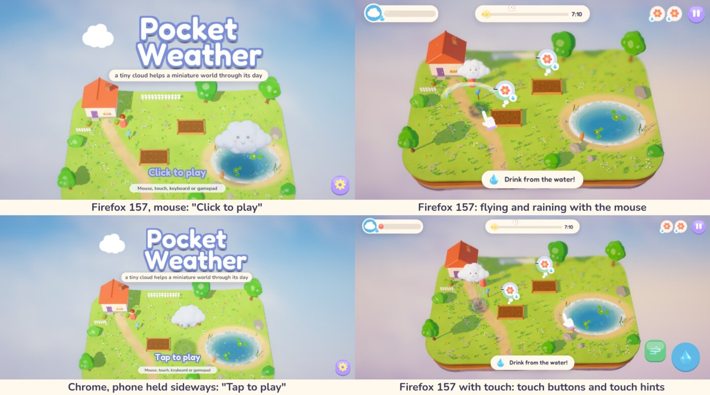

**The bug: on the web, rain notes all came from each track's first chord.** Both browsers log
"getFrequency() is not supported for compressed sound". A one-off log line showed that ten seconds
into a track Unity reported the music source's position as 0.00 s, in all 8 Chrome runs and 1 of
4 Firefox runs. The rain's notes, mote arpeggios and chimes take their pitches from the chord at
that position, so on the web they never followed the progression. The web player now counts the
track's time from when it started, on the audio clock; desktop players still read the source,
which was correct (10.01 to 10.07 s in the self-test's 16 log lines). In all six browser modes
the chords' clock now reads 10.0 to 10.3 s, matching the audio clock. `web_smoke` fails if it
falls behind. Nobody has heard the difference.

### R4-4. A title prompt that matches the device: done

The title said "Tap to play" everywhere. It now starts from the same guess as the first hints
and follows the device used next: "Tap to play", "Click to play", "Press Enter to play" or
"Press A to play". A tap's synthesised mouse movement doesn't count as a mouse. The keyboard,
gamepad and touch self-tests check the wording after their first input. `web_smoke` checks it
before any input: "Tap" on emulated phones and touch desktops, "Click" with a mouse in Chrome and
Firefox.

### R4-5. Colour-blind check: one fix needed, one judged acceptable

The state colours were simulated for protanopia, deuteranopia and tritanopia (Machado, Oliveira
and Fernandes 2009, full severity), with the CIELAB difference between states measured:

| States (dE76) | normal | protanopia | deuteranopia | tritanopia |
| --- | --- | --- | --- | --- |
| ring: thirsty / just right | 62.3 | 57.8 | 55.1 | 11.3 |
| ring: just right / soggy | 92.6 | 18.3 | 16.8 | 99.7 |
| tray: met / problem tint | 35.6 | **6.9** | **3.5** | 36.6 |

- **The needs tray was the problem.** For red-green colour blindness the met and problem tints
  are nearly the same colour, so the tick and "!" over the item's edge had to carry the meaning.
  They were faint: 21 to 26 L* of contrast against the tint. They now sit on a white disc with an
  ink edge, a shade deeper, for 40 to 51 L* in both simulations (measured on the Day 2 band
  capture). The tints stay.
- **The bed ring is acceptable as it is.** Just right and soggy look alike in both red-green
  simulations, but a soggy bed's fill runs past the notch and its icon becomes a puddle. Thirsty
  and just right differ least for tritanopia (11.3), which is rare, and the fill's position
  against the band still tells them apart.
- This was checked by simulation, not by colour-blind players.

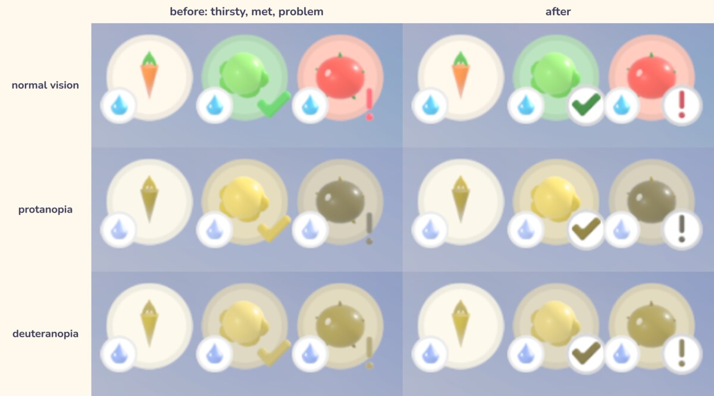

### Also changed

- `web_smoke` now waits for the browser to exit before deleting its throwaway profile. Before,
  most Chrome runs left a `Recordings/chrome-profile-*` folder behind.

### Found along the way, not fixed

- **A double-clicked Linux release hangs on this machine** for the reason R4-2 works around, and
  the v0.1.0 zip has no launcher. Releasing a new zip is the owner's decision.
- **Phone landscape legibility** (from planning): at 844x390 the HUD draws at 0.36x, so the
  smallest text is about 9 to 11 CSS px and the pause button about 36 CSS px. That needs a real
  phone before redesigning.
- Unity's WebGL player also logs "Trying to get length of sound which is not loaded yet" at
  boot and on scene changes, in both browsers. No missing sound was traced to it.

## Round 5 scope

Planned 2026-10-06 on `improvements-5`, from `main` at `9f8997c` (round 4 merged, `main` equal to
`origin/main`). Rounds 1 to 4 made the web build ready to host and fit for phones, so the player
this round has in mind is someone who opens a link on their phone. Before planning I measured
the HUD at a phone's size and probed the web build in headless Chrome:

- **The HUD is below phone guidelines in landscape.** At 844x390 CSS px (a typical phone on its
  side) the HUD draws at 0.36x: the pause button is 33 px (Apple asks for 44 pt, Material for
  48 dp), the clock's digits are 12 px, and the tray's items are 30 px with 13 px badges. Held
  upright (390x844) it's smaller still, at 0.325x. Most of the screen's width is free beside the
  island. Menus are better off: their smallest text is 28 to 30 design px (10 to 11 CSS px), and
  their buttons are 33 px tall or more. So this round enlarges the HUD only.
- **The web game keeps playing its music in a hidden tab.** With the game's tab hidden (another tab
  in front, which is also what a phone does when you switch apps), the game freezes but its
  AudioContext keeps running: its clock advanced 6.0 s in 6 s hidden, so the music and ambience
  loop on, and if Pip was raining, so does the rain. Unity's WebGL audio has no visibility
  handling.
- **Not a bug:** round 4's "Trying to get length of sound which is not loaded yet" warnings. A
  Web Audio probe showed the ambience, the three loops, the music and the rain notes all start in
  Chrome. The warnings come at music changes.
- **Not worth it:** a smaller download from the icons. Their uncompressed textures shrink to
  1.5 MB under Brotli, less than the PNGs.

### R5-1. A HUD sized for phones

**What:** the HUD's pieces never draw smaller than about 0.48 CSS px per design unit while the
screen has room for them. That makes the pause button 44 px. The gauge, sun track, tray, pause
button, hint and toast are scaled together by a factor k (at most 1.4). k is worked out from the
canvas's scale in CSS px: on the web, a small plugin reports the canvas's real pixels per CSS
pixel; elsewhere it's 1. The tray still shrinks to fit between the sun track and the pause button,
and the sun track gets shorter on small screens to leave it room. Bubbles grow less (at most
1.2x), because they sit over the island. The touch buttons already measure 51 to 69 px and stay
as they are. Desktop windows are untouched (k = 1 at 1280x720 and above). Held upright, the tray
moves to a third row if it doesn't fit beside the gauge. If that turns out messy, portrait is left
as it is and reported.

**Acceptance:**
- The UI audit runs at two more sizes, 844x390 and 740x360 (phones on their side, as the Linux
  window stands in for CSS px). There, on Days 1, 4 and 12, it fails unless the pause button is at
  least 43.5 px and the clock's text at least 15 px. It also fails if any tray item is smaller than
  before this round, or if the HUD pieces overlap.
- At 1600x900, 1600x720 and 1200x900 the audit logs k = 1. The landscape before/after screenshots
  differ only by animation.
- `web_smoke --phone` logs the HUD's scale in CSS px and fails below 0.47.
- The full self-test passes.

**Verify:** the UI audit at seven sizes, before/after screenshots at 844x390 (and 390x844), and
web smoke on desktop and phone.

### R5-2. The web game goes quiet when it's hidden

**What:** the page suspends the game's audio when it's hidden and resumes it when it comes back.
Play is paused by then anyway, by round 1's focus handling. The web music clock (round 4) already
runs on the audio clock, so the rain's chords stay in step.

**Acceptance:** `web_smoke` (Chrome) hides the page in the middle of play by opening a tab in front
of it. It fails if the game's audio clock moves more than 0.3 s in 3 s hidden, if the clock doesn't
run again after the page returns, or if the "music clock" check fails. Firefox runs the same check
if WebDriver BiDi can hide a tab; otherwise that's reported.

### R5-3. Fullscreen on phones in the browser

**What:** on a phone in the browser, the first tap asks for fullscreen. Held sideways in Chrome on
Android, the address bar takes about 56 of 390 CSS px. Settings → Fullscreen shows the real state
and can turn it off. Desktops, and phones whose browser can't do it (iPhone Safari), are left
alone.

**Acceptance:** `web_smoke --phone` fails unless the page is fullscreen after the first taps and the
game keeps playing (postcard, play, rain). `--mouse` and desktop runs must not go fullscreen.
`--portrait` still shows the "turn sideways" card. Not verifiable here: real Android and iOS
browsers.

### R5-4. Small: settings that stick on the web

**What:** the browser keeps PlayerPrefs only when the game asks it to save, so the music mute (M)
is saved when it's toggled, as the settings screen's changes already are.

**Verify:** by reading the code: every PlayerPrefs write outside the settings screen is followed by
a save.

### Not in this round

- Menus at phone size (10 to 11 CSS px for the smallest text). They're readable, and enlarging
  them means re-laying out every screen for a shorter canvas. That needs a real phone to judge.
- Safari/WebKit, real phones and controllers, audio by ear, Encore tuning: these need people or
  the owner.

## Round 5 results

Implemented on `improvements-5` in two commits: the phone-sized HUD (R5-1), then the web page's
changes (R5-2 and R5-3 together, because they share the page and its smoke test). Screenshots are
in [`docs/media/improvements/round5/`](media/improvements/round5/). The machine's load average
was 17 to 64 during the round (other sessions' builds); runs are noted with their load below.

The full self-test passed on the final Linux build (load average 20 to 40 while it ran):
- validator and loop seams
- keyboard 35, gamepad 26 and touch 21 checks
- the UI audit at seven sizes, 19 checks each (two new landscape phone sizes, 844x390 and
  740x360)
- the AutoPilot campaign 12/12 with 11/12 delights (the wedding bouquet catch, as before), no
  exceptions
- prefs in the game's own folder

`web_smoke` passed on a fresh web build of the final code in all six modes (Chrome desktop,
`--mouse`, `--phone` and `--portrait`; `--firefox` and `--firefox --phone`) with 0 console errors.
The up-front download is still 20.9 MB. The real prefs files' `pw.` entries were identical before
and after the round, and the game's own prefs file was byte-identical.

### R5-1. A HUD sized for phones: done, both orientations

- The top bar (gauge, sun track, tray, pause), the hint and the toast now sit in one container,
  scaled up together until the HUD is 0.48 CSS px per design unit, at most 1.5x. On the web, a
  plugin reports the canvas's pixels per CSS pixel (1.5 on an emulated phone, 2 in Firefox's).
  Desktops keep 1x.
- On a phone-sized top bar the sun track is shorter (420 instead of 620 units), and it moves left
  only as far as the tray needs to fit at full size. Held upright, the tray takes a third row.
- Bubbles grow up to 1.2x. A bubble of a need at the back of the island now waits just below the
  top bar instead of under it (the scaled bar covered Day 12's boat in the first try).
- Held upright, the hint now sits above the touch buttons. A long hint already ran into the gust
  button at 390x844 before this round.
- Measured by the UI audit (the Linux window stands in for CSS px; load 22 to 26):

  | Screen | Top bar | Pause button | Clock | Tray items, Day 12 (old layout) |
  | --- | --- | --- | --- | --- |
  | 844x390 | x1.33 | 44.2 px (was 33) | 16.3 px (was 12) | 40.3 px (30.3) |
  | 740x360 | x1.44 | 44.2 px | 16.3 px | 34.6 px (28.0) |
  | 390x844 | x1.48 | 44.2 px | 16.3 px | 40.3 px (27.3) |
  | 1600x900, 1600x720, 1200x900, 720x1280 | x1.00 | unchanged | unchanged | unchanged |

- The audit fails on a phone-sized screen (short side 500 CSS px or less) if the pause button is
  under 44 px, the clock under 15 px, or any tray item smaller than the old layout drew it, worked
  out from the old numbers. It also fails if a desktop-sized screen gets scaled, and it checks
  Days 1, 4 and 12 and a long hint against the touch buttons. 19 checks pass at each of seven
  sizes.
- At 1600x900, captures of the old and new code differ by 0.1 to 0.5% of pixels on the HUD
  screens (fuzz 8%). The postcard differs by 2.7%, because the capture caught its slide-in at
  another moment.
- `web_smoke --phone` logged 0.480 CSS px per design unit (canvas 1266x585 at 1.5 px per CSS px),
  `--portrait` 0.481, and Firefox's phone window 0.480 at 2 px per CSS px.

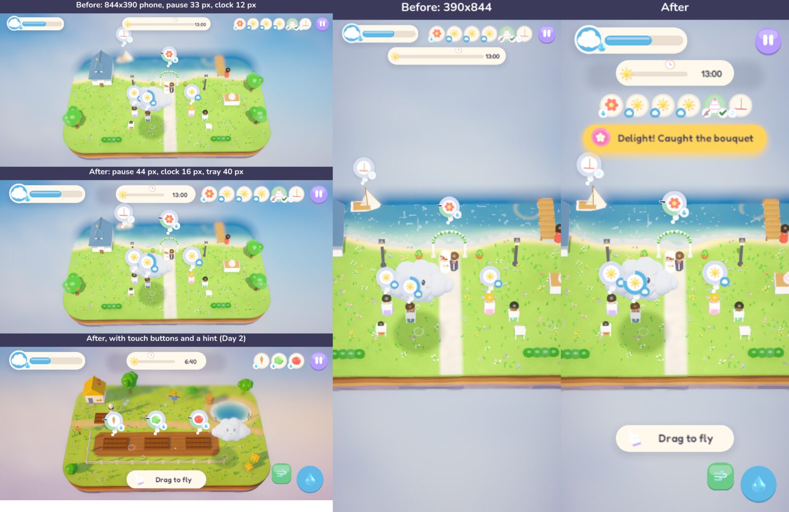

Not judged: whether 44 px feels right under a real thumb, and whether the bigger top bar in
portrait (three rows, about a fifth of the screen) crowds the island on a real phone.

### R5-2. The web game goes quiet when it's hidden: done

- The page keeps hold of the audio contexts the game creates, by wrapping `AudioContext` before
  Unity's loader runs, and suspends them while the page is hidden.
- In every browser mode, `web_smoke` hid the page behind another tab for 3 s. The audio clock
  moved 0.00 s (before the fix, 6.0 s in 6 s), was running again within 2.5 s of coming back, and
  the game logged that play had paused itself. That covers Chrome desktop, touch desktop, phone and
  portrait, and Firefox mouse and phone.
- It turned up a bug of its own. Hiding the page ends fullscreen (R5-3), and Unity then drew a
  black screen on return until the canvas changed size. So after a fullscreen change, the page
  nudges the canvas by a pixel for two frames when it's shown again. `web_smoke` now measures
  the screenshot taken on return and fails if it's black: brightness 0.00 before the nudge, 0.59
  to 0.63 after.

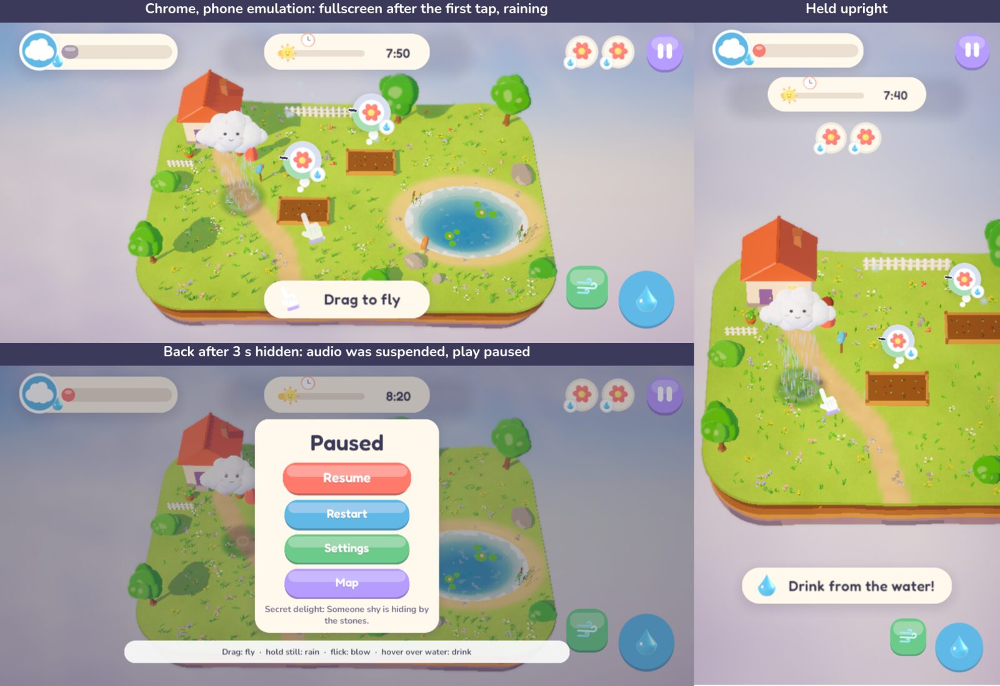

### R5-3. Fullscreen on phones in the browser: done

- On a phone, the first touch on the game asks for fullscreen of the whole page, once a visit.
  The page's existing phone test is the same one the "turn sideways" card uses. Unity's Settings →
  Fullscreen now targets the same element (`fullscreenElementID`). The toggle shows the real state
  each time the settings open; before, it showed the state at boot.
- `web_smoke --phone` and `--portrait`: the page is fullscreen after the first tap, and the game
  logs "fullscreen: on". It then plays on: postcard, play and rain. Chrome desktop (touch and
  mouse) and Firefox stay windowed. Firefox's phone mode can't report touch points here, so the
  page treats it as a desktop, and the test says so instead of checking.
- Leaving the tab ends fullscreen, and the game doesn't ask again in that visit. Settings →
  Fullscreen brings it back.
- Not verifiable here: real Android Chrome (whether `navigationUI: "hide"` gives the full
  height), Samsung Internet, and iPhone Safari, which has no fullscreen for pages and should just
  carry on.

### R5-4. Settings that stick on the web: not needed

Reading the code showed that the mute key already saves (`GameSettings.ToggleMusicMute` calls
`Save`), and the settings screen saves on Done, Esc and B. Nothing outside it writes a setting
without saving, so nothing was changed.

### Found along the way, not fixed

- The web build's "Trying to get length of sound which is not loaded yet" warnings come at music
  changes. A Web Audio probe showed every kind of sound starting, so they look harmless, but which
  call raises them wasn't pinned down.
- On desktops the needs tray still shrinks on Days 10 to 12 (to 0.86 at 1600x900), because the
  sun track stays centred there. Moving it left as on phones would let the tray keep full size,
  but that changes the desktop layout, which this round left alone.

## Round 6 scope

Planned 2026-10-07 on `improvements-6`, from `main` at `b08a7aa` (round 5 merged, `main` equal to
`origin/main`). Round 5 left three things open that a player would notice, and each can be
checked here. Before planning I captured the round 5 build's menus at 844x390 and 740x360 (phones
on their side; the Linux window stands in for CSS px) and Day 12 at 1600x900:

- **Menus on a phone held sideways are small.** The menu canvas draws at 0.36x (844x390) and 0.33x
  (740x360), so its smallest text (26 to 30 design units) is 8.7 to 10.8 CSS px, while two thirds
  of the screen's width is empty beside the panels. Settings (1060 units tall) and pause (panel plus
  controls strip) already fill the height, so they can't simply be drawn bigger.
- **On a desktop, Day 12's needs tray is drawn at 0.86x** (and Days 10 and 11 shrink too), because
  the sun track stays centred. On phones round 5 moves it left as far as the tray needs.
- **A phone that switches apps loses fullscreen for the rest of the visit.** The page asks once
  per visit, so after coming back the browser's bars stay until Settings → Fullscreen.

### R6-1. The desktop tray keeps its full size

**What:** in landscape on every screen size, the sun track moves left (never closer than the gauge)
as far as the tray needs to fit at full size, as it already does on phones. Days with few needs keep
the centred sun track.

**Acceptance:** the UI audit fails if the tray is shrunk on Day 12 at 1600x900, 1600x720 or
1200x900 (it logs 0.86 today), and its overlap checks still pass at all seven sizes. Days 1 and 4
keep a centred sun track (1600x900 before/after captures differ only by animation).

**Verify:** the UI audit at seven sizes, before/after captures of Days 1 and 12 at 1600x900.

### R6-2. Fullscreen comes back after switching apps

**What:** on a phone in the browser, if fullscreen ended while the page was hidden (switching apps,
the lock screen), the next tap on the game asks for it again. Leaving fullscreen on purpose (the
back gesture, Esc, or Settings → Fullscreen) while the game is showing still sticks for the visit.

**Acceptance:** `web_smoke --phone` (and `--portrait`) hides the page for 3 s as before, then taps
the game and fails unless the page is fullscreen again; then it leaves fullscreen with the page
showing, taps again, and fails if the page goes back to fullscreen. Desktop and `--mouse` runs
still never go fullscreen. Not verifiable here: real Android browsers, iPhone Safari (no page
fullscreen at all).

### R6-3. Menus readable on a phone held sideways

**What:** in landscape, when the menu canvas would draw under 0.44 CSS px per design unit, it's
scaled up to reach that (at most 1.35x), like round 5's HUD; desktop windows keep 1x. The design
area then shrinks to about 820 to 890 units tall, so the screens that don't fit get a short layout:
settings in two columns, pause with its four buttons in a 2x2 grid, the map's grid a little smaller
with its corner buttons lower, and the ending's card higher. The postcard, results, sunset card and
title fit as they are. Text under 28 units goes up to 28 in the short layout. Portrait is left as
it is this round (its menus would need re-laying out for a narrower width too) and reported.

**Acceptance:**
- The UI audit measures every visible menu text on every screen (title, map, postcard, Encore
  postcard, pause, settings, results, sunset, ending) and, on a phone-sized landscape screen, fails
  if any is under 11.5 CSS px. It also fails if any text or control sits off screen, or if two
  controls overlap, at all seven sizes.
- At 1600x900, 1600x720 and 1200x900 the menu scale is 1 (logged), and before/after captures of
  every menu differ only by animation.
- `web_smoke --phone` logs the menu canvas's scale in CSS px and fails below 0.43.
- The keyboard, gamepad and touch self-tests (which drive the menus) pass at their usual size, and
  the touch test passes at 844x390 too.

**Verify:** the UI audit at seven sizes, before/after captures of every menu at 844x390, 740x360 and
1600x900, reviewed by eye, and web smoke on desktop and phone.

### Not in this round

- Portrait menus (8.5 to 9.8 CSS px text at 390x844): they need a narrower layout as well as a
  shorter one. The page already suggests turning the phone sideways.
- Real phones, Safari, controllers, audio by ear and Encore tuning still need people or the owner.
- Hosting, releases and tags, the trailer, licences and Windows Build Support are the owner's.

## Round 6 results

Implemented on `improvements-6`, one commit per item. Screenshots are in
[`docs/media/improvements/round6/`](media/improvements/round6/). The machine's load average was
6 to 83 during the round (other sessions' builds); runs are noted with their load where it
matters.

The full self-test passed on a Linux build with all three items (load 14 to 21 while it ran):
- validator and loop seams
- keyboard 35, gamepad 26 and touch 21 checks
- the UI audit at seven sizes, 19 checks each (with this round's new text, overlap and tray
  checks folded into them)
- the AutoPilot campaign 12/12 with 11/12 delights (Day 6's rainbow, the timing-dependent one), no
  exceptions
- prefs in the game's own folder

`web_smoke` passed on a fresh web build of the final code in all six modes (Chrome desktop,
`--mouse`, `--phone` and `--portrait`; `--firefox` and `--firefox --phone`) with 0 console errors,
at load 17 to 66. The up-front download is still 20.9 MB. The phone runs first failed because the
test's own taps missed the bigger Start button: web_smoke maps design units to page pixels itself,
and now reads the menu scale the game logs. Every tool run used a throwaway config folder in
`Recordings/`. The real prefs files' `pw.` entries were identical from before the full self-test to
the end of the round (the snapshot was taken mid-round, after the first audits and captures, which
were sandboxed the same way).

### R6-1. The desktop tray keeps its full size: done

- In landscape, the sun track now moves left (never closer than the gauge) whenever the tray needs
  the room, on every screen size; before, only phone-sized screens did. Days with few needs keep it
  centred.
- Day 12's tray at 1600x900 and 1200x900 is drawn at x1.00 (it was x0.86); at 1600x720 it was
  already full size. The UI audit now fails if a desktop-sized landscape screen shrinks the tray.
- 1600x900 captures of Day 1 differ from round 5's by 0.1% of pixels (fuzz 8%, animation); Day 12
  by 0.5%, the moved sun track.

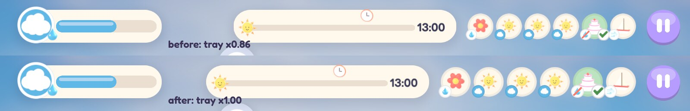

### R6-2. Fullscreen comes back after switching apps: done

- If fullscreen ended while the page was hidden, the next tap on the game asks for it again.
  Leaving fullscreen with the game showing (back gesture, Esc, Settings → Fullscreen) still sticks
  for the visit.
- The first try didn't work, and web_smoke caught it: Chrome ends fullscreen before the page is
  hidden but fires `fullscreenchange` only once the page is showing again, so at the moment of
  hiding the page seemed never to have been fullscreen. The page now goes by the last state it was
  told about.
- `web_smoke --phone` and `--portrait`: after 3 s behind another tab the page came back windowed;
  the next tap made it fullscreen again; after `document.exitFullscreen()` with the page showing,
  a tap left it windowed. Chrome desktop (touch and mouse) and Firefox never went fullscreen.
  Firefox's phone mode can't pose as a touch-screen phone, so it reports the check as not run.
- Not verifiable here: whether real Android browsers order these events the same way, and iPhone
  Safari, which has no page fullscreen.

### R6-3. Menus readable on a phone held sideways: done, landscape only

- In landscape, when the menus would draw under 0.44 CSS px per design unit, their canvas is scaled
  up to reach it, at most 1.35x and never so far that fewer than 1600 design units fit across. That
  is x1.22 at 844x390 and x1.32 at 740x360; desktops (1280x720 and up) and portrait stay at x1.00.
- The shorter design area (820 to 890 units tall) gets short layouts, switched whenever the scale
  changes: settings in two columns, pause with its buttons in a 2x2 grid and the controls line just
  under it, the map without its subtitle, its cards at 0.88x and its corner buttons a little lower,
  the ending's card higher with the button and credits below the couple's rainbow, and 26-unit text
  up to 28. The title, postcards, results and sunset card fit as they were.
- Smallest menu text, measured by the UI audit on every menu screen:

  | Screen size | Before | After |
  | --- | --- | --- |
  | 844x390 | 9.4 CSS px (title, ending credits); 10.1 to 10.8 elsewhere | 11.6 (map cards); 12.3 to 13.2 elsewhere |
  | 740x360 | 8.7 to 10.0 (computed from the same sizes) | 11.6 (map cards); 12.3 to 13.2 elsewhere |
  | 1600x900 | 21.7 | 21.7 (unchanged) |
  | 390x844 (portrait) | 8.5 to 9.8 | 8.5 to 9.8 (not changed this round) |

- The UI audit gained checks that run on every screen at every size: no two controls overlap, no
  menu text is off screen or runs into a control it isn't part of, the smallest text is 11.5 CSS
  px or more on a phone held sideways, and desktop menus aren't scaled. Run against round 5's
  layout (the scale switched off), they failed only on text size at 844x390, and passed at
  1600x900.
- 1600x900 captures of all nine menu screens differ from the round 5 layout's by at most 0.6% of
  pixels (fuzz 8%; the title's and ending's animation).
- The touch self-test, which taps through the title, settings and pause menus, passed 21/21 in an
  844x390 window too.
- A new `-pwScript menus` capture shoots every menu screen at any window size.

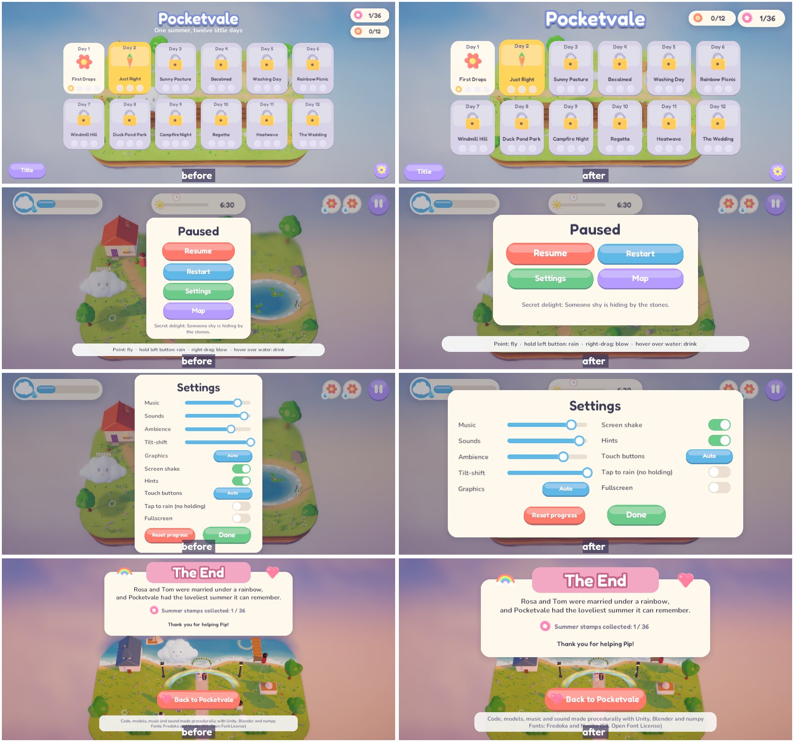

In the browser, `web_smoke --phone` logged the menus at 0.440 CSS px per design unit (x1.22 on a
1266x585 canvas at 1.5 px per CSS px), and Firefox's phone window the same at 2 px per CSS px.
Below: the pause menu on the emulated phone, after the page came back from another tab and the
next tap made it fullscreen again (R6-2).

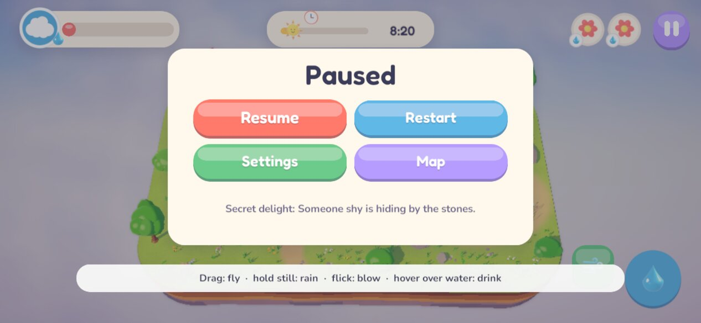

Not judged: whether the bigger menus feel right in the hand on a real phone. Held upright, the
menus' smallest text is still 8.5 to 9.8 CSS px; they'd need a narrower layout as well as a shorter
one.

### Found along the way, not fixed

- The Unity editor rewrites `~/.config/unity3d/Pocketvale Studio/Pocket Weather/prefs` on every
  batch build: that's where the editor keeps the project's player prefs too, and it stores two keys
  of its own there (`unity.cloud_userid`, `UnityGraphicsQuality`), no game settings or progress. A
  player who builds from source on the machine they play on shares that file with the editor.

## Round 7 scope

Planned 2026-10-07 on `improvements-7`, from `main` at `3b7b827` (round 6 merged, `main` equal to
`origin/main`). Before planning I built HEAD and captured every menu held upright at 390x844, and
every day at 844x390 and 390x844 (the Linux window stands in for CSS px; throwaway config folders
in `Recordings/r7/`). I also ran the Day 6 bot with a new log line saying where each rainbow lands
and who it covers:

- **Held upright, the menus are landscape cards shrunk to fit the width.** At 390x844 the menu
  canvas draws at 0.325 CSS px per design unit, so the postcard's story is 11.7 px, its "Today,
  help" and par line 9.8 to 10.4 px, and the pause menu's controls line 9.1 px, with half the
  screen's height empty above and below. Round 6 left this because the screens need a narrower
  layout, not only a shorter one.
- **A hint can run off a narrow screen.** Day 5's "Blow the washing dry (right-drag)" is wider than
  a 390-wide screen and loses both ends. The UI audit only tries the touch wording ("(flick)"),
  which fits. The keyboard and gamepad wordings, and the mouse wording on a portrait tablet or a
  narrow desktop window, don't.
- **An Encore's postcard shows the ordinary day's best time.** Encores have no best time of their
  own, so the scorcher's postcard says "Your best: 10:40" for a time set on the ordinary day, and
  the Encore's results card never says whether you beat anything.
- **Day 6's rainbow delight is not a game bug as far as I can tell.** Run alone, the bot found it
  4 times in 4, and in 2 runs of Days 1 to 6 back to back, twice more. Each time the arc was centred
  about 0.5 units from Rosa, covering her with 1.3 units to spare. Round 6's miss came in a full
  campaign under load. The log line stays, so a future miss shows where the rainbow went.

### R7-1. Menus on a phone held upright

**What:** held upright, when the menus would draw under 0.44 CSS px per design unit, the menu
canvas is scaled up to reach it (at most 1.4x), like round 6 did held sideways. On a 390-wide
phone that leaves a design area about 890 units wide and 1900 tall, so the screens get narrow
layouts:
- the title's logo is smaller
- the map has three cards a row, with the stamp pills under its title
- the postcard is taller, with its rows stacked
- the pause menu's controls line wraps in a narrower strip
- the results card puts its stamps closer together
- the sunset card and the ending wrap their lines

Landscape layouts and larger portrait windows (720x1280 on a desktop) don't change.

**Acceptance:**
- The UI audit fails on any phone-sized screen held either way (short side 500 CSS px or less) if
  any menu text is under 11.5 CSS px. At 390x844 it was 9.1 px.
- The audit also fails, at all seven sizes, if any text or control is off screen, two controls
  overlap, or text runs into a control.
- The audit adds Day 12's postcard (the most needs in a row) and an Encore's results card.
- At 1600x900, 1600x720, 1200x900 and 720x1280 the menus stay x1.00, and before/after captures
  differ only by animation.
- `web_smoke --portrait` logs the menus' scale and fails below 0.43 CSS px per design unit.
- The touch self-test passes in a 390x844 window.

**Verify:** the UI audit at seven sizes, before/after captures of every menu at 390x844 reviewed
by eye, and web smoke on desktop, phone and portrait.

### R7-2. Hints that always fit

**What:** a hint caption never gets wider than the screen leaves it. Its text shrinks (no lower
than about 70%) or wraps to a second line instead.

**Acceptance:** the UI audit shows the longest wording of every hint for each device (mouse,
keyboard, gamepad and touch), and fails if any caption is off screen or runs into the touch
buttons, at all seven sizes. It fails on today's build at 390x844.

### R7-3. Encores keep their own best time

**What:** an Encore records its own best finishing time. The Encore postcard shows "Scorcher best"
from Encores only (and nothing until one is saved), and the Encore's results card says "a new
best!" or what the best is, as ordinary days do. A save from before this round loads unchanged,
with no Encore best yet.

**Acceptance:** the keyboard self-test saves an Encore and checks that the scorcher best is
recorded and shown on its postcard. It also checks that the ordinary day's best is untouched, and
that a round-6 save loads with its stamps and no scorcher best.

### Not in this round

- Real phones, Safari, controllers, audio by ear and Encore difficulty still need people or the
  owner. R7-3 gives a skilled player something to beat, but doesn't retune the Encores.
- Hosting, releases and tags, the trailer, licences and Windows Build Support are the owner's.

## Round 7 results

Implemented on `improvements-7`, one commit per item, plus a touch fix the portrait checks turned
up. Screenshots are in [`docs/media/improvements/round7/`](media/improvements/round7/). Every tool
run used a throwaway config folder in `Recordings/`. The machine's load average was 15 to 51 during
the round; input-driven runs are noted with their load.

The full self-test passed on a Linux build of the final code (started at load 21, ended at 16):
- validator and loop seams
- keyboard 39, gamepad 26 and touch 21 checks
- the UI audit at eight sizes (360x800 added), 21 checks each
- the AutoPilot campaign 12/12 with 11/12 delights (the wedding bouquet catch, the bot's known
  weakness; Day 6's rainbow covered Rosa), no exceptions
- prefs in the game's own folder

`web_smoke` passed on a web build of the final code in all six modes (Chrome desktop, `--mouse`,
`--phone` and `--portrait`; `--firefox` and `--firefox --phone`) with 0 console errors. The
up-front download is still 20.9 MB. `--firefox --portrait` had never been run. It passed every
check except the "turn sideways" card: Firefox here can't pose as a touch phone, so the page
treats it as a desktop. It drew the narrow menus at 0.440 CSS px per design unit at 2 px per CSS
px, and played Day 1 from the narrow postcard. The real prefs files' `pw.` entries were
identical before the self-test and at the end of the round (the snapshot was taken mid-round;
every earlier run was sandboxed the same way).

### R7-1. Menus on a phone held upright: done

- Held upright, when the menus would draw under 0.44 CSS px per design unit, their canvas is scaled
  up to reach it: at most 1.4x, and never so far that fewer than 840 design units fit across. That
  is x1.35 at 390x844 and x1.40 at 360x800. Desktops, landscape phones (as in round 6) and 720x1280
  are unaffected.
- The narrow layouts:
  - **title:** the logo is drawn at 0.7x, with its subtitle line set bigger to read the same.
  - **map:** three cards a row, with the stamp pills side by side under the title.
  - **postcard:** taller, with the story wrapping over more lines and the par line, best time,
    stamps and buttons each on a row. Start sits in the middle until an Encore opens. A long needs
    row (Day 12's seven) draws closer.
  - **pause:** its controls line wraps in a narrower strip.
  - **results card:** stamps closer and smaller, buttons in a row across the bottom.
  - **sunset card and ending:** their lines wrap in narrower cards.
  - **settings:** already fit, so it's unchanged.
- Smallest menu text, measured by the UI audit on every menu screen:

  | Screen size | Before | After |
  | --- | --- | --- |
  | 390x844 | 8.5 CSS px (title credit, ending credits); 9.1 to 9.8 elsewhere | 12.3 (pause, results, ending); 13.2 elsewhere |
  | 360x800 | 7.8 (title credit, ending credits); 8.4 to 9.0 elsewhere | 11.8 |
  | 844x390, 740x360 | 11.6 | 11.6 (unchanged) |
  | 1600x900 | 21.7 | 21.7 (unchanged) |

- The UI audit's 11.5 CSS px floor now covers phones held either way. It also fails if a
  desktop-sized screen (short side 720 or more, 720x1280 included) scales its menus. It adds Day
  12's postcard and an Encore's results card to the screens it checks. All 21 checks passed at
  each of eight sizes (the seven before, plus 360x800).
- Landscape is unchanged: 1600x900 and 844x390 captures of all nine menu screens differ from the
  previous commit's by at most 0.41% of pixels (fuzz 8%; the title's and ending's animation).
- `web_smoke --portrait` logged the menus at 0.440 CSS px per design unit (x1.35 on a 585x1266
  canvas at 1.5 px per CSS px). It tapped the narrow postcard's Start and played Day 1, with 0
  console errors. It now fails below 0.43 held either way.

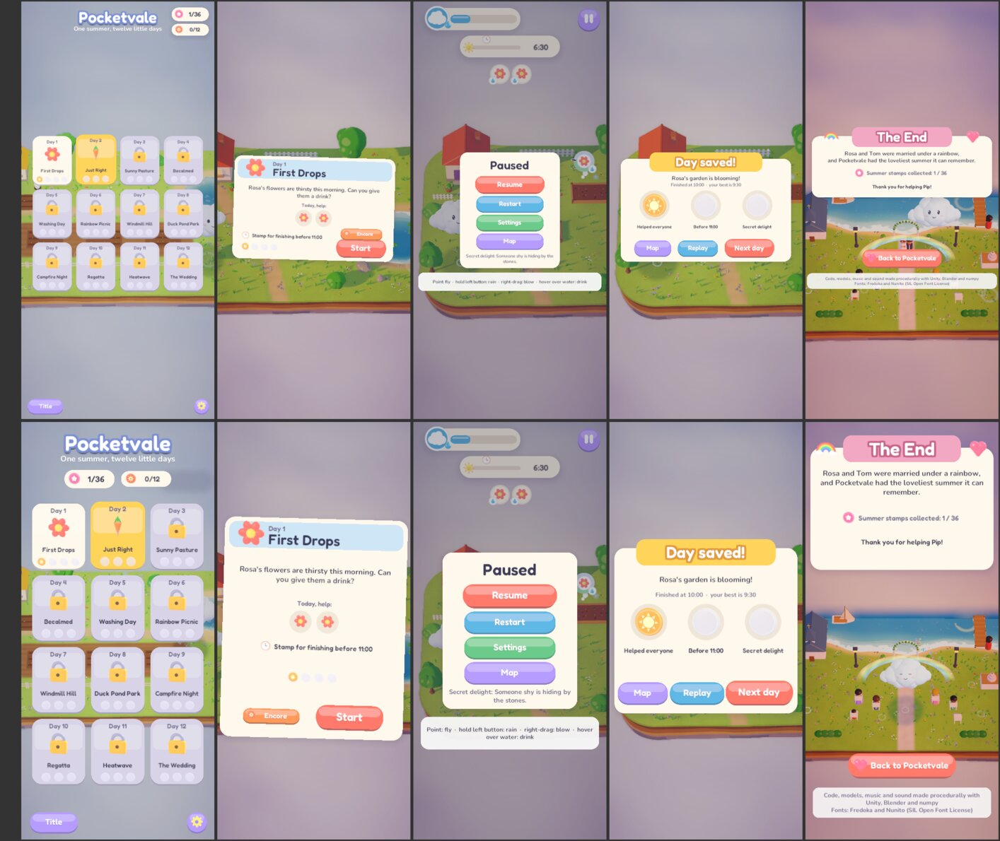

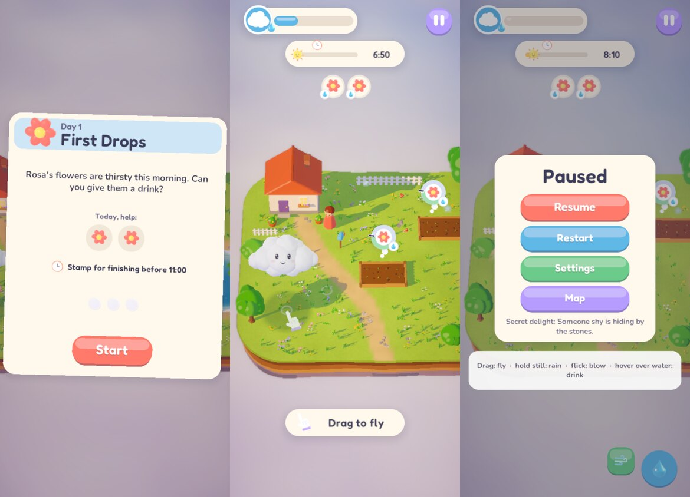

Not judged: how the narrow menus feel on a real phone. The page still suggests turning sideways.

### R7-2. Hints that always fit: done, with a HUD fix for 360-wide phones

- A hint or toast is sized to its text on one line if the screen has room. Otherwise the text
  shrinks (down to 75%), and as a last resort wraps onto two lines, leaving about 12 CSS px at
  each side. Held upright, the hint sits above the touch buttons however tall it is.
- **Before:** Day 5's mouse-worded hint filled a 390-wide screen edge to edge (99% of the width,
  2 px from each edge). On a 360-wide screen both "(right-drag)" hints ran off it. At 390x844 the
  delight toast "A rainbow for Rosa and Tom" also touched both edges.
- **After:** the widest caption is 88% of a 390-wide screen and 87% of a 360-wide one, at 0.84x
  and 0.75x of its usual size. None needed two lines. Landscape captions are unchanged (the widest
  is 44% of an 844-wide screen).
- The UI audit shows every hint in every device's words (34) and the 16 longest toasts. It fails
  if one is off screen or within 4 CSS px of its edges, runs out of its pill, shrinks below 75% or
  meets the touch buttons. Run on the old code it failed at 390x844 and 360x800; now it passes at
  all eight sizes.
- **Found on the way:** at 360x800, a common Android size, the HUD's top bar stopped at its 1.5x
  cap, so the pause button was 41.4 px. The cap is now 1.6x, and the pause button is 44.2 px. The
  self-test now runs the UI audit at 360x800 as well.

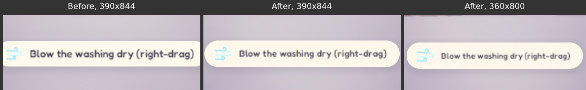

### R7-3. Encores keep their own best time: done

- An Encore records its own best finishing hour. A new save field, which a save from before this
  round reads as "none yet".
- The Encore postcard shows "Scorcher best: 11:15", and nothing until an Encore is saved; before,
  it showed the ordinary day's best. Its results card says "a new best!" or what the best is, as
  ordinary days do.
- The keyboard test (39 checks, was 35) gives Day 1 a best of 10:30, then saves its Encore through
  the real celebration. It checks that the scorcher's best is recorded and shown on the Encore
  postcard, that the day's own best is untouched and still shown on its postcard, and that a
  round-6 save parses with its stamps and no scorcher best.

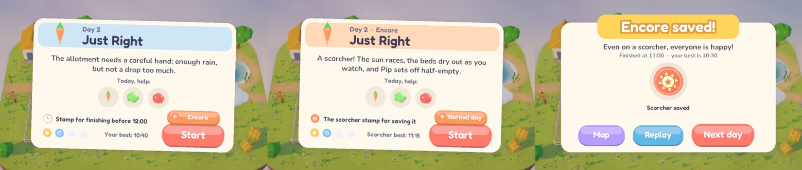

### Also changed: flicks on a phone held upright

- The touch self-test failed its flick checks at 390x844 in 3 of 5 runs, on this round's code and
  the round's starting point alike (load 20 to 26).
- Logging each release showed why. Flick distance and speed were measured in units of the screen's
  height, the long side of an upright phone, so the test's flick averaged 439 to 805 against a
  threshold of 700. A real flick held upright had to be about twice as long in pixels as the same
  flick on the same phone held sideways.
- They're now measured by the short side, which leaves landscape exactly as it was. The same flick
  measures about 2.2x more, and the test passed 4 runs out of 4 at 390x844 (load 16 to 19, lower
  than the failing runs). The still-finger test that starts rain uses the same unit, so it now
  matches landscape too.

### Found along the way, not fixed

- `web_smoke --firefox --portrait` can't check the "turn sideways" card, for the same reason
  `--firefox --phone` can't check fullscreen. Only Chrome's phone emulation exercises both.
- The bot still misses the wedding bouquet in some campaigns (11/12 delights this round).
- Not looked at again: the Encores' difficulty, which still needs people.

### Decisions for the owner (unchanged)

Hosting the web build, a new release zip (v0.1.0 predates all seven rounds), the trailer,
licences, signing and Windows Build Support.

## Round 8 scope

Planned 2026-10-07 on `improvements-8`, from `main` at `c3c89bf` (round 7 merged, `main` equal to
`origin/main`). Seven rounds made the game fit for phones and the web. This round turns to things
any player meets, on any device. Before planning I measured three of them:

- **The finale's bouquet gives a player nothing to go on.** "The bouquet!" appears as it's
  thrown, and it's in the air for 2.4 s. It flies about 2 units towards the camera, at a random
  angle of up to 40° either side, and counts only if it passes within 1.25 cloud radii of Pip in
  3D. Its arc rises well above Pip and comes down through Pip's height near the end. Nothing on
  screen shows where that will be, and from the tilted camera "on top of Pip" on screen isn't the
  same as on top of Pip in the world. A geometry check of the current rule (`Recordings/r8/bouquet_sim.py`)
  shows a still Pip catches it only within a patch of 2 to 9 square units, depending on how full
  Pip is. The expert bot, which computes the arc exactly, caught it in 5 of 6 runs of Day 12 on
  round 7's build (load 18 to 33), and it's the delight the bot has missed in recent campaigns.
- **One tap on Restart or Map throws away the day.** On a phone held sideways, the pause menu's
  2x2 grid puts Restart right beside Resume and Map right below it. Neither asks first, so a
  stray tap two minutes into the wedding sends you back to the start.
- **The web download is mostly meshes and ambience.** Round 7's web build is 21.0 MB before the
  title appears. Unity's build report puts meshes at 9.8 MB uncompressed (the twelve island
  terrains are 0.47 to 0.54 MB each) and sounds at 4.5 MB, of which the four ambience loops are
  2.4 MB. Ogg doesn't compress further, so those 2.4 MB arrive as they are. No model uses Unity's
  mesh compression.

### R8-1. A bouquet you can catch

**What:**
- When the bride cheers (1.2 s before the throw), the toast says "The bouquet! Catch it!", and a
  ring appears on the ground where the bouquet will come down through Pip's height. The ring stays
  until the bouquet lands.
- The bouquet also counts as caught once it's falling (past the top of its arc) inside Pip's
  shadow and no higher than Pip's top, so dropping into Pip from above is a catch.
- The game logs how close the bouquet came to Pip, so a miss can be traced.

**Acceptance:**
- The keyboard self-test throws the bouquet three times at fixed angles (left, straight, right)
  with an empty cloud (the smallest Pip), parked on the ring each time. It fails unless all three
  are caught. It throws a fourth with Pip parked 2.5 units from the ring, and fails if that's
  caught.
- The bot heads for the ring (what a player sees) instead of computing the arc. It catches the
  bouquet in 6 of 6 runs of Day 12 (5 of 6 before).
- The full AutoPilot campaign finds the wedding delight.

**Verify:** the keyboard test, six bot runs of Day 12 before and after, the full self-test, and a
capture of the ring in flight.

### R8-2. Restart and Map ask first

**What:** once a day has been played for 5 s or more, Restart and Map on the pause menu need a
second press. The first turns the button's label to "Sure?", as Settings' "Reset progress" does.
Pressing another button, moving the selection away or closing the menu puts it back. Under 5 s
there's nothing to lose, so one press still does it.

**Acceptance:** the keyboard self-test presses Restart once well into a day and fails unless the
game is still paused, on the same hour, with the button saying "Sure?"; a second Enter restarts the
day. It also checks that Map, pressed early in a fresh day, leaves at once. The touch self-test
taps Restart once and fails if the day restarts, then taps again and fails if it doesn't. The UI
audit checks the "Sure?" label fits its button at all eight sizes.

**Verify:** the keyboard, gamepad and touch self-tests, and the UI audit.

### R8-3. A smaller web download

**What:**
- The ambience loops leave the up-front download and arrive afterwards, as the music has since
  round 3. The web fetches the current scene's loop first and fades it in when it arrives. Desktop
  players open them from disk, as they do the music.
- The models use Unity's mesh compression if captures can't tell the difference.

**Acceptance:**
- The web download before the title is 17.5 MB or less (21.0 MB now).
- `web_smoke` passes in all six modes with 0 console errors, and logs that the title's ambience
  arrived and started.
- Captures of all twelve days at 1600x900 are reviewed against round 7's by eye, with the pixel
  difference measured. Mesh compression is left out if it shows (banding on the terrain, gaps,
  props floating or sinking).
- The AutoPilot campaign still passes 12/12, since ground heights come from the terrain meshes.
- On the Linux build, the ambience plays from its bundle (logged).

**Verify:** the web build's size report, web smoke in six modes, before/after captures, and the
full self-test.

### Not in this round

- Real phones, Safari, controllers, audio by ear and the Encores' difficulty still need people or
  the owner.
- Splitting each island's terrain into its own download (it would take most of the remaining
  meshes off the up-front download) needs the levels moved out of `Resources`. Left as a lead.
- Hosting, releases and tags, the trailer, licences and Windows Build Support are the owner's.

## Round 8 results

Implemented on `improvements-8`, one commit per item. Screenshots are in
[`docs/media/improvements/round8/`](media/improvements/round8/). Every tool run used a throwaway
config folder in `Recordings/`. The machine's load average was 15 to 74 during the round
(other sessions' builds); input-driven runs are noted with their load.

The full self-test passed on a Linux build of the final code (started at load 20, ended at 16):
- validator and loop seams (the ambience loops checked from their new folder)
- keyboard 45, gamepad 26 and touch 23 checks; the touch test also passed in 844x390 and
  390x844 windows (load 15 and 12)
- the UI audit at eight sizes, 22 checks each
- the AutoPilot campaign 12/12 with **12/12 delights**, the wedding bouquet included (caught at
  13:37), no exceptions
- prefs in the game's own folder

`web_smoke` passed on a web build of the final code in all six modes (Chrome desktop, `--mouse`,
`--phone` and `--portrait`; `--firefox` and `--firefox --phone`) with 0 console errors, at load 15
to 74. Each run checked that the ambience arrived and played. The real prefs files' `pw.` entries
were identical before the round's first tool run and after the last.

### R8-1. A bouquet you can catch: done

- The throw is now decided when the bride cheers, 1.2 s before the bouquet leaves her hands. A pink
  ring then marks the ground where its arc comes down through Pip's height, until it lands. The
  toast says "The bouquet! Catch it!" at the cheer, not at the throw. That gives a player 3.6 s
  to get there, where before they had 2.4 s and no idea where to go.
- It also counts as caught once it's falling into Pip from above: past the top of its arc,
  inside Pip's shadow and no higher than Pip's top. In the geometry check that adds 1 to 20% to
  the area a still Pip can catch it from. The ring and the extra warning are the main change.
- The game logs where the ring is and how close the bouquet came, so a miss can be traced.
- **Keyboard test:** with an empty cloud (the smallest Pip, radius 0.62) waiting on the ring,
  throws at -40°, 0° and 40° were all caught. A throw with Pip parked 2.5 units off the ring was
  not.
- **The bot** now waits on the ring, as a player would, instead of computing the arc. The first
  six runs caught 5 of 6. The miss, like round 7's baseline miss, came when the throw happened
  during one of the bot's own routines (shading a guest), so it never looked at the ring. Every
  routine now gives way to the ring, as a player would drop what they're doing. After that the
  bot caught it in **6 of 6** Day 12 runs (load 20 to 24): four of them in that early case, and
  one caught only by the new drop-in rule.

  | Day 12, six bot runs | Caught |
  | --- | --- |
  | Round 7 build (bot computes the arc) | 5 of 6 (load 18 to 33) |
  | Ring, bot waits on it | 5 of 6 (load 18 to 38) |
  | Ring, bot drops what it's doing when it appears | 6 of 6 (load 20 to 24) |

- `-pwCapture <dir> -pwScript bouquet` shoots the ring and the catch.

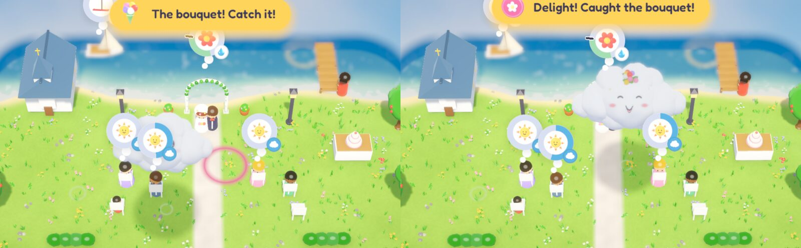

Not judged: whether a person sees the ring in time and finds 3.6 s enough. That needs people.

### R8-2. Restart and Map ask first: done

- Once a day has run 5 s, the first press on Restart or Map in the pause menu turns its label to
  "Sure?", as Settings' "Reset progress" does, and only a second press goes. Moving the selection
  off it, or reopening the menu, takes the question back. In the first 5 s one press still does
  it.
- **Keyboard test** (45 checks, was 39): one Enter on Restart 5.6 s into Day 4 left the day paused
  on the same hour, with the button saying "Sure?". Up took it back to "Restart", and two Enters
  restarted the day. Map 0.5 s into a fresh day left at once.
- **Touch test** (23 checks, was 21): one tap on Restart asked, the second restarted the day.
- **UI audit:** the pause menu with "Sure?" showing passed every check at all eight sizes (22
  checks each, was 21).

### R8-3. A smaller web download: done

- The four ambience loops moved out of `Resources` to `Assets/Ambience`, and each is built into
  its own asset bundle in `StreamingAssets/Ambience`, as the music has been since round 3.
  - The web fetches them after boot: the title's music first, then the meadow loop under it,
    then the rest. A loop fades in when it arrives, and its decoded samples are freed when
    another loop replaces it.
  - Desktop players open them from disk. On the Linux build every day's ambience logged
    "playing" in the screenshot tour.
- Every model now uses Unity's mesh compression (Medium).
  - 1600x900 captures of all twelve days, the title, map, postcard, pause, settings, sunset card
    and ending differ from the uncompressed build by 0.00 to 0.64% of pixels (fuzz 8%).
  - Mapped out on Day 7, the largest, all of the difference is animation: grass sway, water, the
    windmill's sails, the hint and the pointer hand. There's no banding on the terrain, and no
    props shifted or floating.
  - The keyboard test and the AutoPilot campaign, which depend on ground heights from the
    terrain meshes, still pass.

  | Web build | Round 7 | Round 8 |
  | --- | --- | --- |
  | Before the title (Unity's build report) | 21.0 MB | **17.0 MB** |
  | `Build/` folder, bytes | 21,894,837 | 17,611,158 |
  | of which the data file | 15.1 MB | 10.8 MB (about 2.4 MB of ambience and 1.8 MB of meshes) |
  | Fetched after boot | 7.9 MB of music | 7.9 MB of music, 2.4 MB of ambience |

- In `web_smoke` the meadow loop arrived 0.1 to 3.6 s after it was asked for (localhost, load 15
  to 74), and all four loops arrived in every mode.

- Booting on an emulated link (`web_smoke --throttle`, a fresh profile each run) took **19.8 s
  at 8 Mbps** (load 11) and **12.5 s at 20 Mbps** (load 15 at the start, 56 by the end).
  Earlier rounds recorded about 23.5 s and 14 s, but in other runs at other loads, and round 7's
  web build was overwritten before it could be timed alongside. 4.3 MB less is about 4.3 s less
  at 8 Mbps. The title's music arrived 1.9 s and 5.2 s after it was asked for, and the meadow
  loop 1.5 s and 3.3 s.

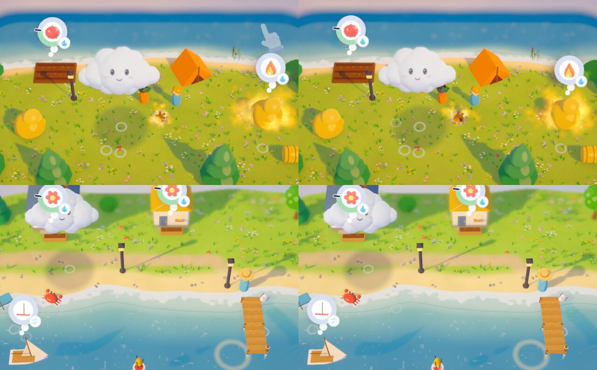

### Found along the way, not fixed

- In round 7's build, the bot's bouquet misses came when the throw happened while it was busy.
  A player doing something else when the bride cheers is in the same position. The ring and the
  earlier toast are meant for exactly that, but only people can say whether they're enough.
- The Linux build has a `proto` level's terrain (0.5 MB uncompressed) in `Resources`, used only by
  `-pwLevel proto`. It's in the web download too. Not removed, since tools still use it.

### Decisions for the owner (unchanged)

Hosting the web build, a new release zip (v0.1.0 predates all eight rounds), the trailer (it was
staged before the bouquet's ring and new toast, so a re-cut would show them), licences, signing and
Windows Build Support.

## Round 9 scope

Planned 2026-10-07 on `improvements-9`, from `main` at `a40f06d` (round 8 merged, `main` equal to
`origin/main`). Eight rounds made the game fit for phones, the web and every input. This round
looks at what happens when something goes wrong around the game: a controller that drops out, a
crash, a lost picture, a feature nobody is told about. Before planning I built HEAD and probed it
in a private, invisible KWin (`kwin_wayland --virtual`, its own socket, the real GPU), so no test
window reached the shared desktop:

- **The web page answers a crash with a developer's `alert()`.** Unity's loader listens for every
  `error` and `unhandledrejection` on the page, and with no `errorHandler` in the page's config it
  pops up "An error occurred running the Unity content on this page. See your browser JavaScript
  console…", whatever raised it (another script or a browser extension included). The page passes
  `showBanner`, which only logs.
- **A lost WebGL context leaves a dead screen.** Phones drop a page's GPU context under memory
  pressure or after a while in the background. Unity's framework has no `webglcontextlost`
  handling (checked in the round 8 build's `framework.js`), so the game would stop drawing and
  nothing would tell the player.
- **A controller that drops out doesn't pause the day.** The game pauses when it loses focus, but
  not when the gamepad in use disconnects (a wireless pad's battery or sleep timer), so the sun runs
  on while the player reaches for a cable.
- **Encores are never mentioned.** Saving a day opens its Encore, but the results card says nothing.
  "Next day" leads to the next day's postcard, which has no Encore yet, so a player only finds one by
  going back to a day they've saved.
- **The Linux player's startup crash under Wayland** (about one launch in 45, a known issue since
  round 1) exits with status 139: the player's crash handler prints a stack and re-raises SIGSEGV
  (checked by sending one to a running build). The launcher can see that and try again.
- Checked and fine: the UI audit passes all 22 checks at 2400x1000 (an ultrawide) and 1280x800 (the
  Steam Deck's screen), sizes it doesn't normally run.

### R9-1. Test windows in a private compositor

**What:** `Tools/nested.sh <command>` starts a private KWin on a virtual screen (its own Wayland
socket, nothing shown on the desktop), runs the command with that display and without `DISPLAY`,
and stops the KWin it started afterwards. `Tools/play.sh` runs every tool run (any `-pw`
automation flag) inside one when `kwin_wayland` is available, and `Tools/selftest.sh` runs all of
its windows inside one. `PW_NESTED=0` opts out. A plain `Tools/play.sh` still opens a normal window.

**Acceptance:** during a self-test the game's environment holds the private socket and no
`DISPLAY`; afterwards the KWin is gone and its socket removed; the full self-test passes this way.

### R9-2. A controller that drops out pauses the day

**What:** if the gamepad Pip is being flown with disconnects during a day, the day pauses, and the
pause menu's controls line says so ("Controller disconnected: reconnect it, or carry on with…").
When a pad comes back, the line shows the pad's controls again. A player using the mouse, keys or
touch isn't paused when an idle pad drops out.

**Acceptance:** the gamepad self-test removes its virtual pad mid-flight and fails unless the day
pauses with the message; adds one back and fails unless the line returns to the pad's controls and
B resumes; then, flying with the keyboard, removes the pad and fails if the day pauses.

### R9-3. Encores you can find

**What:** the first time a day is saved, its results card says the day's Encore is open, with the
Encore stamp: "Encore unlocked: play this day again on a scorcher, from its postcard." Later saves
of the same day don't repeat it.

**Acceptance:** the keyboard self-test saves a day for the first time and fails unless the note
shows, then saves it again and fails if it does. The UI audit adds the first-save results card and
must pass at all eight sizes (text on screen, inside the card, not touching the buttons, 11.5 CSS px
or more on phones).

### R9-4. A Linux launcher that tries again after a startup crash

**What:** `PocketWeather.sh` no longer `exec`s the game. If the game dies of a signal within 20 s
of starting, it starts it once more with the same arguments; any other exit, or a crash later in
play, ends the launcher with the game's status. SIGTERM and SIGINT sent to the launcher reach the
game.

**Acceptance:** `Tools/linux/test_launcher.sh` (run by `selftest.sh`) drives the launcher with stub
games: a crash at start is retried once with the arguments intact; two crashes stop after the
second with status 139; a clean exit, an exit with status 1 and a crash after the window are not
retried; a SIGTERM to the launcher ends the game. A real build boots through the launcher in the
private KWin.

### R9-5. The web page catches crashes and a lost picture

**What:** the page gives Unity an `errorHandler`. An error from the game's own files (or a
WebAssembly trap, abort or out-of-memory) shows a card in the game's style: "Pip got lost in the
clouds", saying stamps are saved, with **Reload** and a smaller **Try to carry on**. Errors from
anything else on the page are logged, not shown. Losing the WebGL context shows the same card with
Reload only ("Pip lost sight of Pocketvale"). The game logs a summary of its save at boot so a
reload can be checked.

**Acceptance:** in all six `web_smoke` modes, no browser dialog opens; a stray error event from
another script shows nothing; losing the context with `WEBGL_lose_context` shows the card within
1 s, and its Reload button boots the game again with the progress it had (the boot log's save
summary); an error event from the game's framework file shows the card. Screenshots of both cards.
Not verifiable here: a real phone losing its context, and Safari.

### Not in this round

- Splitting each island's terrain into its own web download: the build report puts meshes at 4.7 MB
  uncompressed of the 17 MB, so it would save perhaps 1.5 MB, for a level-loading change that
  touches every screen. Still a lead.
- Real phones, Safari, controllers, audio by ear and the Encores' difficulty still need people or
  the owner. Hosting, releases and tags, the trailer, licences and Windows Build Support are the
  owner's.

## Round 9 results

Implemented on `improvements-9`, one commit per item, plus a touch self-test fix that the new test
compositor turned up. Screenshots are in
[`docs/media/improvements/round9/`](media/improvements/round9/). Every game window this round
opened in a private KWin on a virtual screen (R9-1), and every tool run used a throwaway config
folder in `Recordings/`. The machine's load average was 12 to 64 during the round; input-driven
runs are noted with their load.

The full self-test, run inside its private KWin on a Linux build of the round's code (load 21 at the
start, 19 at the end), passed every row but one:
- validator and loop seams
- the Linux launcher with stand-in games (9 cases), and the real build booting through it
- keyboard 47 and gamepad 32 checks (were 45 and 26)
- the UI audit at eight sizes, 24 checks each (was 22)
- the AutoPilot campaign 12/12 with **12/12 delights**, no exceptions
- prefs in the game's own folder, and all 13 windows on the private KWin's display with no X11
- **touch: 22 of 23.** "Drag moves Pip to the finger" missed by 0.05 units. It's a pre-existing
  flake, not this round's code: in the private KWin round 8's code failed it 4 runs in 5 and this
  round's 3 in 5 (load 15 to 20). The check measured 0.05 s after the finger stopped, and Pip
  glides after a finger, so uneven frames left it a few hundredths short. It now gives Pip up to
  0.25 s (rain needs 0.38 s of a still finger, so it still checks before rain), and passed 6 runs
  out of 6 (load 15 to 18), plus once each at 844x390 and 390x844.

A second full self-test on the final code (load 11 at the start, 16 at the end) passed touch 23/23
and every other row, except the UI audit at 740x360: 23 of 24, a caption "with no visible glyphs"
(see below). After that fix, the UI audit passed all 24 checks at all eight sizes (load 14 to 15).

`web_smoke` passed in all six modes (Chrome desktop, `--mouse`, `--phone` and `--portrait`;
`--firefox` and `--firefox --phone`) on a web build of the round's code, with 0 console errors, at
load 24 to 64. The download before the title is still 17.0 MB (17,607,262 bytes in `Build/`).

### R9-1. Test windows in a private compositor: done

- `Tools/nested.sh <command>` starts `kwin_wayland --virtual` with its own Wayland socket under
  `dbus-run-session` (a probe without it showed the nested KWin joining the desktop's session bus),
  runs the command with that display and no `DISPLAY`, then stops the KWin by its own PID and
  removes its socket.
- `Tools/play.sh` runs every tool run (any `-pw` automation flag) inside one when `kwin_wayland`
  is installed, and `Tools/selftest.sh` runs all its windows inside one. `PW_NESTED=0` opts out. A
  plain `Tools/play.sh` still opens a normal window.
- The game logs which display it opened on, and the self-test fails unless every window went to
  the private one: all 13 did. Afterwards the KWin was gone and its socket and work folder removed.
- The virtual screen draws on the real GPU (the log names the Radeon 8060S).
- It also lets the UI audit run at sizes larger than the desktop: 2400x1000 (an ultrawide) and
  1280x800 (the Steam Deck's screen) passed all 22 checks during planning.

### R9-2. A controller that drops out pauses the day: done

- If the gamepad flying Pip is removed or disconnects during a day, the day pauses and the pause
  menu's controls line reads "Controller disconnected: reconnect it, or carry on with the mouse,
  keys or touch". A pad coming back puts the pad's controls back on the line. An idle pad dropping
  out while the keys or mouse are flying is ignored.
- **Gamepad test** (32 checks, was 26, load 25): removing the virtual pad mid-flight paused the day
  with the message, and the clock stayed put for 0.6 s; a new pad brought the pad's controls back,
  and B on it resumed. With the keys flying, removing the pad left the day running.
- The UI audit checks the menu with that line at all eight sizes (smallest text 11.8 CSS px at
  360x800).

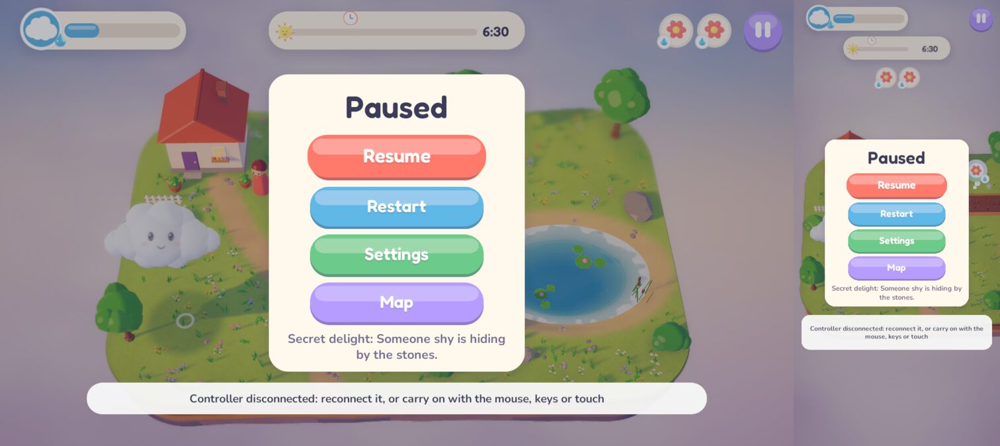

Not verified: a real wireless pad going to sleep. The Input System reports that as a removed or
disconnected device, which is what the test sends.

### R9-3. Encores you can find: done

- The first time a day is saved, its results card says "Encore unlocked! Play this day as a
  scorcher from its postcard." with the Encore stamp, in a pill between the stamps and the buttons.
  Later saves don't repeat it.
- **Keyboard test** (47 checks, was 45): saving Day 3 for the first time through the real
  celebration showed the note, and saving it again didn't.
- **UI audit:** the first-save card passes at all eight sizes. The first layout's note wrapped onto
  a second line at 1600x900 and spilled out of its pill, which the audit didn't catch, because it
  checked text against controls only. It now also fails if menu text spills out of the card, pill
  or button it's drawn on (a settings row's label beside its switch is allowed). The note is now
  one line on desktops and two inside a taller pill held upright.

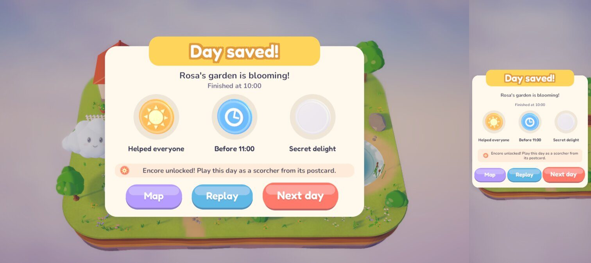

Not judged: whether players read it, and whether they then go looking for Encores.

### R9-4. A Linux launcher that tries again after a startup crash: done

- `PocketWeather.sh` runs the game as a child. If the game dies of a signal within 20 s of
  starting, it's started once more with the same arguments and the launcher says why. Any other
  exit, or a crash later in play, ends the launcher with the game's status. SIGTERM, SIGINT and
  SIGHUP to the launcher stop the game.
- `Tools/linux/test_launcher.sh` (run by the self-test) passed all 9 cases with stand-in games: a
  crash at start retried once with arguments intact (one containing a space); two crashes stop
  with 139; a clean exit, status 1 and a crash after the window aren't retried; SIGTERM stops the
  game with 143; no `-force-wayland` without Wayland. The stand-ins turn off core dumps; the first
  run, before that, left four small bash cores in systemd's store.
- **The real thing:** in the private KWin, the real build was started through the launcher and
  killed with SIGSEGV 2 s in. The launcher logged "the game stopped with status 139 while
  starting; starting it again", and the second start booted, ran its capture and quit with 0.
- Not seen: the Wayland backend's own crash being caught, since it happens about once in 45
  launches. Only bash (`/bin/sh` here) ran the launcher; dash (Debian and Ubuntu's `/bin/sh`)
  isn't installed, so `PW_SH=dash Tools/linux/test_launcher.sh` is there for a machine that has it.
- Probing the player's exit status during planning (a SIGSEGV sent to a running build) left one
  25 MB core of the game in systemd's coredump store, which systemd cleans up by itself.

### R9-5. The web page catches crashes and a lost picture: done

- The page gives Unity an `errorHandler`. Before, Unity's loader showed a developer's `alert()`
  ("An error occurred running the Unity content on this page…") for any error or unhandled
  rejection on the page, whoever raised it. Now:
  - an error from the game's own `Build/` files, or a WebAssembly trap, abort or out-of-memory,
    shows a card in the game's style, "Pip got lost in the clouds", saying stamps are saved, with
    **Reload** and a smaller **Try to carry on**;
  - anything else is logged and left alone.
- Losing the WebGL context (Unity's framework has no handling for it, so the game would just stop
  drawing) shows "Pip lost sight of Pocketvale" with Reload only.
- The game logs its save at boot ("save: 1 days played, 0 stamps, 0 Encore stamps"), so a reload
  can be checked.
- **web_smoke**, in all six modes: an error event from another script showed nothing; losing the
  context with `WEBGL_lose_context` showed the card in 21 to 227 ms; its Reload booted the game
  again with the day it had played; a pretend trap from the framework file showed the card, and
  "Try to carry on" closed it. No browser dialog opened. Run against round 8's page, the same
  checks found Unity's alert and no card.
- After the build, two lines of CSS changed (a shadow under Pip's icon and a sky-blue focus ring).
  They were copied into the built page byte for byte rather than rebuilding, and the six runs used
  that page.

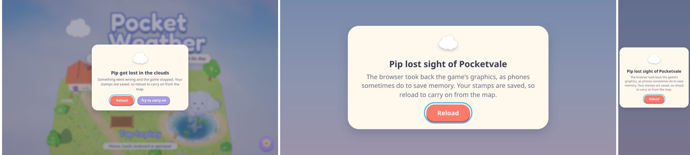

Not verified: a real phone dropping the game's graphics, a real crash, and Safari. The errors were
pretend ones that go through the same path in Unity's loader.

### Found along the way, not fixed

- **Fixed in the test:** the UI audit's caption check twice reported a hint "with no visible glyphs"
  ("Flick to blow" at 1200x900, load 25; "Drag to fly" at 740x360 in the second self-test). It
  measures right after `Canvas.ForceUpdateCanvases()`, and when the dynamic font's atlas is
  rebuilt that frame (shrunk captions ask for new sizes) the text's layout can come back empty.
  The check now lays the text out once more before failing; a caption with really no glyphs still
  fails. It then passed at all eight sizes once, which can't show a one-in-ten flake is gone.
- Running the Unity player in the private KWin makes frame pacing less even than on the desktop,
  which is what exposed the touch check above. Timing measurements (`-pwPerf`) should still use
  `PW_NESTED=0`, or be read with that in mind.

### Decisions for the owner (unchanged)

Hosting the web build, a new release zip (v0.1.0 predates all nine rounds, and the new launcher
is only in builds from the current source), the trailer, licences, signing and Windows Build
Support.

## Round 10 scope

Planned 2026-10-07 on `improvements-10`, from `main` at `83a6c7a` (round 9 merged, `main` equal to
`origin/main`). Nine rounds made the game fit for every screen, input and browser, and made it
survive crashes and dropped controllers. This round goes back to the day itself, and to the player
the bots can't stand in for: someone who keeps running out of daylight. Before planning I read the
day clock, the sunset card and the results code on a fresh Linux build of HEAD:

- **A day that's too hard has no way round it.** Days open one after another, so a player who
  can't save one before sundown can't see the rest of the summer. Days last 120 to 200 s; the
  newcomer bot, the slowest player we have, saves Day 9 only 1.2 game-hours inside par, and no
  person has ever played it. The sunset card offers "Try again" and a tip, nothing more. The
  Encores already scale a day's length (`MakeEncore`), so the clock can be stretched the same way.
- **Sundown creeps up unannounced.** In the last 15% of a day the sun track pulses coral, but it's
  at the top of the screen, and a player's eyes are on Pip. Nothing says how many friends are left.
- **Every retry goes through the postcard again.** "Try again" on the sunset card and Restart in
  the pause menu both load the day behind its postcard, so each retry costs another press on a
  card the player has just seen.
- **Round 9 left one thing unproven:** the UI audit's caption fix passed once at each size, which
  can't show a one-in-ten flake is gone, and no complete self-test ran on round 9's final commit.

### R10-1. Relaxed days

**What:**
- **Settings → Relaxed days** (Off by default): on an ordinary day the sun takes half as long
  again to cross the sky (Day 1's 120 s becomes 180 s, the wedding's 200 s becomes 300 s).
  Encores, which are the challenge, keep their scorcher pace.
- From the second sunset on the same day, the sunset card offers it: a **Slower sun** button beside
  "Try again" turns Relaxed days on and goes straight back into the day.
- The day saved and the delight count as usual. "Before par" and best times are about pace, so
  they're kept for the usual sun: a relaxed day's postcard says so where the par stamp is
  described, and its results card labels the par stamp "Usual pace only".

**Acceptance:**
- The keyboard self-test turns the setting on and fails unless a day's clock runs at 2/3 of its
  usual rate (measured over at least 2 s), and an Encore's at its usual scorcher rate. It saves a
  relaxed day and fails unless the day-saved stamp is awarded, the par stamp and best time aren't,
  and the results card says "Usual pace only". It lets the same day reach sunset twice and fails
  unless the second sunset card, and not the first, shows "Slower sun"; pressing it must turn the
  setting on and start the day relaxed.
- The UI audit checks the settings menu with the new row, the sunset card with three buttons, and
  the relaxed postcard and results card, at all eight sizes.
- The keyboard, gamepad and touch self-tests and the AutoPilot campaign still pass (they play with
  the setting off).

**Verify:** the self-tests above, plus screenshots of the settings, the sunset card's offer, the
relaxed postcard and the results card.

### R10-2. "Not long left"

**What:** when 85% of a day has gone (as the sun track starts to pulse) and friends still need
Pip, a toast says so once, with the count: "Not long left! 2 still need you". It waits for any
toast already showing (a fire, the finale), and doesn't show if everyone's happy.

**Acceptance:** the keyboard self-test moves a day's clock to just before 85% and fails unless
the toast appears within 1 s of crossing it, with the right count, and only once; on a day whose
needs are all met it must not appear. The UI audit adds the longest wording to its toast checks.

**Verify:** the keyboard test, the UI audit, and a screenshot.

### R10-3. Try again goes straight back to the day

**What:** "Try again" on the sunset card and Restart in the pause menu (after its "Sure?") reload
the day and start it at once, without its postcard. Replay on the results card, and picking a day
on the map, still show the postcard, since that's where the Encore is chosen.

**Acceptance:** the keyboard self-test's Restart check fails unless the day is running again at
its start hour with no postcard; its sunset check fails unless "Try again" does the same. The touch
test's Restart check still passes.

**Verify:** the keyboard and touch self-tests.

### R10-4. Proof runs

**What:** no code. Run the UI audit 10 times at each of the two sizes where round 9's caption flake
was seen (1200x900 and 740x360), run the full self-test on the round's final commit, and run
`web_smoke` in all six modes on a web build of the round's code.

**Acceptance:** each run's verdict is read from its own log and reported with the log's name and
the machine's load.

### Not in this round

- Splitting each island's terrain into its own web download (about 1.5 MB of the 17 MB) still
  needs the levels moved out of `Resources` and an asynchronous level load behind every screen.
  Still a lead.
- Real phones, Safari, controllers, audio by ear and the Encores' difficulty still need people or
  the owner. Hosting, releases and tags, the trailer, licences and Windows Build Support are the
  owner's.
- Whether a relaxed day should still be able to earn "Before par" is a design call; this round
  keeps the stamp for the usual pace and notes it for the owner.
