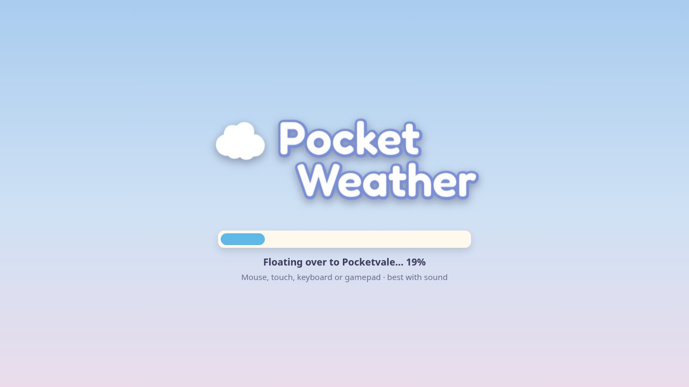
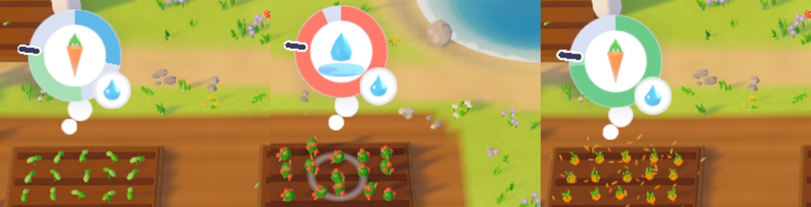
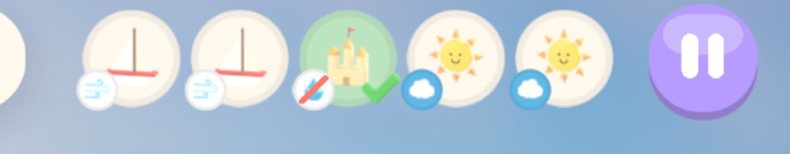
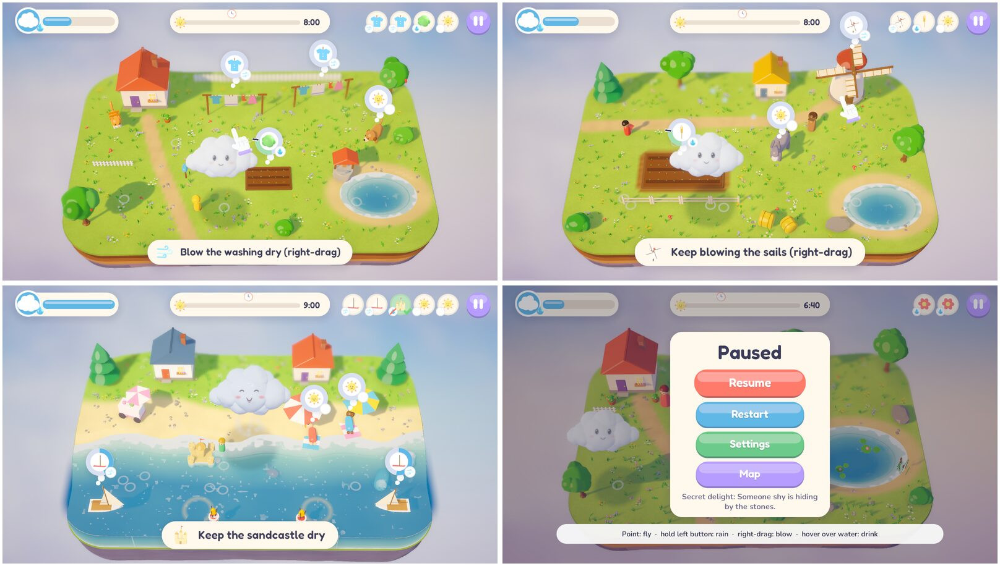
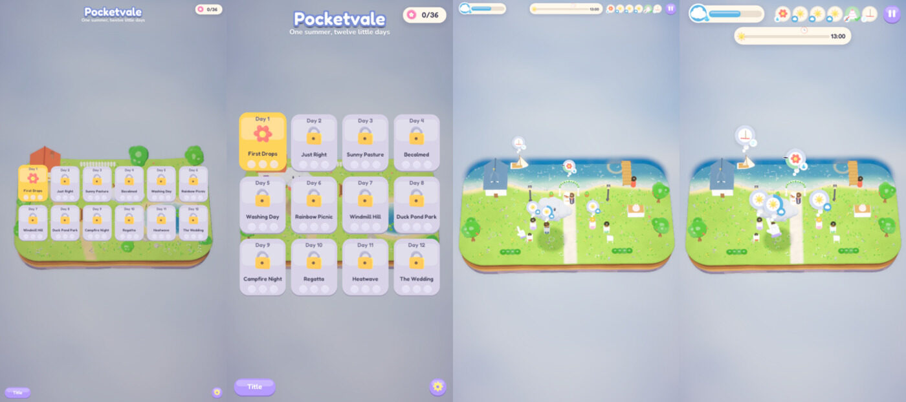
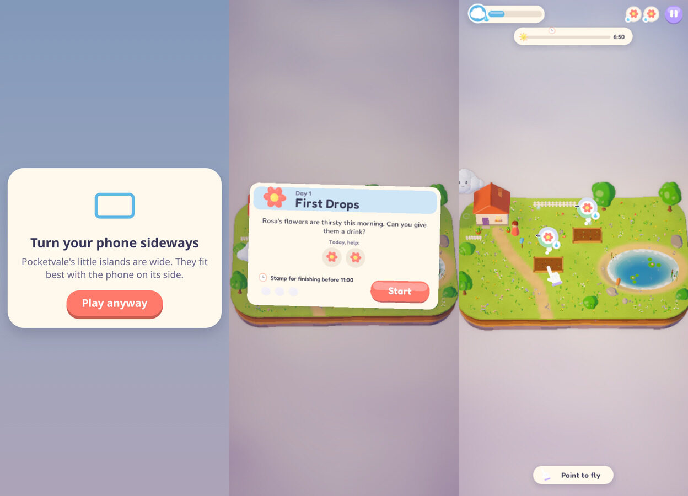
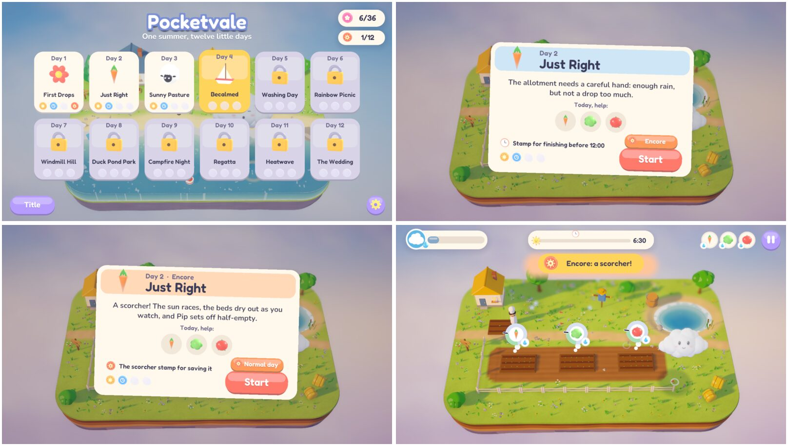
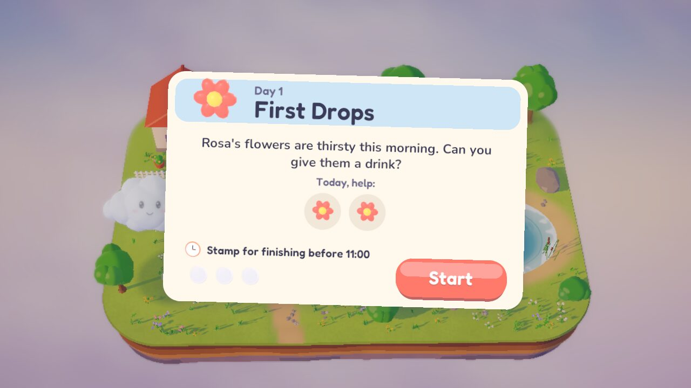
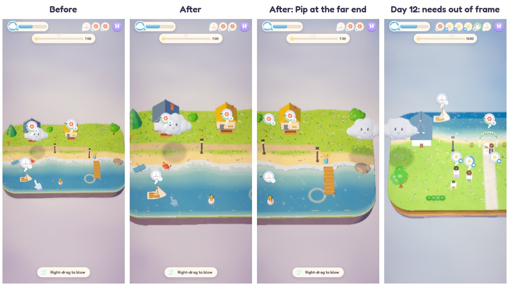
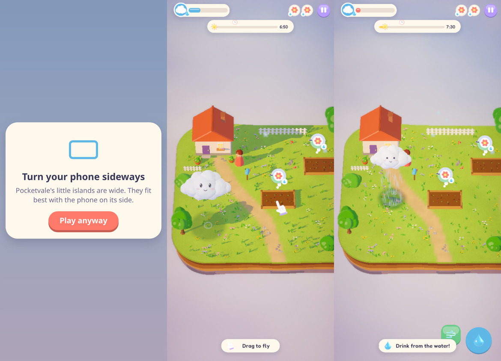

# Pocket Weather: improvements, round 1

Written 2026-10-06 on the `improvements` branch, starting from `41a6f09` (v0.1.0). The plan for
the round comes first, as written before any work began. What was actually done, and how it was
verified, is under [Round 1 results](#round-1-results) at the end.

## Baseline (measured today)

Everything was run on this machine against a fresh `Tools/unity.sh build` of HEAD.

| Check | Result |
| --- | --- |
| Linux build (`Tools/unity.sh build`) | Succeeded, 133 MB, no compiler errors |
| `Tools/selftest.sh` (full) | **All passed**: validator, audio loop seams, keyboard 19/19, gamepad 24/24, touch 18/18, UI audit 9/9 at 1600x900, 1600x720, 1200x900 and 720x1280, AutoPilot 12/12 with 12/12 delights, no exceptions. The known flaky "rain waters the bed" check passed this time. |
| Expert AutoPilot | Every day was saved before par, 19 to 82 s into a 120 to 200 s day. It finished 1.3 to 4 game-hours ahead of par, with 3 oopses across the whole campaign. |
| Screenshot tour (`-pwCapture`) | All 12 days, pause, settings, fail and ending screens rendered with no exceptions. I reviewed them. |
| Web smoke (`node Tools/web_smoke.mjs`, desktop and `--phone`) | Both pass with 0 console errors. Boot (to `GameRoot booted`) took 1.4 to 2.2 s from localhost. Under SwiftShader, Auto graphics drops to Low, as expected. |
| Web download | 32.6 MB with gzip: data 22.8 MB, wasm 9.7 MB, framework 75 KB. Brotli would be 27.4 MB (data 20.4, wasm 7.0). |
| Web boot over an emulated network (Chrome DevTools throttling, 60 ms latency) | 7.6 s at 50 Mbps, **14.2 s at 20 Mbps, 33.7 s at 8 Mbps** |

Things I could not verify: how the game sounds, how it feels to a human, real touchscreens and
controllers, real phone GPUs, and any macOS or Windows build.

## What I found

Each item below comes from the code, the running game or the screenshots.

1. **The web version isn't really playable in a browser yet.** The blog lists Windows, macOS,
   Linux and Web. The release has a Linux zip and a web zip that has to be unzipped and served
   with `python3 -m http.server`. The web build uses Unity's default template: on desktop the game
   sits in a fixed 960x600 box on a white page with a Unity logo footer, and the tab title is
   "Unity Web Player | Pocket Weather" (`/tmp/pw-web/w04_play.png`). The "Made with Unity" splash
   is on (`m_ShowUnitySplashScreen: 1`), and its logo texture alone is 2.7 MB of build data. Phone
   browsers render at full devicePixelRatio (2 to 3x) with MSAA x4 and bokeh depth of field, and
   Auto quality has to discover the slowdown again on every visit. The touch design is the
   strongest thing about the game, and the platform that suits it best is the one that's hardest
   to reach.
2. **The "just right" band is invisible.** A bed's bubble ring fills to the bottom of its band
   (`BedNeed.Progress = Moisture / BandMin`) and then just stays full until the bed suddenly turns
   soggy. Nothing on screen shows the top of the band. Day 2's tomatoes have a band of 14 to 24
   (about one second of full rain), so on Days 2, 8, 11 and 12 overwatering is guesswork. The
   plan promised this ("L2 shows the bed's band on the bubble ring", PLAN §9), but it wasn't built.
3. **Bubbles show who wants something, not what to do.** Laundry shows a shirt, the windmill
   shows a windmill, boats show a boat, and shade-seekers show a sun. Nothing says "gust" or
   "shade" (see the Day 5, 7, 10 and 12 screenshots). On the wedding day the tray holds four
   near-identical sun icons.
4. **Several new ideas arrive with no hint.** `Onboarding.cs` has hints for move, drink, band,
   shade, gust (boats only), rainbow, fire, pond and sunny. Day 5 (laundry wants gusts and hates
   rain), Day 7 (the windmill wants repeated gusts), Day 9's campfire (keep it lit) and Day 10's
   sandcastle (keep it dry) have none, because their levels have an empty `teach`. There's also
   no way to look up the controls in game after the first hint fades: the pause menu has none.
5. **The music repeats a lot.** The "afternoon" loop is **38 s** long and plays on six days (5,
   6, 7, 8, 10, 11), about 16 minutes of a 30-minute summer. The wedding waltz is a 27 s loop
   under a 200 s day. The "evening" track (46 s) is generated and shipped (0.9 MB) but never used:
   no level references it.
6. **Small bugs and loose ends:**
   - **Settings → Touch buttons can't turn them off for touch players.** The toggle writes 1
     (always) or 0 (auto, which still shows them on touch). The "never" value (2) is unreachable
     (`Screens.cs:376`).
   - **The onboarding hint stays on screen over the pause menu** (tour screenshot `t03_pause`).
   - **M (mute) sets music back to 0.8** rather than the player's own volume (`GameFlow.Update`).
   - **Best finishing time is recorded but never shown** (`SaveData.bestHour`), so there's no
     target when replaying for the par stamp.
   - **The title and map always show Day 1's diorama.** `LoadDisplayLevel` computes the next
     unfinished day and then ignores it.
   - **The "rain waters the bed" check is flaky.** In KeyTest and PadTest, Pip can still be
     gliding (up to about 1.1 radii) when rain starts, so only part of the shower lands on the bed
     in the 1.2 s window.
7. **No macOS or Windows builds.** Mac Build Support is installed, so a macOS build is possible
   now, but it would be unsigned and untested (there's no Mac here). Without signing,
   Gatekeeper blocks it on download, and Apple Silicon needs at least an ad-hoc signature.
   Windows needs the Windows Build Support module, which isn't installed.
8. **Replayability ends at 36 stamps.** After that there's nothing new. Par is generous for an
   expert (the bot finishes 1.3 to 4 game-hours early), but the newcomer bot lands only 2.5 to 3
   hours inside par on the hardest days, so tightening par without human data would be guessing.

## Ranked list

Impact means how much it raises the game for a real player. Effort: S is under half a day, M is
about a day, L is several days. Risk is the chance of breaking something or of not being able to
verify it.

| # | Improvement | Impact | Effort | Risk |
| --- | --- | --- | --- | --- |
| 1 | **Hosted-ready web build**: branded full-window template, smaller and faster download, mobile resolution cap, a deploy-ready package (finding 1) | High: a link anyone can click, and the best platform for touch | M | Low to medium (Brotli fallback and splash licensing need checking) |
| 2 | **Moisture band on bed bubbles** (finding 2) | High for Days 2, 8, 11, 12: it turns guessing into a skill | S–M | Low |
| 3 | **"Wants" badges on need bubbles and tray** (finding 3) | Medium–high: every day is easier to read | S–M | Low |
| 4 | **Onboarding for the unhinted days, plus a controls card in pause** (finding 4) | Medium–high for first-time players | S | Low |
| 5 | **Fixes bundle**: touch-button setting, hint over pause, mute restores volume, best time shown, title shows your current day, flaky test made deterministic (finding 6) | Medium (each is small, and together they feel careful) | S | Low |
| 6 | **More music variety**: use the evening track, add B sections to the shortest loops, no loop on more than 3 days (finding 5) | Medium, but nobody can hear it | M | Medium: can't be judged by ear here, and the web download grows |
| 7 | macOS build, universal and unsigned, built from Linux (finding 7) | Medium for reach | S–M | High: untestable, and Gatekeeper friction without a Developer ID |
| 8 | Windows build (finding 7) | High for reach | S once the module is installed | Blocked: the owner has to install Windows Build Support |
| 9 | Persist Auto quality's downgrade between sessions (so phones start on Low) | Low–medium | S | Low (could fold into 1) |
| 10 | Post-campaign content (for example remixed "stormy" versions of days, or par challenges) | Medium for retention | L | Medium, and design work without playtest data |
| 11 | Retune par and difficulty from real playtests | High eventually | S per pass | Needs human playtesters |
| 12 | Native Android build | Medium | L | Needs the Android module and a device |

## Proposed scope for this round

Items 1 to 5. Item 6 if the web budget in item 1 leaves room. All five can be verified on this
machine, and none needs an owner decision to start.

### 1. Hosted-ready web build

What:

- A custom WebGL template in `Assets/WebGLTemplates/PocketWeather/`:
  - a full-window canvas that follows window resizes and phone rotation
  - a loading screen in the game's own style (sky gradient, Pip icon, cloud-paper progress pill,
    Fredoka title)
  - a proper `<title>`, description, Open Graph and Twitter-card tags, and a favicon made from
    the Pip icon
  - a friendly message for browsers without WebGL 2
  - no Unity footer
  - devicePixelRatio capped at 2 on desktop and 1.5 on phones
- `PlayerSettings` for the web:
  - turn the "Made with Unity" splash off if the licence allows (Unity 6 made it optional on
    Personal; I'll check this in the editor)
  - per-platform Vorbis quality overrides for music and ambience on WebGL
  - mesh compression where it doesn't hurt how things look
  - Brotli with decompression fallback, if the fallback's decompression time on load doesn't cost
    more than the download saves. Otherwise keep gzip.
- Persist Auto quality's downgrade (item 9) so returning phone players start on Low.
- `Tools/package_web.sh`: builds or zips `Builds/WebGL` into
  `Builds/PocketWeather-<version>-web.zip`. It must work from any static host with no special
  headers (GitHub Pages, itch.io, the blog's own host), with a short `DEPLOY.md` note. **Nothing
  will be deployed.**
- `Tools/web_smoke.mjs` gains a `--throttle <Mbps>` option and reports download size and time to
  boot.

Acceptance:

- Total download is **≤ 22 MB** (from 32.6 MB), and boot at an emulated 20 Mbps is **≤ 10 s**
  (from 14.2 s).
- The desktop browser shows the game filling the window with no Unity branding. The phone
  emulation fills the screen, as it does today.
- `web_smoke` passes on desktop and `--phone` with 0 console errors.
- The Linux self-test still passes in full.
- The README's Play-it section and badges are updated to match the truth.

How I'll verify: run web_smoke desktop and phone, unthrottled and at 20 and 8 Mbps, and record
the numbers before and after in this file. Review the loading-screen and in-game screenshots
myself. Diff the build report to see where the size went.

### 2. Moisture band on bed bubbles

What: bed bubbles get a ring that maps moisture onto 0 to about 1.25 × the top of the band.
- The band is drawn as a green arc behind the fill.
- The fill is blue below the band, mint inside it and coral when soggy.
- A small tick marks the top of the band.
- When moisture is within 10% of the top of the band, the bubble gives a gentle pulse while
  rain is landing on it.

Other needs keep their current ring.

Acceptance:

- On Day 2, screenshots of a bed at thirsty, in-band and soggy moisture clearly show where
  "just right" is. A new `-pwScript band` capture sets the three moisture levels directly.
- The expert AutoPilot campaign still passes 12/12, and the newcomer bot is no worse on oopses
  from sogginess than today's baseline, which I'll record before the change.
- The UI audit passes at all four window shapes.

How I'll verify: capture script screenshots reviewed by eye, then the selftest and newcomer runs.

### 3. "Wants" badges on bubbles and tray

What: a small badge on each bubble and tray icon shows the verb that helps:
- 💧 rain: beds, fires, rainbow wishes (rain beside them)
- ☁ shade: shade-seekers
- 🌬 gust: boats, laundry, windmill
- 🚫💧 "keep dry": campfire, sandcastle, cake
- ☀ "no shade": sunflowers

It uses the existing icon set where it can. Any new badge icons come from `ArtSource/icons.py`
(the generator), not hand-made art. The badge hides once the need is met.

Acceptance:

- Every need type in the 12 levels maps to a badge, and an automated check walks all levels'
  needs and fails on any unmapped type.
- The tour screenshots for Days 5, 7, 10 and 12 show the badges legibly at 1600x900 and 720x1280.
- The UI audit passes.

### 4. Onboarding gaps and a controls card

What:
- Add `teach` tags and device-aware hints for:
  - laundry: "Blow the washing dry", with the flick or right-drag hand aimed at the line
  - windmill: "Keep blowing the sails"
  - campfire: "Keep the campfire lit"
  - keep-dry: "Keep the sandcastle dry"
- The gust hint targets whatever gust-need comes first, not only boats.
- The pause menu gains a compact controls row for the device in use.
- Levels are regenerated through `Tools/make_levels.py`, not by editing the JSON by hand.

Acceptance:

- On a fresh save, Days 5, 7, 9 and 10 each show their hint within 3 s of play starting.
  KeyTest/TouchTest gain a check that a hint appears on Day 5.
- The pause controls row matches the last device used (checked in the keyboard, gamepad and
  touch self-tests).
- The validator passes.

### 5. Fixes bundle

What:
- Touch buttons becomes Auto / On / Off, using the existing cycle-button pattern from Graphics.
- The hint and hand are hidden while paused and come back on resume.
- M remembers and restores the player's music volume.
- The postcard and results show "Best 9:40" once a day has been finished.
- The title and map show the next unfinished day's diorama.
- KeyTest and PadTest wait until Pip has settled over the bed before measuring the rain.

Acceptance:
- Each fix has a self-test check where one is practical: a touch-buttons Off check in
  TouchTest, a hint-hidden-on-pause check in KeyTest, and a best-time label check in KeyTest's
  results step.
- Keyboard and gamepad tests pass **10 runs in a row** with no flake (run them in a loop and
  record the result here).

### 6. (Stretch) More music variety

What:
- Assign the unused evening track to Regatta and Heatwave.
- In `Tools/audio/music.py`, extend "afternoon" and "wedding" with a second section (new melody
  over the same chord loop) so each loop runs at least 75 s.
- Regenerate with `Tools/audio/synth.py`.

Acceptance:
- No track plays on more than 3 days.
- The loop-seam check passes, and loudness stays within ±1 LU of today's.
- The web download is still within item 1's budget.
- The README says plainly that this was done by measurement, not by ear.

## Blocked, or needs the owner

- **Where the web build will be hosted.** The packaging will work on GitHub Pages, itch.io or the
  blog's own static host. Picking one and publishing it is the owner's call, since this effort
  doesn't deploy. The blog should link to it once it's up.
- **macOS.** Should I build an unsigned universal `.app` (testable by nobody here, and Gatekeeper
  will warn), or wait until there's an Apple Developer ID for signing and notarisation
  (`rcodesign` can do both from Linux)?
- **Windows** needs Windows Build Support installed in Unity Hub (6000.6.2f1).
- **The blog lists Windows and macOS**, which don't exist yet. Either the builds arrive or the
  page should change.
- Human ears and hands are still needed for audio, feel and difficulty. This round doesn't
  change that, and the README will keep saying so.

## Round 1 results

Implemented on `improvements`, one commit per item. Screenshots are in
[`docs/media/improvements/`](media/improvements/).

### 1. Hosted-ready web build: done; the size and speed targets were not met

- **Page:** the game fills the window on desktop and phone, with a loading card in its own
  colours, link-preview tags and a favicon. It shows a plain message if WebGL 2 is missing, and
  the render resolution is capped at 1.5x on phones and 2x on desktops. There's no Unity footer
  or "Unity Web Player" title, and the "Made with Unity" splash is off for every build (Unity 6
  allows this on every licence).
  
- **Auto graphics** remembers dropping to Low, so phones and slow browsers start there on the
  next visit. web_smoke's reload check verifies it in headless Chrome.
- **Packaging:** `Tools/package_web.sh` produces a zip that any static host serves as-is, and
  [HOSTING.md](HOSTING.md) covers GitHub Pages, itch.io and the blog's own host. Nothing has been
  deployed.
- **Size and load time:**

  | Web build | Download | Boot at 20 Mbps | Boot at 8 Mbps |
  | --- | --- | --- | --- |
  | v0.1.0 (gzip, default page, splash) | 32.6 MB | 14.4 s | 33.6 s |
  | Item 1 alone (Brotli, size-optimised wasm, no splash) | 25.8 MB | 12.2 s | 28.4 s |
  | End of round (plus item 6's longer music) | 27.9 MB | 13.2 s | 30.2 s |

  Boot is the time from navigation to the game's first log line. Each figure is the median of 3
  runs in headless Chrome with DevTools network throttling (60 ms latency) and a fresh profile,
  alternating with v0.1.0 (which was re-measured alongside each build). The machine's load
  average was 6 to 12 at the time. Under heavier load (30 to 80) the same runs were noisier and
  slower for both builds.

  **Why not 22 MB / 10 s:**
  - The remaining 26 MB is mostly things the build settings can't shrink. Audio is 9.7 MB:
    Unity's WebGL path re-encodes every clip to 160 kbps AAC whatever the quality setting (I
    tried overrides: no change). URP's film-grain and blue-noise textures (about 3 MB of
    incompressible noise) live in its global settings and can't be stripped safely.
  - "Optimize mesh data" saved 1.9 MB but stripped the vertex colours, which turned the world
    beige, so it stays off.
  - Gzip was measured too: no faster than Brotli at 20 Mbps and about 5 s slower at 8 Mbps,
    because its download is 5 MB larger.
  - Shrinking further would mean cutting audio quality or lengths for the web, which nobody can
    judge by ear here.
- **Verified:** `web_smoke` passes on desktop and phone emulation, 0 console errors.

### 2. Moisture band on bed bubbles: done

- Bed rings show moisture on a fixed scale: a green band, a notch at its top, blue while thirsty,
  mint in the band and coral when soggy.
- The bubble now stays up while rain lands on a bed. Before, it vanished the moment the bed was
  happy, so nothing warned before it went soggy.
- The notch throbs in the top quarter of the band.

Verified with `-pwScript band` screenshots at each state (Day 2), plus the selftest. The bots
don't read bubbles, so no bot metric can show the benefit. It needs a human.

### 3. "Wants" badges: done

Every bubble and tray icon carries a badge for the verb that helps. For shade, the white Pip icon
sits on a sky disc, because the first version was invisible on white. The UI audit fails on any
need without a decided badge, and passes for all 12 days.

At 720x1280 portrait the badges are as small as the rest of the HUD. That was already true
before this round and is noted under known issues.

### 4. Onboarding gaps and controls card: done

Days 5, 7, 9 and 10 now show their new idea within 3 s (checked in KeyTest), and Day 9 follows
up with "Keep the campfire lit". The pause menu shows a one-line controls reminder for the device
in use, checked in the keyboard, gamepad and touch tests.

### 5. Fixes bundle: done

- Touch buttons cycle Auto / On / Off.
- Hints hide while paused.
- M restores the player's own volume, and the slider refreshes to match.
- Best times appear on the postcard and results.
- `FormatHour` can no longer print 9:60.
- The title and map show the day you're up to.

The "rain waters the bed" check now lines Pip up first. Keyboard and gamepad tests each passed
**10 runs out of 10**; before, the check failed about one run in six.

### 6. Music variety (stretch): done, scaled down

- The "evening" track was generated but never used. It now plays on Day 7 and Day 11, so
  "afternoon" covers four days instead of six.
- "afternoon" gains a B section (38 s → 77 s loop) and "wedding" a B and C section (27 s → 80 s).
  Each new section is a generated melody (chord tones on strong beats, mostly stepwise, in key)
  over the same chords.
- The other four tracks decode identically to before.
- Loop seams pass. RMS level is within 0.5 dB of before.
- Not done: no track playing on more than 3 days. There are only three daytime tracks for ten
  daytime days. Lengthening morning and evening too would add about 1.7 MB to the web download.
- **Nobody has heard the new sections**; they were checked only by measurement.

### macOS build (orchestrator-approved extra): built, untested

`Tools/unity.sh mac` produces `Builds/macOS/PocketWeather.app`:
- a universal binary (x86_64 + arm64, checked with `file`)
- Mono scripting
- bundle id `com.nearbycoder.pocketweather`
- 146 MB, or 60 MB zipped

Unity gives it an ad-hoc `_CodeSignature`, but it isn't signed with a Developer ID or notarised.
Gatekeeper will warn on first launch (right-click → Open, or clear the quarantine attribute). **It
has never been run on a Mac.** A zip is in `Builds/` (gitignored) and nothing is published.

`Tools/unity.sh windows` and `BuildScript.BuildWindows` exist but have never run: Windows Build
Support isn't installed.

### Also changed

- **AutoPilot:** a missed delight gets a second try, except the wedding's bouquet catch, which
  happens whenever the bouquet flies. Day 6's rainbow delight was timing-dependent: the v0.1.0
  build found it in 1 of 4 runs, and this build in 7 of 8 with the retry.
- **The wedding's bouquet always flies now.** It's thrown once the couple's rainbow wish is met,
  but only while the day is running. Reading the code, if that rainbow was the last need met, the
  day was saved in the same frame and the bouquet (the trailer moment, and Day 12's delight)
  never flew. Day 12 now holds completion from its start until the bouquet lands.
  - In 6 bot runs, the bouquet was thrown every time and the day was saved afterwards.
  - The bot caught it only once, so the selftest's delight count for Day 12 still varies. That's
    the bot's catching, not the game.
  - The last-need case itself wasn't reproduced.
- **web_smoke:** uses free ports. A fixed port once served another project's build during a run.

### Found along the way, not fixed

- **A native crash in Unity's Wayland backend:** one SIGSEGV inside
  `wl_display_dispatch_queue_pending` at startup, in about 45 automated launches. It isn't in the
  game's code. The XWayland path hangs instead, so `-force-wayland` stays.
- **On a shared machine,** the shared `/tmp` filled up (55 GB tmpfs) during the round, so this
  round's scratch files live in the gitignored `Recordings/scratch`. `selftest.sh` still writes
  its logs to `/tmp/pw-selftest`.

## Round 2 scope

Planned 2026-10-06 on `improvements-2`, from `main` after round 1 was merged. These items come
from the ranked list (10: post-campaign content) and from what round 1 turned up (the small
portrait HUD, and music still repeating across days). They're ordered by value to a player who
opens the game, most likely from a link on a phone.

### R2-1. Phones held upright

**Why:** the UI is laid out on a 1920-wide canvas. Held upright, a phone shows it at 0.375×:
720 px wide, so the HUD is tiny, and the map's six-card rows only fit because they shrink with it.

**What:** in portrait, the canvases switch to a narrower design width (1200), so everything is
about 1.6× bigger. The screens that don't fit in 1200 reflow:
- **HUD:** the sun track drops to a second row under the gauge and tray.
- **Map:** four cards per row instead of six.
- **Pause:** the controls line wraps.
- **Toast:** moves below the HUD's second row.

The web page also asks phones held upright to turn sideways (the dioramas are wide), with a
"Play anyway" button. Landscape layouts stay exactly as they are.

**Acceptance:**
- The UI audit passes at 720x1280 and a new 390x844 (phone) size.
- A new audit check fails if the HUD's top elements overlap, at any of the audited sizes.
- In portrait, the UI scale is at least 0.56 at 720 px wide (it was 0.375).
- Landscape screenshots at 1600x900 show no layout change; the UI audit still passes at all
  landscape sizes.
- The web smoke test with a portrait phone shows the rotate card, and "Play anyway" dismisses it.

**Verify:** UI audit at six window shapes, before/after screenshots, and the web smoke test with
`--phone --portrait`.

### R2-2. No music track on more than three days

**Why:** after round 1, "morning" still plays on Days 1–4 and "afternoon" on 5, 6, 8 and 10.

**What:** a fourth daytime track, made with the existing synth like the others. Its own key,
tempo and instruments, with a generated melody over its chords (round 1's `phrase_melody`).
It plays on Becalmed and the Regatta, the two sea days.

**Acceptance:**
- `validate_levels.py` fails if any track plays on more than 3 days, and the levels pass.
- The new track's loop seam passes `check_loops.py`. Its peak is at most -1 dBFS and its RMS is
  within 1 dB of the other daytime tracks.
- Its chord timeline is exported to `music.json`.
- The player logs the new track starting on Days 4 and 10.
- The web download grows by at most 1 MB.

**Verify:** the validator, the synth's stats, the loop checker, a capture tour's logs, and
`package_web.sh` sizes. It's still unheard by a person, and the README will keep saying so.

### R2-3. Encore days (something to do after 36 stamps)

**Why:** after all 36 stamps there's nothing left to play for.

**What:** once a day has been saved, its postcard offers an Encore: the same diorama on a
scorcher. The sun runs faster (the day is 25% shorter), beds and the flower arch dry out as if it
were the heatwave, and Pip starts with less water. Saving an Encore earns that day's fourth stamp
(a gold sun), so the summer has 48 stamps. The map cards and postcards show it.

The rules are generic modifiers applied when a level loads, not twelve hand-made variants, so the
existing level data and validator stay the source of truth. Saves from round 1 load unchanged.

**Acceptance:**
- The expert AutoPilot saves all 12 Encores before sundown (`-pwEncore`), and the newcomer bot
  saves at least 10 of 12.
- The level validator gets an Encore pass using the same budget estimate.
- The keyboard test opens an unlocked Encore from the postcard and checks that it runs with the
  modifiers.
- The UI audit covers the Encore postcard and a 4-stamp map.
- A round-1 save still loads with its stamps.

**Verify:** the AutoPilot and newcomer campaigns with `-pwEncore`, the self-tests, the validator,
and screenshots.

**Risk:** balance is judged only by bots. If the Encores can't all be made reliably solvable,
this ships with the solvable subset or is deferred, rather than half-landed.

### R2-4. The first minute

**Why:** a brand-new player currently goes Title → Map (one card unlocked) → Postcard → play.

**What:** on a fresh save, tapping the title goes straight to Day 1's postcard. Later visits still
go to the map.

**Acceptance:** a fresh-save self-test check that Enter on the title opens Day 1's postcard, plus
the existing check that a returning player reaches the map.

**Verify:** the keyboard and touch tests.

### Not in this round

- Windows Build Support, signing and notarisation, hosting, licences, and releases or tags are
  the owner's.
- Real-device phone and controller testing, and listening to the audio, need people.
- Unity's experimental progressive web loading
  (`PlayerSettings.WebGL.progressiveAssetLoading`) could start the game before every file has
  arrived. But the game loads all its content through `Resources` at runtime, so it would need
  restructuring. That's left as a lead.

## Round 2 results

Implemented on `improvements-2`, one commit per item. Screenshots are in
[`docs/media/improvements/round2/`](media/improvements/round2/). At the end, the full self-test
passed on HEAD:
- validator and loop seams
- keyboard 33, gamepad 25 and touch 20 checks
- the UI audit at five sizes, 14 checks each
- the AutoPilot campaign 12/12, with no exceptions

### R2-1. Phones held upright: done

- In portrait, the canvases use a 1200-wide design, so a 720-wide screen draws the UI at 0.6×
  (it was 0.375×) and a 390-wide phone at 0.325×.
- The HUD's sun track drops to a second row, the map shows four cards a row, the pause controls
  line narrows, and the cloud wipe covers a tall screen.
- Landscape is unchanged: 1600x900 before/after screenshots of eight screens differ only by
  animation (at most 2.4% of pixels, with a 2% tolerance).
- The UI audit now also runs at 390x844, and a new check fails on overlapping HUD pieces or a
  below-scale UI. It passes at all five sizes, on Day 1 and on Day 12's seven needs.
- In the browser, phones held upright get a "Turn your phone sideways" card with "Play anyway".
  `web_smoke --portrait` checks that it shows and that the button dismisses it.

What's left: the island itself is small in portrait, because its width sets the camera. Hence
the nudge to turn sideways.

### R2-2. No track on more than three days: done

- "seaside" (A major, 88 bpm, 43.6 s) plays on Becalmed and the Regatta. It's made with the
  existing synth: off-beat plucked strums, a generated marimba tune and a glockenspiel answer.
- Peak -1.0 dBFS and RMS -15.8 dB; the other daytime tracks sit at -15.5 to -16.1. The loop seam
  passes.
- Morning now plays on Days 1–3, afternoon on 5, 6 and 8, evening on 7 and 11, and seaside on 4
  and 10. The validator enforces at most three days per track.
- The player logs "music seaside" on Days 4 and 10.
- The web download grew by 0.9 MB.
- **Not heard by a person.**

### R2-3. Encore days: done

- A saved day's postcard offers its Encore, a scorcher: a 25% shorter day, Pip starting half as
  full, and beds drying at 0.35/s. Saving it earns a new fourth stamp (rendered by `icons.py`).
  The map shows Encore stamps on each card and in an x/12 pill.
- **Expert AutoPilot (`-pwEncore`):** 12/12 saved before sundown, using 19–71 s of 90–150 s days.
- **Newcomer bot:** 12/12. Its tightest were Becalmed (66 of 105 s) and the Heatwave (78 of 135 s).
- The validator's Encore pass is OK for all 12. KeyTest opens an Encore from its postcard and
  checks its rules, and the UI audit covers the Encore postcard and map.
- **Balance caveat:** both bots finish with time to spare, so for a skilled player the Encores
  may be a gentle step up rather than a real challenge. Tuning the three numbers needs human
  playtesting; they live in `LevelLibrary.MakeEncore` and are mirrored in the validator.
- Save compatibility is by design and wasn't run against a real old save: the Encore stamp is a
  new bit in the existing stamps field, and no fields were added.

### R2-4. The first minute: done

On a fresh save, tapping the title opens Day 1's postcard; returning players get the map.
KeyTest checks both. A fresh browser profile in `web_smoke` lands on the postcard (screenshot
`w02_after_title`).

### Also changed

- **Tools stay out of the shared `/tmp`:** `selftest.sh` now writes to `Recordings/selftest/`, and
  `web_smoke.mjs` writes to `Recordings/web-smoke/`. Its throwaway Chrome profile lives in
  `Recordings/` and is removed when the run ends (it used to be left behind).

### Web build at the end of round 2

- The download is 28.8 MB: up 1.0 MB on round 1, for the seaside track and the new stamp, and
  still down from v0.1.0's 32.6 MB.
- Desktop, landscape-phone and portrait-phone smoke runs all boot with 0 console errors, and
  remember Low on reload.
- Boot times, median of 3 alternating with v0.1.0, with the machine's load average at 20 to 30:

  | Web build | Boot at 20 Mbps | Boot at 8 Mbps |
  | --- | --- | --- |
  | v0.1.0 | 17.0 s | 34.8 s |
  | end of round 2 | 17.2 s | 33.0 s |

  At this load, the 20 Mbps advantage measured in round 1 (at load 6 to 12) disappears into the
  noise.

### Found along the way, not fixed

- On a phone, the first hint reads "Point to fly" until the first touch. Before any input, the
  WebGL player under Chrome's phone emulation doesn't report itself as a mobile platform. Not
  checked on a real phone.
- The bot still catches the wedding bouquet only some of the time (11/12 delights in the final
  campaign). That's its catching, not the game, as round 1 found.

## Round 3 scope

Planned 2026-10-06 on `improvements-3`, from `main` at `ffabb6a` (round 2 merged, `main` equal to
`origin/main`). Round 2 left the phone player with a small island in portrait and a desktop hint
before their first touch, and the web player with a 28.8 MB wait. While checking how the tools
keep away from real saves, I also found that the self-tests don't: the Linux player keeps
progress and settings in `~/.config/unity3d/Pocketvale Studio/Pocket Weather/prefs`, and
`selftest.sh`'s AutoPilot run passes `-pwFreshSave`, which deletes the save there. Anyone who
plays the game and runs the self-test on the same machine loses their stamps.

### R3-1. Tools never touch the real save

**What:** `Tools/play.sh` points the player's config folder (`XDG_CONFIG_HOME`, which the Unity
Linux player honours; checked) at the gitignored `Recordings/config/` whenever it's started with
an automation flag (`-pwAutopilot`, `-pwKeyTest`, `-pwCapture` and the rest). `selftest.sh` uses
a fresh one per run. `PW_REAL_PREFS=1` opts out. A plain `Tools/play.sh` still plays with the
real save.

**Acceptance:** the real prefs file's checksum is unchanged after a full `selftest.sh`, and the
sandbox holds the test's save afterwards.

**Verify:** `sha256sum` before and after the end-of-round self-test.

### R3-2. Portrait: a bigger island that follows Pip

**Why:** held upright, the island's width sets the camera, so a 390x844 phone shows the island in
a strip about 28% of the screen tall, with empty sky above and below it.

**What:** in portrait the camera frames part of the island's width (about 57% on a 20:9 phone,
70% at 720x1280, all of it again from a 4:5 window upward) and pans side to side to follow Pip,
with a dead zone in the middle, clamped to the island's edges. On the title, map and postcard it
stays centred. Touch still puts Pip under the finger, so holding a finger near the screen's edge
scrolls the view that way. Thought bubbles of needs that are off screen are pinned to the screen
edge, with their tail pointing toward the need, so nothing waits out of sight. Landscape framing
doesn't change.

**Acceptance:**
- At 390x844 the island's on-screen height is at least 1.5x what it is today (the UI audit
  measures and logs it, and fails below the target).
- The UI audit sends Pip to each end of the island at both portrait sizes and fails if Pip leaves
  the screen, or if a pinned bubble sits off screen.
- At 1600x900 the camera distance is identical to before (logged), and the UI audit still passes
  at all five sizes.
- The expert AutoPilot campaign still passes in a portrait window (the bot is world-space, so this
  checks nothing else broke).

**Verify:** UI audit at five sizes, before/after portrait screenshots of Days 1, 4, 7 and 12, and
a portrait AutoPilot run. Whether edge-scrolling under a finger feels good needs a real phone.

### R3-3. Phones get touch wording from the first hint

**Why:** before the first touch, the game guesses the device from `Application.isMobilePlatform`,
which the WebGL player doesn't set in Chrome's phone emulation, and which can't know about an iPad
(it reports itself as a Mac). So the first hint can read "Point to fly" on a phone.

**What:** a small JavaScript plugin asks the browser whether its main pointer is coarse (a finger)
and the game uses that as its guess before any input, for the hints and the pause menu's controls
line. Native mobile platforms keep `isMobilePlatform`.

**Acceptance:** `web_smoke --phone` reads the first hint from the log and fails unless it's the
touch wording ("Drag to fly"). The Linux build's keyboard test, which checks hint wording, still
passes.

**Verify:** web smoke on desktop and phone, and the self-tests.

### R3-4. The web download no longer waits for the music

**Why:** the music is about a quarter of the web download (Unity re-encodes it to 160 kbps AAC),
and all of it arrives before the title screen, though the player hears one track at a time.

**What:** the music tracks move out of `Resources` into one asset bundle per track, built for the
target platform by `BuildScript` into `StreamingAssets`. The Linux and macOS players load a track
from disk the moment it's needed, so nothing changes there. The web player starts with the
title's track and fetches the rest in the background in campaign order. A track that hasn't
arrived yet fades in when it does. Stings and sound effects stay in the main download. The
bundles are plain files, so the "any static host" promise in `HOSTING.md` still holds.

**Acceptance:**
- The web build's up-front download is at least 5 MB smaller than round 2's 28.8 MB.
- Boot at an emulated 8 Mbps is at least 15% faster than round 2's build measured alongside it.
- `web_smoke` passes on desktop and phone with 0 console errors and logs the title and Day 1
  tracks starting.
- On Linux, a capture tour logs each day's track starting with the right length, and the
  self-test passes.

**Verify:** throttled web smoke runs alternating with round 2's build, `package_web.sh` sizes, and
the Linux self-test and tour logs.

**Risk:** if bundles fight back (loop seams, a track that doesn't arrive), this is reverted and
reported rather than half-landed.

### Not in this round

- Encore tuning, audio by ear, and real phones and controllers still need people.
- Windows Build Support, signing, hosting, licences, releases and the trailer are the owner's.
- Full progressive loading (models and textures after boot) would need everything moved out of
  `Resources`; R3-4 does it for the music only.

## Round 3 results

Implemented on `improvements-3`, one commit per item. Screenshots are in
[`docs/media/improvements/round3/`](media/improvements/round3/). At the end, the full self-test
passed on the final code (a Linux build with all four items):
- validator and loop seams
- keyboard 33, gamepad 25 and touch 20 checks
- the UI audit at five sizes, 17 checks each (three of them the new framing check)
- the AutoPilot campaign 12/12 with 11/12 delights (the wedding bouquet catch, as before), no
  exceptions

`web_smoke` passed on desktop, `--phone`, `--portrait` and `--mouse`, with 0 console errors.

### R3-1. Tools never touch the real save: done, and the scope's premise was wrong

**Correction:** the scope said the self-test deleted real progress. It didn't. Under any
automation flag `SaveData` already keeps progress under a separate key (`pw.save.test`), so
`-pwFreshSave` only ever cleared the bots' own save. What the tests did write into the real
prefs were **settings**: music volume and its pre-mute level, touch buttons, tap-to-rain and
Auto graphics' "dropped to Low" memory. The real file is also not where the scope said: the
Linux player keeps its prefs in `~/.config/unity3d/unknown/unknown/prefs`, despite a correct
`app.info` (see "Found along the way").

- `Tools/play.sh` sets `XDG_CONFIG_HOME` to `Recordings/config/` whenever a `-pw` automation
  flag is passed (`PW_REAL_PREFS=1` opts out, `PW_CONFIG` picks another folder), and
  `selftest.sh` uses a fresh `Recordings/selftest/config/` per run. Audio still connects with
  the sandboxed config (checked with `pactl`).
- **Verified:** the real file's `pw.*` entries were byte-identical before and after a sandboxed
  keyboard test (33/33), whose settings changes went to its sandbox instead. The final
  self-test's prefs ended up in `Recordings/selftest/config/`. A whole-file checksum couldn't
  be used, because another game on this machine writes to the same `unknown/unknown` file.

### R3-2. Portrait: a bigger island that follows Pip: done

- In portrait the camera frames 58% of the island's width on a 390x844 phone and 70% at
  720x1280, and slides with Pip (with a dead zone across the middle 30% of the view, clamped to the island's ends,
  and Pip can never leave the frame however fast it flies). On the title, map, postcard and
  ending it stays centred.
- At 390x844 the camera is **1.56x closer** than whole-width framing and the island fills **43%**
  of the screen's height (about 28% before). At 720x1280 it's 1.40x closer.
- Bubbles of needs out of frame wait at the screen's edge with an arrow pointing the way.
- Landscape is untouched: the UI audit checks the camera distance equals the old framing's, and
  it did on Days 1, 4 and 12 at 1600x900, 1600x720 and 1200x900.
- The UI audit's new framing check (Days 1, 4, 12, at all five sizes) sends Pip to both ends of
  the island and fails if Pip or any bubble leaves the screen. It caught the edge arrow poking
  2 px off a 390-wide screen, which was fixed.
- The expert AutoPilot saved all 12 days in a 390x844 window, with no exceptions.

Not verified: how edge-scrolling under a finger feels on a real phone. Holding a finger near the
screen's edge keeps the view sliding that way until the island ends.

### R3-3. Phones get touch wording from the first hint: done

- `Assets/Plugins/WebGL/PocketWeather.jslib` asks the page whether its main pointer is coarse
  (or, for iPads, whether it has touch points and no hover). `Platform.TouchFirst` combines that
  with `Application.isMobilePlatform`, logs it at boot, and the hints and pause controls line use
  it until the first input.
- A second bug turned up on the way: tapping the page's "Play anyway" card makes the browser
  move its mouse pointer, which play then counted as a mouse being used, so the first hint in
  portrait still said "Point to fly". The pointer position is now kept in step while Pip's input
  is off.
- `web_smoke` now fails unless the first hint is "Drag to fly" with `--phone` and `--portrait`,
  and a new `--mouse` mode (no touch emulation) must guess "no" and show "Point to fly". All four
  modes pass with 0 console errors.

### R3-4. The web download no longer waits for the music: done

- The seven tracks moved from `Resources/Audio/Music` to `Assets/Music`. After each player build,
  `BuildScript.AddMusic` packs each into an uncompressed asset bundle for that platform and
  copies it to the player's `StreamingAssets/Music` (3.5 MB of Vorbis on Linux, 7.9 MB of AAC on
  the web). Stings, effects and ambience stay where they were.
- Desktop players open a track's bundle from disk the moment it's played, so nothing changes
  there: a capture tour logged every day's track starting with the same loop lengths as before,
  and a `-pwVideo` recording of the title matched the title track sample-aligned (at exactly
  4.00 s).
- The web player downloads the bundles one at a time in the background, title first. A track is
  decoded only when it's about to play and released after it fades out, because browsers keep
  decoded audio as raw samples (15–20 MB a track). The loader caches `.bundle` files, so later
  visits don't download them again (the console shows each stored in the browser cache).
- `package_web.sh` now includes `StreamingAssets/` and lists it separately; `HOSTING.md` says to
  upload it.
- **Sizes and boot times** (Chrome DevTools throttling, 60 ms latency, fresh profile each run,
  alternating with round 2's build; machine load average 34 to 63):

  | Web build | Before the title | Boot at 8 Mbps (3 runs) | Boot at 20 Mbps (3 runs) |
  | --- | --- | --- | --- |
  | round 2 | 28.8 MB | 31.7, 32.0, 32.7 s | 17.1, 18.0, 29.9 s |
  | round 3 | 21.0 MB (+7.9 MB music later) | 23.4, 24.3, 23.5 s | 13.7, 14.2, 18.6 s |

  Medians: **27% faster at 8 Mbps** (32.0 → 23.5 s) and **21% faster at 20 Mbps** (18.0 →
  14.2 s). The title's music started 1.3 to 2.1 s after boot at 8 Mbps. The wasm grew by 15 KB
  for the two modules added (asset bundles and their web request).

Not verified: Safari and Firefox. If a browser can't fetch or decode a track, the game logs it,
retries twice and plays on silently.

### Also changed

- Relative `-logFile` paths land in `Builds/Linux/` (the player changes directory), so the
  README's AutoPilot example now uses `$PWD/Recordings/...`.

### Found along the way, not fixed

- **The Linux player stores its prefs under `unknown/unknown`.** `PocketWeather_Data/app.info`
  correctly says "Pocketvale Studio / Pocket Weather", yet the save and settings go to
  `~/.config/unity3d/unknown/unknown/prefs`, and on this machine another game's build writes the
  same file. The game's keys are all prefixed `pw.`, so nothing collides except Unity's own
  window-size keys, but two games sharing one prefs file is fragile. Not investigated further
  this round; setting `PlayerSettings` names explicitly or checking a newer Unity would be the
  next step.
- While the editor builds, the Input System package sometimes adds its actions asset to
  `preloadedAssets` in `ProjectSettings.asset`. It was reverted each time rather than committed.
- The web smoke test's localhost fetch of the title's track once took 19 s with the machine's
  load average around 50 (1.3 to 2.5 s otherwise). Under that load SwiftShader starves the main
  thread; it says nothing about a real browser, but it was the slowest case seen.
